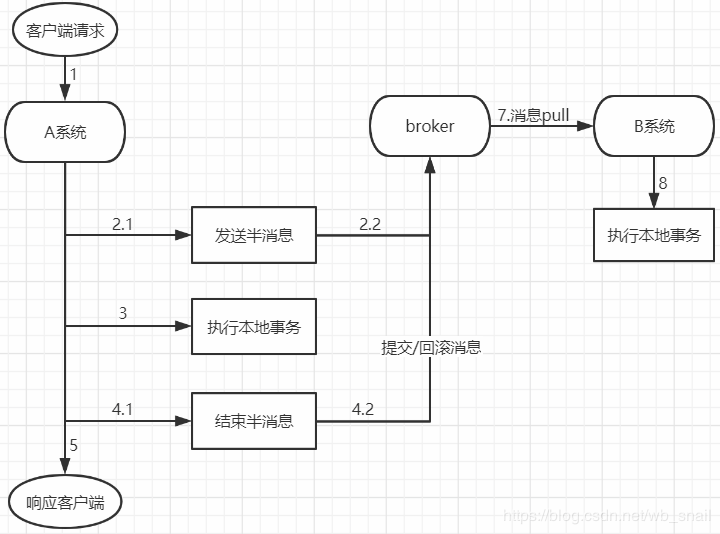

# URL
  - https://blog.csdn.net/wb_snail/article/details/89238596
  ````
  ````
  
  
  大家日常使用事务的场景，基本上都是在操作数据库时，我们都知道，事务具有ACID的特性，可以为数据的可靠性提供保证

但在分布式场景中，不同系统使用不同的库，当一个请求涉及到多个系统数据变更时，单靠数据库事务就无法保证数据的可靠了，这就需要另一种机制，用于保证跨系统数据变更动作的可靠性，这个机制就是我们常说的分布式事务，对于分布式系统来说，严格实现ACID这四个特性代价往往太高，高到我们无法承受，仅仅是保证"一致性"就已经非常困难了，"顺序一致性"、"最终一致性"、"强一致性"的分类，就是一种妥协，业界的2PC，TCC，以及我们要讲的事务消息，都做了一定程度的妥协，每种方案都有特定的使用场景和限制，没有完美的解决方案，所以也需要我们根据实际场景权衡利弊

事务消息是分布式事务的解决方案之一，它基于消息队列中间件实现，今天我们就来讲讲在rocketMq中事务消息是如何实现的

我先画个事务消息的流程图，方便大家理解，我们假设本次涉及到A、B两个系统的数据变更



1. producer(本例中指A系统)发送半消息到broker，这个半消息不是说消息内容不完整， 它包含完整的消息内容， 在producer端和普通消息的发送逻辑一致

2. broker存储半消息，半消息存储逻辑与普通消息一致，只是属性有所不同，topic是固定的RMQ_SYS_TRANS_HALF_TOPIC，queueId也是固定为0，这个tiopic中的消息对消费者是不可见的，所以里面的消息永远不会被消费。这就保证了在半消息提交成功之前，消费者是消费不到这个半消息的

3. broker端半消息存储成功并返回后，A系统执行本地事务，并根据本地事务的执行结果来决定半消息的提交状态为提交或者回滚

4. A系统发送结束半消息的请求，并带上提交状态(提交 or 回滚)

5. broker端收到请求后，首先从RMQ_SYS_TRANS_HALF_TOPIC的queue中查出该消息，设置为完成状态。如果消息状态为提交，则把半消息从RMQ_SYS_TRANS_HALF_TOPIC队列中复制到这个消息原始topic的queue中去(之后这条消息就能被正常消费了)；如果消息状态为回滚，则什么也不做。

6. producer发送的半消息结束请求是oneway的，也就是发送后就不管了，只靠这个是无法保证半消息一定被提交的，rocketMq提供了一个兜底方案，这个方案叫消息反查机制，Broker启动时，会启动一个TransactionalMessageCheckService任务，该任务会定时从半消息队列中读出所有超时未完成的半消息，针对每条未完成的消息，Broker会给对应的Producer发送一个消息反查请求，根据反查结果来决定这个半消息是需要提交还是回滚，或者后面继续来反查

7. consumer(本例中指B系统)消费消息，执行本地数据变更(至于B是否能消费成功，消费失败是否重试，这属于正常消息消费需要考虑的问题，本文不作讨论)

在rocketMq中，不论是producer收到broker存储半消息成功返回后执行本地事务，还是broker向producer反查消息状态，都是通过回调机制完成，我把producer端的代码贴出来你就明白了：


半消息发送时，会传入一个回调类TransactionListener，使用时必须实现其中的两个方法，executeLocalTransaction 方法会在broker返回半消息存储成功后执行，我们会在其中执行本地事务；checkLocalTransaction方法会在broker向producer发起反查时执行，我们会在其中查询库表状态。两个方法的返回值都是消息状态，就是告诉broker应该提交或者回滚半消息

从上面的流程中，我们不难看到，rocketMq通过二阶段提交的思想实现了事务消息，那我们就顺便说说二阶段提交：

````
我们将使用二阶段提交保证数据一致性的模型做一个抽象：
A、B两个系统，都要更新各自的数据，假设A更新操作叫A_upd，B更新操作叫B_upd
为了确保数据的一致性，我们需要保证：
    1.A_upd执行成功，则B_upd也要执行成功
    2.A_upd执行失败，则B_upd不执行
简单来说，A_upd和B_upd要嘛都执行，要嘛都不执行，这样才能保证一致
如果我们的代码是这样：
    if(A_upd()){
        B_upd()
    }
第2点可以保证，但因为是两个不同系统，第1点无法保证

我们将A_upd拆分为两步，即A_upd1,A_upd2：
然后我们的代码是这样：
    if(A_upd1()){
        if(B_upd()){
            A_upd2();
        }
    }
1.A_upd1失败，则B_upd不会执行，满足第2点
2.A_upd1成功，B_upd失败，则A_upd2不执行，满足第2点
3.A_upd1成功，B_upd成功，A_upd2是否成功无法保证，如果A_upd2成功，则流程正常，满足第1点，如果A_upd2失败，则流程可能正常，也可能不正常，所以需要回查检测机制来满足第1点，结合A_upd1操作以及B_upd操作记录的执行状态，就可以确认A_upd2是否可以执行，在rocketMq中，消息反查就是这里的回查检测机制
通过这种将一个完整操作拆分为两个半操作，并在中间插入另一个系统的操作，来确保数据一致性的手段，叫做二阶段提交

当要保证不同系统，或者不同模块的数据一致性时，二阶段提交是一个非常常用的手段
mysql数据库中binlog与redolog的一致性，kafka中的事务消息，2PC协议，以及上面介绍的rocketMq事务消息，都多多少少涉及到了二阶段提交，如果你要实现类似的功能，也可以参考这种思想
````

PS:如果有不足之处，欢迎指出；如果解决了你的疑惑，就点个赞吧o(*￣︶￣*)o
————————————————
版权声明：本文为CSDN博主「wb_snail」的原创文章，遵循CC 4.0 BY-SA版权协议，转载请附上原文出处链接及本声明。
原文链接：https://blog.csdn.net/wb_snail/java/article/details/89238596
