# URL
  - https://www.cnblogs.com/myseries/p/10939355.html
  ````
  ````
  
  
  # 分布式事务解决方案汇总：2PC、3PC、消息中间件、TCC、状态机+重试+幂等（转）
　　数据一致性问题非常多样，下面举一些常见例子。比如在更新数据的时候，先更新了数据库，后更新了缓存，一旦缓存更新失败，此时数据库和缓存数据会不一致。反过来，如果先更新缓存，再更新数据库，一旦缓存更新成功，数据库更新失败，数据还是不一致；

　　比如数据库中的参照完整性，从表引用了主表的主键，对从表来说，也就是外键。当主表的记录删除后，从表是字段置空，还是级联删除。同样，当要创建从表记录时，主表记录是否要先创建，还是可以直接创建从表的记录；

 　　比如数据库中的原子性：同时修改两条记录，一条记录修改成功了，一条记录没有修改成功，数据就会不一致，此时必须回滚，否则会出现脏数据。 

　　比如数据库的Master-Slave异步复制，Master宕机切换到Slave，导致部分数据丢失，数据会不一致。

 　　发送方发送了消息1、2、3、4、5，因为消息中间件的不稳定，导致丢了消息4，接收方只收到了消息1、2、3、5，发送方和接收方数据会不一致。

 　　从以上案例可以看出，数据一致性问题几乎无处不在。本书把一致性问题分为了两大类：事务一致性和多副本一致性。这两类一致性问题基本涵盖了实践中所遇到的绝大部分场景，本章和下一章将分别针对这两类一致性问题进行详细探讨。

 

# 随处可见的分布式事务问题

 　　在“集中式”的架构中，很多系统用的是Oracle这种大型数据库，把整个业务数据放在这样一个强大的数据库里面，利用数据库的参照完整性机制、事务机制，避免出现数据一致性问题。这正是数据库之所以叫“数据库”而不是“存储”的一个重要原因，就是数据库强大的数据一致性保证。

　　但到了分布式时代，人们对数据库进行了分库分表，同时在上面架起一个个的服务。到了微服务时代，服务的粒度拆得更细，导致一个无法避免的问题：数据库的事务机制不管用了，因为数据库本身只能保证单机事务，对于分布式事务，只能靠业务系统解决。 

　　例如做一个服务，最初底下只有一个数据库，用数据库本身的事务来保证数据一致性。随着数据量增长到一定规模，进行了分库，这时数据库的事务就不管用了，如何保证多个库之间的数据一致性呢？

 　　再以电商系统为例，比如有两个服务，一个是订单服务，背后是订单数据库；一个是库存服务，背后是库存数据库，下订单的时候需要扣库存。无论先创建订单，后扣库存，还是先扣库存，后创建订单，都无法保证两个服务一定会调用成功，如何保证两个服务之间的数据一致性呢？ 

　　这样的案例在微服务架构中随处可见：凡是一个业务操作，需要调用多个服务，并且都是写操作的时候，就可能会出现有的服务调用成功，有的服务调用失败，导致只部分数据写入成功，也就出现了服务之间的数据不一致性。 

# 分布式事务解决方案汇总

 　　接下来，以一个典型的分布式事务问题——“转账”为例，详细探讨分布式事务的各种解决方案。

　　以支付宝为例，要把一笔钱从支付宝的余额转账到余额宝，支付宝的余额在系统A，背后有对应的DB1；余额宝在系统B，背后有对应的DB2；蚂蚁借呗在系统C，背后有对应的DB3，这些系统之间都要支持相关转账。所谓“转账”，就是转出方的系统里面账号要扣钱，转入方的系统里面账号要加钱，如何保证两个操作在两个系统中同时成功呢？ 

1. 2PC

　 **（1）2PC理论**。在讲MySQL Binlog和Redo Log的一致性问题时，已经用到了2PC。当然，那个场景只是内部的分布式事务问题，只涉及单机的两个日志文件之间的数据一致性；2PC是应用在两个数据库或两个系统之间。 

　　2PC有两个角色：事务协调者和事务参与者。具体到数据库的实现来说，每一个数据库就是一个参与者，调用方也就是协调者。2PC是指事务的提交分为两个阶段，如图10-1所示。

    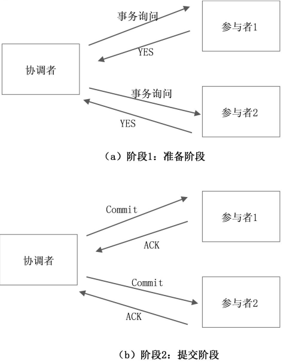

　　　　阶段1：准备阶段。协调者向各个参与者发起询问，说要执行一个事务，各参与者可能回复YES、NO或超时。

　　　　阶段2：提交阶段。如果所有参与者都回复的是YES，则事务协调者向所有参与者发起事务提交操作，即Commit操作，所有参与者各自执行事务，然后发送ACK。

 

　　如果有一个参与者回复的是NO，或者超时了，则事务协调者向所有参与者发起事务回滚操作，所有参与者各自回滚事务，然后发送ACK，如图10-2所示。

    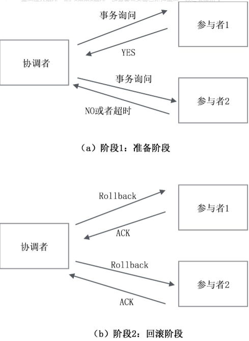
  

　　所以，无论事务提交，还是事务回滚，都是两个阶段。

 

　**（2）2PC的实现**。通过分析可以发现，要实现2PC，所有参与者都要实现三个接口：Prepare、Commit、Rollback，这也就是XA协议，在Java中对应的接口是javax.transaction.xa.XAResource，通常的数据库也都实现了这个协议。开源的Atomikos也基于该协议提供了2PC的解决方案，有兴趣的读者可以进一步研究。

 

　**（3）2PC的问题**。2PC在数据库领域非常常见，但它存在几个问题：

　　问题1：性能问题。在阶段1，锁定资源之后，要等所有节点返回，然后才能一起进入阶段2，不能很好地应对高并发场景。

　　问题2：阶段1完成之后，如果在阶段2事务协调者宕机，则所有的参与者接收不到Commit或Rollback指令，将处于“悬而不决”状态。

　　问题3：阶段1完成之后，在阶段2，事务协调者向所有的参与者发送了Commit指令，但其中一个参与者超时或出错了（没有正确返回ACK），则其他参与者提交还是回滚呢？ 也不能确定。 

　为了解决2PC的问题，又引入了3PC。3PC存在类似宕机如何解决的问题，因此还是没能彻底解决问题，

　　2PC除本身的算法局限外，还有一个使用上的限制，就是它主要用在两个数据库之间（数据库实现了XA协议）。但以支付宝的转账为例，是两个系统之间的转账，而不是底层两个数据库之间直接交互，所以没有办法使用2PC。

　　不仅支付宝，其他业务场景基本都采用了微服务架构，不会直接在底层的两个业务数据库之间做一致性，而是在两个服务上面实现一致性。 

　　正因为2PC有诸多问题和不便，在实践中一般很少使用。

 

2. 3PC(三阶段提交)

　　三阶段提交协议（3PC）主要是为了解决两阶段提交协议的阻塞问题，2pc存在的问题是当协作者崩溃时，参与者不能做出最后的选择。因此参与者可能在协作者恢复之前保持阻塞。三阶段提交（Three-phase commit），是二阶段提交（2PC）的改进版本。

　　与两阶段提交不同的是，三阶段提交有两个改动点。

　　也就是说，除了引入超时机制之外，3PC把2PC的准备阶段再次一分为二，这样三阶段提交就有CanCommit、PreCommit、DoCommit三个阶段。

## 1、CanCommit阶段

　　之前2PC的一阶段是本地事务执行结束后，最后不Commit,等其它服务都执行结束并返回Yes，由协调者发生commit才真正执行commit。而这里的CanCommit指的是 尝试获取数据库锁 如果可以，就返回Yes。

    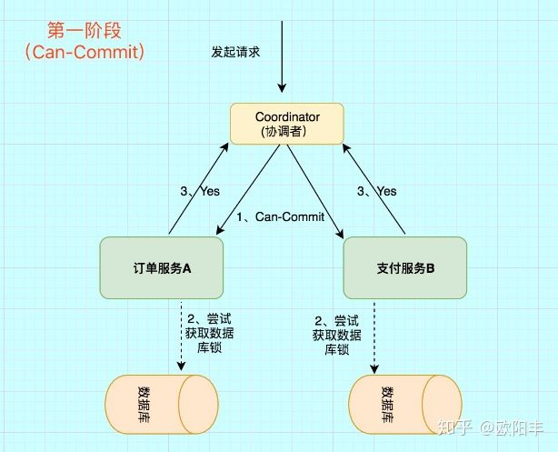

 

这阶段主要分为2步

* 事务询问 协调者 向 参与者 发送CanCommit请求。询问是否可以执行事务提交操作。然后开始等待 参与者 的响应。
* 响应反馈 参与者 接到CanCommit请求之后，正常情况下，如果其自身认为可以顺利执行事务，则返回Yes响应，并进入预备状态。否则反馈No
## 2、PreCommit阶段

　　在阶段一中，如果所有的参与者都返回Yes的话，那么就会进入PreCommit阶段进行事务预提交。这里的PreCommit阶段 跟上面的第一阶段是差不多的，只不过这里 协调者和参与者都引入了超时机制 （2PC中只有协调者可以超时，参与者没有超时机制）。

## 3、DoCommit阶段

　　这里跟2pc的阶段二是差不多的。

## 总结
相比较2PC而言，3PC对于协调者（Coordinator）和参与者（Partcipant）都设置了超时时间，而2PC只有协调者才拥有超时机制。这解决了一个什么问题呢？

　　这个优化点，主要是避免了参与者在长时间无法与协调者节点通讯（协调者挂掉了）的情况下，无法释放资源的问题，因为参与者自身拥有超时机制会在超时后，

　　自动进行本地commit从而进行释放资源。而这种机制也侧面降低了整个事务的阻塞时间和范围。

　　另外，通过CanCommit、PreCommit、DoCommit三个阶段的设计，相较于2PC而言，多设置了一个缓冲阶段保证了在最后提交阶段之前各参与节点的状态是一致的。

　　以上就是3PC相对于2PC的一个提高（相对缓解了2PC中的前两个问题），但是3PC依然没有完全解决数据不一致的问题。

 

 

3. 最终一致性（消息中间件） 

　　一般的思路是通过消息中间件来实现“最终一致性”，如图10-3所示。

    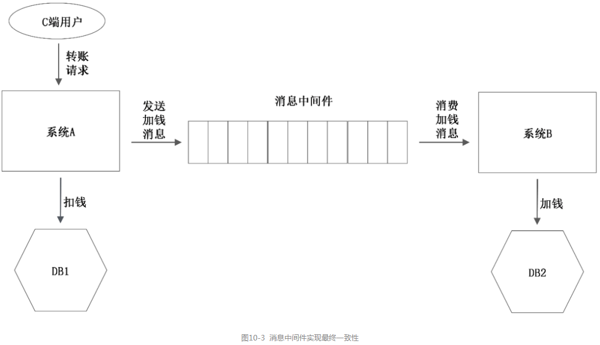

　　系统A收到用户的转账请求，系统A先自己扣钱，也就是更新DB1；然后通过消息中间件给系统B发送一条加钱的消息，系统B收到此消息，对自己的账号进行加钱，也就是更新DB2。

　这里面有一个关键的技术问题：

　　系统A给消息中间件发消息，是一次网络交互；更新DB1，也是一次网络交互。系统A是先更新DB1，后发送消息，还是先发送消息，后更新DB1？

　　假设先更新DB1成功，发送消息网络失败，重发又失败，怎么办？又假设先发送消息成功，更新DB1失败。消息已经发出去了，又不能撤回，怎么办？或者消息中间件提供了消息撤回的接口，但是又调用失败怎么办？

　　因为这是两次网络调用，两个操作不是原子的，无论谁先谁后，都是有问题的。

 

## 下面来看最终一致性的几种具体实现思路：

 　**a．最终一致性：错误的方案0**

　　有人可能会想，可以把“发送加钱消息”这个网络调用和更新DB1放在同一个事务里面，如果发送消息失败，更新DB自动回滚。这样不就可以保证两个操作的原子性了吗？ 

　　这个方案看似正确，其实是错误的，原因有两点： 

（1）网络的2将军问题：发送消息失败，发送方并不知道是消息中间件没有收到消息，还是消息已经收到了，只是返回response的时候失败了？

　　如果已经收到消息了，而发送端认为没有收到，执行update DB的回滚操作，则会导致账户A的钱没有扣，账户B的钱却被加了。

（2）把网络调用放在数据库事务里面，可能会因为网络的延时导致数据库长事务。严重的会阻塞整个数据库，风险很大。 

 

　**b．最终一致性：第1种实现方式（业务方自己实现**

　　假设消息中间件没有提供“事务消息”功能，比如用的是Kafka。该如何解决这个问题呢？

　　消息中间件实现最终一致性示意图如图10-4所示。

    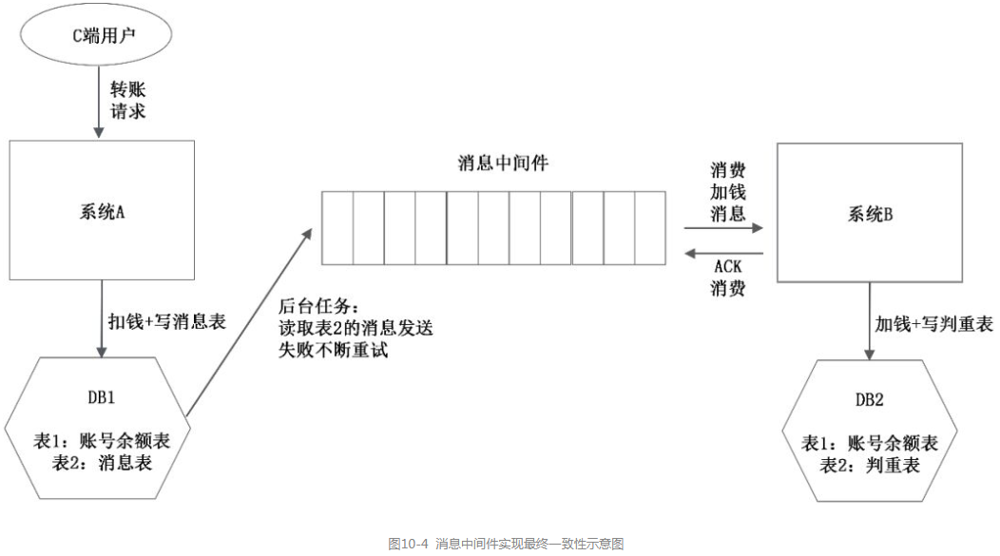

　　（1）系统A增加一张消息表，系统A不再直接给消息中间件发送消息，而是把消息写入到这张消息表中。把DB1的扣钱操作（表1）和写入消息表（表2）这两个操作放在一个数据库事务里，保证两者的原子性。 

　　（2）系统A准备一个后台程序，源源不断地把消息表中的消息传送给消息中间件。如果失败了，也不断尝试重传。因为网络的2将军问题，系统A发送给消息中间件的消息网络超时了，消息中间件可能已经收到了消息，也可能没有收到。系统A会再次发送该消息，直到消息中间件返回成功。所以，系统A允许消息重复，但消息不会丢失，顺序也不会打乱。

　　（3）通过上面的两个步骤，系统A保证了消息不丢失，但消息可能重复。系统B对消息的消费要解决下面两个问题：

　<font color=#DC143C size=7 face="黑体"> 问题1：丢失消费。系统B从消息中间件取出消息（此时还在内存里面），如果处理了一半，系统B宕机并再次重启，此时这条消息未处理成功，怎么办</font>

　　答案是通过消息中间件的ACK机制，凡是发送ACK的消息，系统B重启之后消息中间件不会再次推送；凡是没有发送ACK的消息，系统B重启之后消息中间件会再次推送。

　　但这又会引发一个新问题，就是下面问题2的重复消费：即使系统B把消息处理成功了，但是正要发送ACK的时候宕机了，消息中间件以为这条消息没有处理成功，系统B再次重启的时候又会收到这条消息，系统B就会重复消费这条消息（对应加钱类的场景，账号里面的钱就会加两次）

　<font color=#DC143C size=7 face="黑体">问题2：重复消费。除了ACK机制，可能会引起重复消费；系统A的后台任务也可能给消息中间件重复发送消息。</font>

 

　　为了解决重复消息的问题，系统B增加一个判重表。判重表记录了处理成功的消息ID和消息中间件对应的offset（以Kafka为例），系统B宕机重启，可以定位到offset位置，从这之后开始继续消费。 

　　每次接收到新消息，先通过判重表进行判重，实现业务的幂等。同样，对DB2的加钱操作和消息写入判重表两个操作，要在一个DB的事务里面完成。 

　　这里要补充的是，消息的判重不止判重表一种方法。如果业务本身就有业务数据，可以判断出消息是否重复了，就不需要判重表了。

　　通过上面三步，实现了消息在发送方的不丢失、在接收方的不重复，联合起来就是消息的不漏不重，严格实现了系统A和系统B的最终一致性。

 

　但这种方案有一个缺点：系统A需要增加消息表，同时还需要一个后台任务，不断扫描此消息表，会导致消息的处理和业务逻辑耦合，额外增加业务方的开发负担。

 

　**c．最终一致性：第二种实现方式（基于RocketMQ事务消息**

　　为了能通过消息中间件解决该问题，同时又不和业务耦合，RocketMQ提出了“事务消息”的概念，如图10-5所示。

 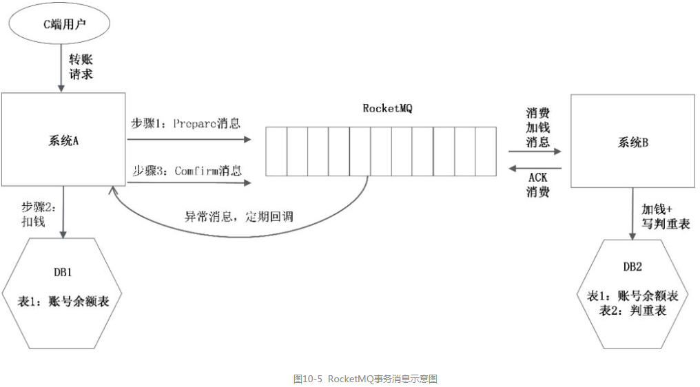

　RocketMQ不是提供一个单一的“发送”接口，而是把消息的发送拆成了两个阶段，Prepare阶段（消息预发送）和Confirm阶段（确认发送）。具体使用方法如下： 

　　步骤1：系统A调用Prepare接口，预发送消息。此时消息保存在消息中间件里，但消息中间件不会把消息给消费方消费，消息只是暂存在那。

　　步骤2：系统A更新数据库，进行扣钱操作。

　　步骤3：系统A调用Comfirm接口，确认发送消息。此时消息中间件才会把消息给消费方进行消费。

 

　显然，这里有两种异常场景： 

　　场景1：步骤1成功，步骤2成功，步骤3失败或超时，怎么处理？

　　场景2：步骤1成功，步骤2失败或超时，步骤3不会执行。怎么处理？

 　这就涉及RocketMQ的关键点：RocketMQ会定期（默认是1min）扫描所有的预发送但还没有确认的消息，回调给发送方，询问这条消息是要发出去，还是取消。发送方根据自己的业务数据，知道这条消息是应该发出去（DB更新成功了），还是应该取消（DB更新失败）。

　　对比最终一致性的两种实现方案会发现，RocketMQ最大的改变其实是把“扫描消息表”这件事不让业务方做，而是让消息中间件完成。 

　　至于消息表，其实还是没有省掉。因为消息中间件要询问发送方事物是否执行成功，还需要一个“变相的本地消息表”，记录事务执行状态和消息发送状态。

　　同时对于消费方，还是没有解决系统重启可能导致的重复消费问题，这只能由消费方解决。需要设计判重机制，实现消息消费的幂等。

 

　**d．人工介入**

　　无论方案1，还是方案2，发送端把消息成功放入了队列中，但如果消费端消费失败怎么办？

　　如果消费失败了，则可以重试，但还一直失败怎么办？是否要自动回滚整个流程？ 

　　答案是人工介入。从工程实践角度来讲，这种整个流程自动回滚的代价是非常巨大的，不但实现起来很复杂，还会引入新的问题。比如自动回滚失败，又如何处理？ 

　　对应这种发生概率极低的事件，采取人工处理会比实现一个高复杂的自动化回滚系统更加可靠，也更加简单。 

4. TCC　　

说起分布式事务的概念，不少人都会搞混淆，似乎好像分布式事务就是TCC。实际上TCC与2PC、3PC一样，只是分布式事务的一种实现方案而已。

TCC（Try-Confirm-Cancel）又称补偿事务。其核心思想是："针对每个操作都要注册一个与其对应的确认和补偿（撤销操作）"。它分为三个操作：

* Try阶段：主要是对业务系统做检测及资源预留。

* Confirm阶段：确认执行业务操作。

* Cancel阶段：取消执行业务操作。

　　2PC通常用来解决两个数据库之间的分布式事务问题，比较局限。现在企业采用的是各式各样的SOA服务，更需要解决两个服务之间的分布式事务问题。

　　为了解决SOA系统中的分布式事务问题，支付宝提出了TCC。TCC是Try、Confirm、Cancel三个单词的缩写，其实是一个应用层面的2PC协议，Confirm对应2PC中的事务提交操作，Cancel对应2PC中的事务回滚操作，如图10-6所示。

 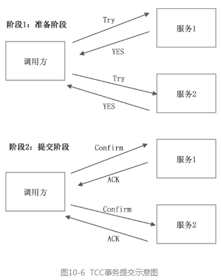

　（1）准备阶段：调用方调用所有服务方提供的Try接口，该阶段各调用方做资源检查和资源锁定，为接下来的阶段2做准备。

　（2）提交阶段：如果所有服务方都返回YES，则进入提交阶段，调用方调用各服务方的Confirm接口，各服务方进行事务提交。如果有一个服务方在阶段1返回NO或者超时了，则调用方调用各服务方的Cancel接口，如图10-7所示。

 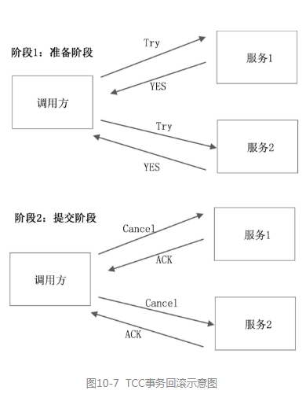

　　这里有一个关键问题：TCC既然也借鉴2PC的思路，那么它是如何解决2PC的问题的呢？也就是说，在阶段2，调用方发生宕机，或者某个服务超时了，如何处理呢？ 

　　答案是：不断重试！不管是Confirm失败了，还是Cancel失败了，都不断重试。这就要求Confirm和Cancel都必须是幂等操作。注意，这里的重试是由TCC的框架来执行的，而不是让业务方自己去做。

　　下面以一个转账的事件为例，来说明TCC的过程。假设有三个账号A、B、C，通过SOA提供的转账服务操作。A、B同时分别要向C转30元、50元，最后C的账号+80元，A、B各减30元、50元。

　　阶段1：分别对账号A、B、C执行Try操作，A、B、C三个账号在三个不同的SOA服务里面，也就是分别调用三个服务的Try接口。具体来说，就是账号A锁定30元，账号B锁定50元，检查账号C的合法性，比如账号C是否违法被冻结，账号C是否已注销。

　　所以，在这个场景里面，对应的“扣钱”的Try操作就是“锁定”，对应的“加钱”的Try操作就是检查账号合法性，为的是保证接下来的阶段2扣钱可扣、加钱可加！ 

　　阶段2：A、B、C的Try操作都成功，执行Confirm操作，即分别调用三个SOA服务的Confirm接口。A、B扣钱，C加钱。如果任意一个失败，则不断重试，直到成功为止。

　　从案例可以看出，Try操作主要是为了“保证业务操作的前置条件都得到满足”，然后在Confirm阶段，因为前置条件都满足了，所以可以不断重试保证成功。

 

　　TCC事务的处理流程与2PC两阶段提交类似，不过2PC通常都是在跨库的DB层面，而TCC本质上就是一个应用层面的2PC，需要通过业务逻辑来实现。这种分布式事务的实现方式的优势在于，可以**让应用自己定义数据库操作的粒度，使得降低锁冲突、提高吞吐量成为可能**。

 

　　而不足之处则在于对应用的侵入性非常强，业务逻辑的每个分支都需要实现try、confirm、cancel三个操作。此外，其实现难度也比较大，需要按照网络状态、系统故障等不同的失败原因实现不同的回滚策略。为了满足一致性的要求，confirm和cancel接口还必须实现幂等。

 

TCC的具体原理图如👇：

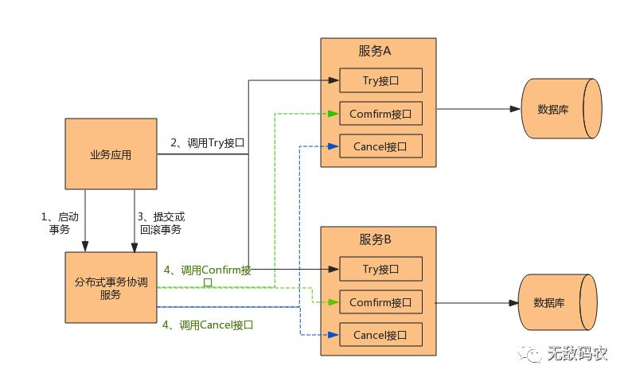


5. 事务状态表+调用方重试+接收方幂等

　　同样以转账为例，介绍一种类似于TCC的方法。TCC的方法通过TCC框架内部来做，下面介绍的方法是业务方自己实现的。

　　调用方维护一张事务状态表（或者说事务日志、日志流水），在每次调用之前，落盘一条事务流水，生成一个全局的事务ID。事务状态表的表结构如表1所示。 

　　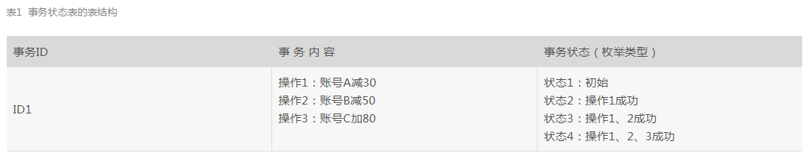

　　初始是状态1，每调用成功1个服务则更新1次状态，最后所有系统调用成功，状态更新到状态4，状态2、3是中间状态。当然，也可以不保存中间状态，只设置两个状态：Begin和End。事务开始之前的状态是Begin，全部结束之后的状态是End。如果某个事务一直停留在Begin状态，则说明该事务没有执行完毕。

　　然后有一个后台任务，扫描状态表，在过了某段时间后（假设1次事务执行成功通常最多花费30s），状态没有变为最终的状态4，说明这条事务没有执行成功。于是重新调用系统A、B、C。保证这条流水的最终状态是状态4（或End状态）。当然，系统A、B、C根据全局的事务ID做幂等操作，所以即使重复调用也没有关系。

补充说明：

　（1）如果后台任务重试多次仍然不能成功，要为状态表加一个Error状态，通过人工介入干预。

　（2）对于调用方的同步调用，如果部分成功，此时给客户端返回什么呢？

　　答案是不确定，或者说暂时未知。只能告诉用户该笔钱转账超时，请稍后再来确认。

　（3）对于同步调用，调用方调用A或B失败的时候，可以重试三次。如果重试三次还不成功，则放弃操作，再交由后台任务后续处理。

 

6 对账 

　　把上一节的方案扩展一下，岂止事务有状态，系统中的各种数据对象都有状态，或者说都有各自完整的生命周期，同时数据与数据之间存在着关联关系。我们可以很好地利用这种完整的生命周期和数据之间的关联关系，来实现系统的一致性，这就是“对账”。

　　在前面，我们把注意力都放在了“过程”中，而在“对账”的思路中，将把注意力转移到“结果”中。什么意思呢？

　　在前面的方案中，无论最终一致性，还是TCC、事务状态表，都是为了保证“过程的原子性”，也就是多个系统操作（或系统调用），要么全部成功，要么全部失败。

　　但所有的“过程”都必然产生“结果”，过程是我们所说的“事务”，结果就是业务数据。一个过程如果部分执行成功、部分执行失败，则意味着结果是不完整的。从结果也可以反推出过程出了问题，从而对数据进行修补，这就是“对账”的思路！

下面举几个对账的例子。

　　案例1：电商网站的订单履约系统。一张订单从“已支付”，到“下发给仓库”，到“出仓完成”。假定从“已支付”到“下发给仓库”最多用1个小时；从“下发给仓库”到“出仓完成”最多用8个小时。意味着只要发现1个订单的状态过了1个小时之后还处于“已支付”状态，就认为订单下发没有成功，需要重新下发，也就是“重试”。同样，只要发现订单过了8个小时还未出仓，这时可能会发出报警，仓库的作业系统是否出了问题……诸如此类。

　　这个案例跟事务的状态很类似：一旦发现系统中的某个数据对象过了一个限定时间生命周期仍然没有走完，仍然处在某个中间状态，就说明系统不一致了，要进行某种补偿操作（比如重试或报警）。

　　更复杂一点：订单有状态，库存系统的库存也有状态，优惠系统的优惠券也有状态，根据业务规则，这些状态之间进行比对，就能发现系统某个地方不一致，做相应的补偿。

　　案例2：微博的关注关系。需要存两张表，一张是关注表，一张是粉丝表，这两张表各自都是分库分表的。假设A关注了B，需要先以A为主键进行分库，存入关注表；再以B为主键进行分库，存入粉丝表。也就是说，一次业务操作，要向两个数据库中写入两条数据，如何保证原子性？

　　案例3：电商的订单系统也是分库分表的。订单通常有两个常用的查询维度，一个是买家，一个是卖家。如果按买家分库，按卖家查询就不好做；如果按卖家分库，按买家查询就不好做。这种通常会把订单数据冗余一份，按买家进行分库分表存一份，按卖家再分库分表存一份。和案例2存在同样的问题：一个订单要向两个数据库中写入两条数据，如何保证原子性？

　　如果把案例2、案例3的问题看作为一个分布式事务的话，可以用最终一致性、TCC、事务状态表去实现，但这些方法都太重，一个简单的方法是“对账”。

　　因为两个库的数据是冗余的，可以先保证一个库的数据是准确的，以该库为基准校对另外一个库。

对账又分为全量对账和增量对账：

　（1）全量对账。比如每天晚上运作一个定时任务，比对两个数据库。

　（2）增量对账。可以是一个定时任务，基于数据库的更新时间；也可以基于消息中间件，每一次业务操作都抛出一个消息到消息中间件，然后由一个消费者消费这条消息，对两个数据库中的数据进行比对（当然，消息可能丢失，无法百分之百地保证，还是需要全量对账来兜底）。

　　总之，对账的关键是要找出“数据背后的数学规律”。有些规律比较直接，谁都能看出来，比如案例2、案例3的冗余数据库；有些规律隐含一些，比如案例1的订单履约的状态。找到了规律就可以基于规律进行数据的比对，发现问题，然后补偿。

 

7. 妥协方案：弱一致性+基于状态的补偿

　可以发现：

　　“最终一致性”是一种异步的方法，数据有一定延迟；

　　TCC是一种同步方法，但TCC需要两个阶段，性能损耗较大；

　　事务状态表也是一种同步方法，但每次要记事务流水，要更新事务状态，很烦琐，性能也有损耗；

　　“对账”也是一个事后过程。

　如果需要一个同步的方案，既要让系统之间保持一致性，又要有很高的性能，支持高并发，应该怎么处理呢？

　　如图10-8所示，电商网站的下单至少需要两个操作：创建订单和扣库存。订单系统有订单的数据库和服务，库存系统有库存的数据库和服务。先创建订单，后扣库存，可能会创建订单成功，扣库存失败；反过来，先扣库存，后创建订单，可能会扣库存成功，创建订单失败。如何保证创建订单 + 扣库存两个操作的原子性，同时还要能抵抗线上的高并发流量？

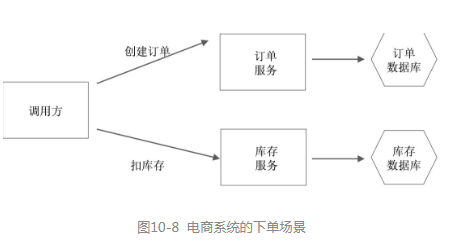
 

　　如果用最终一致性方案，因为是异步操作，如果库存扣减不及时会导致超卖，因此最终一致性的方案不可行；如果用TCC方案，则意味着一个用户请求要调用两次（Try和Confirm）订单服务、两次（Try和Confirm）库存服务，性能又达不到要求。如果用事务状态表，要写事务状态，也存在性能问题。 

　　既要满足高并发，又要达到一致性，鱼和熊掌不能兼得。可以利用业务的特性，采用一种弱一致的方案。

　　对于该需求，有一个关键特性：对于电商的购物来讲，允许少卖，但不能超卖。比如有100件东西，卖给99个人，有1件没有卖出去，这是可以接受的；但如果卖给了101个人，其中1个人拿不到货，平台违约，这就不能接受。而该处就利用了这个特性，具体做法如下。

 

　**方案1：先扣库存，后创建订单**。

　　如表2所示，有三种情况：

　　（1）扣库存成功，提交订单成功，返回成功。

　　（2）扣库存成功，提交订单失败，返回失败，调用方重试（此处可能会多扣库存）。

　　（3）扣库存失败，不再提交订单，返回失败，调用方重试（此处可能会多扣库存）。 

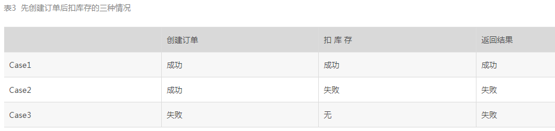
　

　**方案2：先创建订单，后扣库存**。

　　如表3所示，也有三种情况：

　　（1）提交订单成功，扣库存成功，返回成功。

　　（2）提交订单成功，扣库存失败，返回失败，调用方重试（此处可能会多扣库存）。

　　（3）提交订单失败，不再扣库存，调用方重试。

 

　　无论方案1，还是方案2，只要最终保证库存可以多扣，不能少扣即可。 

　　但是，库存多扣了，数据不一致，怎么补偿呢？

　　库存每扣一次，都会生成一条流水记录。这条记录的初始状态是“占用”，等订单支付成功后，会把状态改成“释放”。

　　对于那些过了很长时间一直是占用，而不释放的库存，要么是因为前面多扣造成的，要么是因为用户下了单但没有支付。 

　　通过比对，得到库存系统的“占用又没有释放的库存流水”与订单系统的未支付的订单，就可以回收这些库存，同时把对应的订单取消。类似12306网站，过一定时间不支付，订单会取消，将库存释放。

 

8. 妥协方案：重试+回滚+报警+人工修复 

　　上文介绍了基于订单的状态 +库存流水的状态做补偿（或者说叫对账）。如果业务很复杂，状态的维护也很复杂，就可以采用下面这种更加妥协而简单的方法。

　　按方案1，先扣库存，后创建订单。不做状态补偿，为库存系统提供一个回滚接口。创建订单如果失败了，先重试。如果重试还不成功，则回滚库存的扣减。如回滚也失败，则发报警，进行人工干预修复。

　　总之，根据业务逻辑，通过三次重试或回滚的方法，最大限度地保证一致。实在不一致，就发报警，让人工干预。只要日志流水记录得完整，人工肯定可以修复！通常只要业务逻辑本身没问题，重试、回滚之后还失败的概率会比较低，所以这种办法虽然丑陋，但很实用。

 

9. 总结

 　　本章总结了实践中比较可靠的七种方法：两种最终一致性的方案，两种妥协办法，两种基于状态 + 重试 + 幂等的方法（TCC，状态机+重试+幂等），还有一种对账方法。

　　在实现层面，妥协和对账的办法最容易，最终一致性次之，TCC最复杂。


原文：https://blog.csdn.net/uxiAD7442KMy1X86DtM3/article/details/88968532
