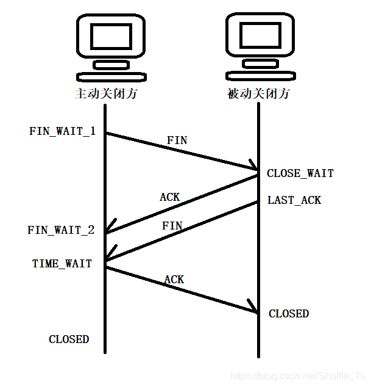

# URL
  - https://blog.csdn.net/Shuffle_Ts/article/details/93909003

大家都知道TCP是全双工的，再建立连接时的三次握手中的SYN和ACK一起发送，这里就会有疑问，为什么在四次挥手的时候没有将SYN和ACK一起发送呢？带着这个问题继续向下看，答案就在其中。
  说到四次挥手，顾名思义，就是在关闭连接的时候双方一共要操作四次，来看一下这四次都是怎么操作的：

  从图中可以看出来，在四次挥手的时候双方一共进入了六种状态，这六种状态就是理解四次挥手的关键所在，我们来看一下

# 四次挥手的状态
1. FIN_WAIT_1:这个状态和FIN_WAIT_2状态都在再等待对方的回复，但是这两种状态是有区别的,FIN_WAIT_1就是主动方在ESTABLISHED状态的时候，想要主动关闭连接，向对方发送FIN报文，这时候就进入了FIN_WAIT_1状态。当他收到对方回复的ACK报文后，就进入了FIN_WAIT_2状态。 但是在实际操作中是很难遇到FIN_WAIT_1状态的，因为无论对方是什么情况都应该立刻回应ACK报文，但是FIN_WAIT_2状态还是可以在主动方中用netstat看到的。

2. FIN_WAIT_2：上面已经对FIN_WAIT_2讲解过了，当主动方进入FIN_WAIT_2时，就表示着半连接状态，也就是主动方还有数据要发给对方，这个数据就是之后的ACK，所有他要等一会儿才关闭连接。

3. CLOSE_WAIT：这个状态从表面也可以看出它的作用，就是等待关闭。当被动方接收到FIN时，会立刻回复一个ACK给对方，接下来就是进入CLOSE_WAIT状态。在这个状态中，被动方需要考虑自己还有没有数据要发送给对方，如果有可以继续发送，如果没有了就可以关闭连接了，发送一个FIN给对方。 这个状态其实也就是给自己一个缓冲的时间，让自己处理完需要处理的事，然后去关闭连接。

4. TIME_WAIT：这个状态就是一段时间后进行一些操作。当主动方收到了对方发来的FIN报文，并发出ACK报文，接下来就等2MSL就可以进入CLOSED状态了。其实，如果主动方在FIN_WAIT_1状态下，收到了对方的FIN+ACK标志的报文，就可以跳过FIN_WAIT_2状态直接进入TIME_WAIT状态了。

5. LAST_ACK：这个状态从表面不难不理解他的意思，这个状态就是被动方发送了FIN报文后，最后等待对方的ACK报文，收到ACK报文后就可以进入CLOSED状态了。

6. CLOSED：上面提到了几次这个状态，相比也猜出来了，这个状态表示的就是连接中断，已经关闭。

  在上面的TIME_WAIT状态中有提到过2MSL，那么什么是2MSL呢？那么来详细说一下TIME_WAIT状态和里面的2MSL。

为什么需要TIME_WAIT?
  TIME_WAIT在四次挥手中有着不可替代的位置，如果没有TIME-WAIT，主动方就会直接进入CLOSED状态，（假设主动方时客户端，被动方时服务端）这时候如果立即重启客户端使用相同的端口，如果因为网络中种种原因最后一次ACK丢失了，服务端就会重复FIN请求，这时这个FIN就会被重新启动的客户端接收到，或者新启动的客户端向服务端发起请求的时候，因为服务端正在等待最后一次ACK，因此新连接请求发送的SYN就会被服务端认为时请求码错误，服务端就会回复RET重置连接。所以就需要主动方发送最后一次ACK之后进入TIME_WAIT状态，等待2MSL（两个报文最大生命周期），等待这段时间就是为了如果接收到了重发的FIN请求能够进行最后一次ACK回复，让在网络中延迟的FIN/ACK数据都消失在网络中，不会对后续连接造成影响

那么为什么TIME_WAIT的时间是2MSL呢？
  MSL是TCP报文的最大生命周期，因为TIME_WAIT持续在2MSL就可以保证在两个传输方向上的尚未接收到或者迟到的报文段已经消失，否则服务器立即重启，可能会收到来自上一个进程迟到的数据，但是这种数据很可能是错误的，同时也是在理论上保证最后一个报文可靠到达，假设最后一个ACK丢失，那么服务器会再重发一个FIN，这是虽然客户端的进程不在了，但是TCP连接还在，仍然可以重发LAST_ACK。
————————————————
版权声明：本文为CSDN博主「哆啦A熊」的原创文章，遵循 CC 4.0 BY-SA 版权协议，转载请附上原文出处链接及本声明。
原文链接：https://blog.csdn.net/Shuffle_Ts/java/article/details/93909003