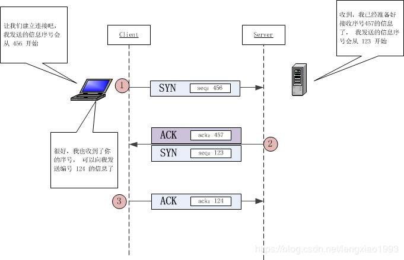

# URL
  - https://blog.csdn.net/lengxiao1993/article/details/82771768


# 大部分网络博客的错误解读
首先需要声明的是， 百度搜索到的大部分网络博客关于这个问题的解答都是不清晰或者不准确的。 讨论这个问题的大部分博客都会引用《计算机网络》的内容：

+ 1 防止已失效的连接请求又传送到服务器端，因而产生错误
不幸的是， 这种解释是不准确的， TCP 采用三次握手的原因其实非常简单， 远没有大部分博客所描述的那样云山雾绕。

这里先给出结论：

````
* 为了实现可靠数据传输， TCP 协议的通信双方， 都必须维护一个序列号， 以标识发送出去的数据包中， 哪些是已经被对方收到的。 三次握手的过程即是通信双方相互告知序列号起始值， 并确认对方已经收到了序列号起始值的必经步骤

* 如果只是两次握手， 至多只有连接发起方的起始序列号能被确认， 另一方选择的序列号则得不到确认
先修知识
````

# TCP 通信流程
# TCP 的通信流程


上图中的每一个箭头都代表着一次 TCP数据包的发送

* 需要注意的是， 上图中出现的 ACK = x +1 的写法很容易让人误以为数据包中的 ACK 域的数据值被填成了 y+1 。 ACK = x+1 的实际含义是：
** TCP 包的 ACK 标志位（1 bit） 被置成了 1
** TCP 包的确认号（acknowledgement number ） 的值为 x+1
* 类似的， TCP 数据包中的 SYN 标志位， 也容易与序号（sequence number） 混淆， 这点需要读者注意
TCP 数据包结构图


# 为什么 TCP 需要握手这个操作
在解答为什么 TCP 需要三次握手， 而不是两次之前， 首先需要回答的问题是:

* 为什么需要握手这个操作， 能不能不握手？
如果读者对比一下 UDP 的通信流程和 TCP 的通信流程， 可以发现， 在 UDP 协议中， 是没有握手这个操作的。


这里就引出了 TCP 与 UDP 的一个基本区别， TCP 是可靠通信协议， 而 UDP 是不可靠通信协议。

* TCP 的可靠性含义： 接收方收到的数据是完整， 有序， 无差错的。
* UDP 不可靠性含义： 接收方接收到的数据可能存在部分丢失， 顺序也不一定能保证。

UDP 和 TCP 协议都是基于同样的互联网基础设施， 且都基于 IP 协议实现， 互联网基础设施中对于数据包的发送过程是会发生丢包现象的， 为什么 TCP 就可以实现可靠传输， 而 UDP 不行？

TCP 协议为了实现可靠传输， 通信双方需要判断自己已经发送的数据包是否都被接收方收到， 如果没收到， 就需要重发。 为了实现这个需求， 很自然地就会引出**序号（sequence number）** 和 **确认号（acknowledgement number）** 的使用。

发送方在发送数据包（假设大小为 10 byte）时， 同时送上一个序号( 假设为 500)，那么接收方收到这个数据包以后， 就可以回复一个确认号（510 = 500 + 10） 告诉发送方 “我已经收到了你的数据包， 你可以发送下一个数据包， 序号从 510 开始” 。

这样发送方就可以知道哪些数据被接收到，哪些数据没被接收到， 需要重发。

# 为什么需要三次握手，而非两次
正如上文所描述的，为了实现可靠传输，发送方和接收方始终需要同步( SYNchronize )序号。 需要注意的是， 序号并不是从 0 开始的， 而是由发送方随机选择的初始序列号 ( Initial Sequence Number, ISN )开始 。 由于 TCP 是一个双向通信协议， 通信双方都有能力发送信息， 并接收响应。 因此， 通信双方都需要随机产生一个初始的序列号， 并且把这个起始值告诉对方。

于是， 这个过程就变成了下面这样。



下面这个流程图描述的和上面一样， 但是更加清楚的展示了 TCP 数据包标志位， 以及数据域的命名来源。


* 补充知识： 有一位读者关注到了三次握手中， 序列号变化的问题， 让笔者临时想起了曾经困扰自己的一个问题：

为什么三次握手最后一次握手中， 在上面的示意图中回复的 seq = x+1 而不是 x+2
答案：


