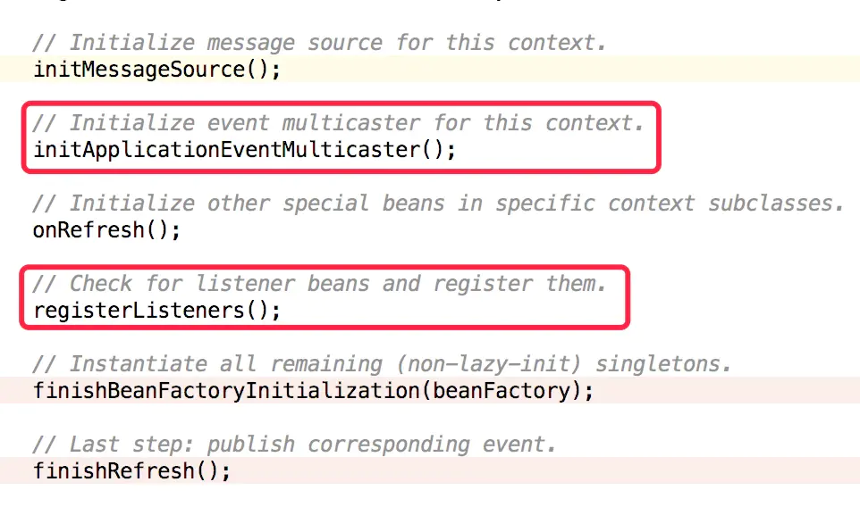
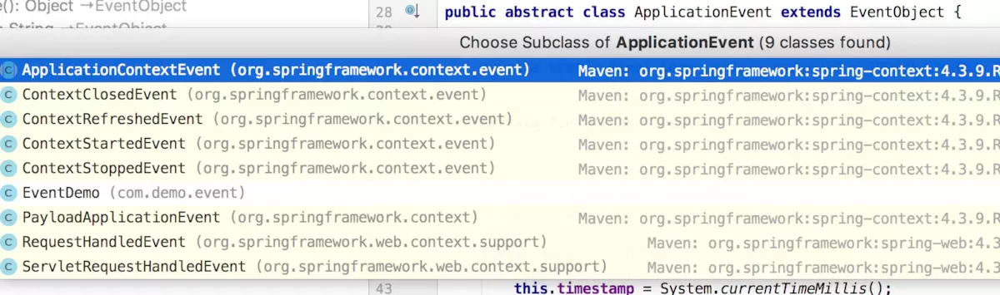
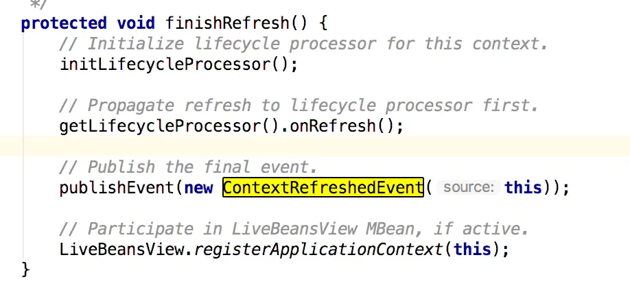
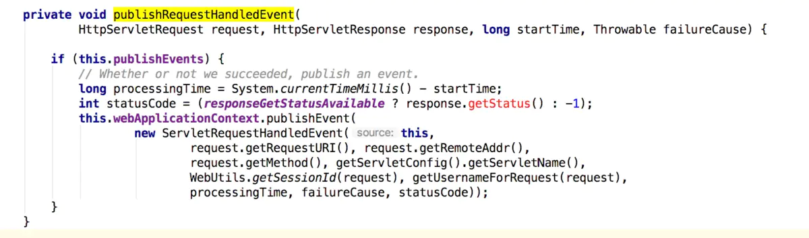
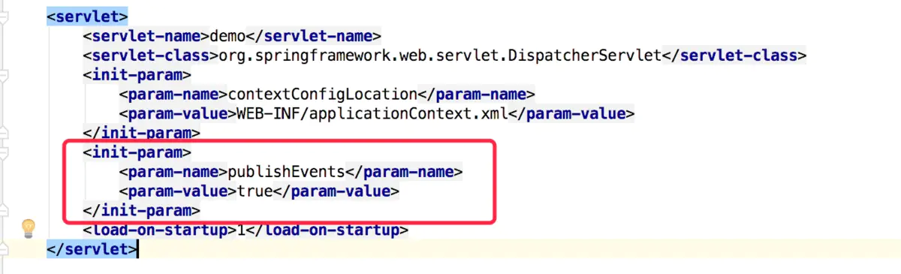
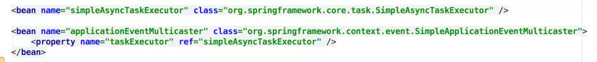

# URL
  - 
  

Spring Event事件通知机制 源码学习

jwfy
  

笔记简述
本学习笔记主要是介绍Spring中的事件通知是如何实现的，同步和异步事件通知的用法和实现细节以及Spring提供的常见的Event，如果实际开发中需要根据事件推送完成相应的功能，该如何选择Event
Spring更多可查看Spring 源码学习

目录

Spring Event事件通知机制 源码学习
1、监听者模式
2、DEMO(同步)
3、Spring实现细节
4、Spring Event
4.1 ContextRefreshedEvent
4.2 ServletRequestHandledEvent
5、异步Pushlish以及DEMO

1、监听者模式
学习spring的事件通知机制肯定要先了解监听者模式（监听者模式和观察者模式有什么区别？）

监听者模式包含了一个监听者Listener与之对应的事件Event，还有一个事件发布者EventPublish，过程就是EventPublish发布一个事件，被监听者捕获到，然后执行事件相应的方法

观察者模式是一对多的模式，一个被观察者Observable和多个观察者Observer，被观察者中存储了所有的观察者对象，当被观察者接收到一个外界的消息，就会遍历广播推算消息给所有的观察者
例如日常生活中的订阅报纸，报纸老板A，现在小明和老板打招呼说我要订报纸（这个过程就相当于观察者的注册），老板A就会拿出自己的小本本记下小明，下次小王、小芳也是类似的操作，现在老板A就有了三个观察者了，然后老板会自动的把报纸送到三位的家里，突然有一天小明说不想订报纸了，老板就在自己的小本本上划掉小明的名字（观察者的取消注册），等到送报纸的时候就不再送到小明家里。

2、DEMO(同步)
事件定义

````
public class EventDemo extends ApplicationEvent {
    private String message;
    public EventDemo(Object source, String message) {
        super(source);
        this.message = message;
    }

    public String getMessage() {
        return message;
    }
}
````

事件监听者

````
@Component
public class EventDemoListern implements ApplicationListener<EventDemo> {

    @Override
    public void onApplicationEvent(EventDemo event) {
        System.out.println("receiver " + event.getMessage());
    }
}
````

事件发布

````
@Component
public class EventDemoPublish {

    @Autowired
    private ApplicationEventPublisher applicationEventPublisher;

    public void publish(String message){
        EventDemo demo = new EventDemo(this, message);
        applicationEventPublisher.publishEvent(demo);
    }

}
````

最后获取到EventDemoPublish这个bean，直接publish就可以完成操作了。

3、Spring实现细节
在spring中由于类的细节太多，参数方法也非常的多，不太建议通篇的一个一个看，优先关注我们关注的点，然后打断点的方式具体了解需要的参数和必备的方法等

在AbstractApplicationContext类就有publishEvent()方法，先分析下。

````
protected void publishEvent(Object event, ResolvableType eventType) {
    Assert.notNull(event, "Event must not be null");
    if (logger.isTraceEnabled()) {
        logger.trace("Publishing event in " + getDisplayName() + ": " + event);
    }

    ApplicationEvent applicationEvent;
    if (event instanceof ApplicationEvent) {
           // 如果是ApplicationEvent对象
        applicationEvent = (ApplicationEvent) event;
    }
    else {
        applicationEvent = new PayloadApplicationEvent<Object>(this, event);
        if (eventType == null) {
            eventType = ((PayloadApplicationEvent)applicationEvent).getResolvableType();
        }
        // 否则就包装为PayloadApplicationEvent时间，并获取对应的事件类型
    }

    if (this.earlyApplicationEvents != null) {
           //初始化时候的事件容器，默认为null的
        this.earlyApplicationEvents.add(applicationEvent);
    }
    else {
        getApplicationEventMulticaster().multicastEvent(applicationEvent, eventType);
        //  监听者容器？大概的就这个意思，推送消息给监听器
    }

    // 如果当前命名空间还有父亲节点，也需要给父亲推送该消息
    if (this.parent != null) {
        if (this.parent instanceof AbstractApplicationContext) {
            ((AbstractApplicationContext) this.parent).publishEvent(event, eventType);
        }
        else {
            this.parent.publishEvent(event);
        }
    }
}

ApplicationEventMulticaster getApplicationEventMulticaster() throws IllegalStateException {
    if (this.applicationEventMulticaster == null) {
           // 意味着肯定需要提前初始化这个监听器容器
        throw new IllegalStateException("ApplicationEventMulticaster not initialized - " +
                "call 'refresh' before multicasting events via the context: " + this);
    }
    return this.applicationEventMulticaster;
}
````

通过分析，又回到了refresh这个核心函数中




````
public static final String APPLICATION_EVENT_MULTICASTER_BEAN_NAME = "applicationEventMulticaster";

// 初始化监听器容器
protected void initApplicationEventMulticaster() {
    ConfigurableListableBeanFactory beanFactory = getBeanFactory();
    if (beanFactory.containsLocalBean(APPLICATION_EVENT_MULTICASTER_BEAN_NAME)) {
           // 手动实现了名称为applicationEventMulticaster的bean
        this.applicationEventMulticaster =
                beanFactory.getBean(APPLICATION_EVENT_MULTICASTER_BEAN_NAME, ApplicationEventMulticaster.class);
        // 还必须得是ApplicationEventMulticaster类
        if (logger.isDebugEnabled()) {
            logger.debug("Using ApplicationEventMulticaster [" + this.applicationEventMulticaster + "]");
        }
    }
    else {
           // 否则就默认自定义一个名称为SimpleApplicationEventMulticaster的监听器容器
        this.applicationEventMulticaster = new SimpleApplicationEventMulticaster(beanFactory);
        beanFactory.registerSingleton(APPLICATION_EVENT_MULTICASTER_BEAN_NAME, this.applicationEventMulticaster);
        if (logger.isDebugEnabled()) {
            logger.debug("Unable to locate ApplicationEventMulticaster with name '" +
                    APPLICATION_EVENT_MULTICASTER_BEAN_NAME +
                    "': using default [" + this.applicationEventMulticaster + "]");
        }
    }
}


private final Set<ApplicationListener<?>> applicationListeners = new LinkedHashSet<ApplicationListener<?>>();
// 默认是一个空列表，而不是null

// 注册监听器，并且加入到监听器容器中
protected void registerListeners() {
    // Register statically specified listeners first.
    for (ApplicationListener<?> listener : getApplicationListeners()) {
        getApplicationEventMulticaster().addApplicationListener(listener);
        // 把提前存储好的监听器添加到监听器容器中
    }

    String[] listenerBeanNames = getBeanNamesForType(ApplicationListener.class, true, false);
    // 获取类型是ApplicationListener的beanName集合，此处不会去实例化bean
    for (String listenerBeanName : listenerBeanNames) {
        getApplicationEventMulticaster().addApplicationListenerBean(listenerBeanName);
    }
    
    Set<ApplicationEvent> earlyEventsToProcess = this.earlyApplicationEvents;
    this.earlyApplicationEvents = null;
    // 初始化事件为null
    if (earlyEventsToProcess != null) {
        for (ApplicationEvent earlyEvent : earlyEventsToProcess) {
            getApplicationEventMulticaster().multicastEvent(earlyEvent);
        }
    }
}
````

这样就很清楚了，在spring进行refresh的时候就完成了监听器容器和监听器的初始化工作（可以很方便的注册自己需要的监听器或者自定义的监听器容器对象），只需要获取到容器就可以直接publish事件了。

4、Spring Event
前面已经说了监听器一般和具体的某一个事件绑定的（这点就和观察者模式非常不一样了），那么就来看看spring已经帮我们实现了哪些Event，具体如下图



````
ApplicationContextEvent(Context...的抽象类)
ContextClosedEvent 生命周期关闭
ContextRefreshedEvent refresh完成
ContextStartedEvent 生命周期启动
ContextStoppedEvent 生命周期停止
PayloadApplicationEvent
RequestHandledEvent
````

ServletRequestHandledEvent RequestHandledEvent的子类，Spring MVC 请求完成之后推送的事件
下面就ContextRefreshedEvent和ServletRequestHandledEvent具体分析下如何使用以及其实现的原理

4.1 ContextRefreshedEvent



在refresh结束之后推送的一个事件，这个时候大部分bean的实例化已经完成了，并且传递了this这个数据，那么如果有需要的话，可以在这个地方实现对Spring上下文数据的统计或者监控，简直不能爽歪歪，但是个人开发目前还没遇到具体的使用场景

4.2 ServletRequestHandledEvent
Spring MVC 中的事件，直接跳到DispatcherServlet类，后来到了FrameworkServlet 抽象类



如果可以推送事件的话，则利用web的上下文推送事件，其中包含了一个请求的基本信息，如果需要定制化统计整个HTTP请求的情况，完全可以通过这个事件推送实现

不过这里有一点需要注意到，还有个publishEvents字段，如果需要使用，需要设置为true，如下图web.xml配置即可



5、异步Pushlish以及DEMO
异步推送采用的是多线程的方法，具体看SimpleApplicationEventMulticaster类，也就是上面说的监听器容器

````
public void multicastEvent(final ApplicationEvent event, ResolvableType eventType) {
    ResolvableType type = (eventType != null ? eventType : resolveDefaultEventType(event));
    for (final ApplicationListener<?> listener : getApplicationListeners(event, type)) {
           // 获取符合事件类型的监听器集合
        Executor executor = getTaskExecutor();
        if (executor != null) {
              // 如果线程池不为null，则提交一个新任务交由线程池运行
            executor.execute(new Runnable() {
                @Override
                public void run() {
                    invokeListener(listener, event);
                }
            });
        }
        else {
              // 否则就是同步执行
            invokeListener(listener, event);
        }
    }
}

protected void invokeListener(ApplicationListener listener, ApplicationEvent event) {
    ErrorHandler errorHandler = getErrorHandler();
    if (errorHandler != null) {
          // 错误处理器不为null
        try {
            listener.onApplicationEvent(event);
        }
        catch (Throwable err) {
            errorHandler.handleError(err);
            // 当推送消息出现异常，利用错误处理器去处理该错误
        }
    }
    else {
        try {
            listener.onApplicationEvent(event);
        }
        catch (ClassCastException ex) {
            String msg = ex.getMessage();
            if (msg == null || msg.startsWith(event.getClass().getName())) {
                // Possibly a lambda-defined listener which we could not resolve the generic event type for
                Log logger = LogFactory.getLog(getClass());
                if (logger.isDebugEnabled()) {
                    logger.debug("Non-matching event type for listener: " + listener, ex);
                }
            }
            else {
                throw ex;
            }
        }
    }
}
````

注入一个线程池可实现异步处理
使用errorHandler可以做到最后的事件处理的兜底方案
那么问题来了，如何注入一个线程池呢？往哪里注入呢？

只需要手动实现applicationEventMulticaster的bean，并且利用Set注入的方法注入了一个线程池，线程池也需要实例化，就直接使用了spring自带的简单异步任务线程池



从同步改成异步，代码不需要修改，直接注入这么一个bean即可（当然了XML配置和Config配置均可）

本人微信公众号（搜索jwfy）欢迎关注