# URL
  - https://sowhat.blog.csdn.net/article/details/105000051
  ````
  ````
  
  
#  全网最强HashMap讲解


高清思维导图已同步Git：https://github.com/SoWhat1412/xmindfile，关注公众号sowhat1412获取海量资源

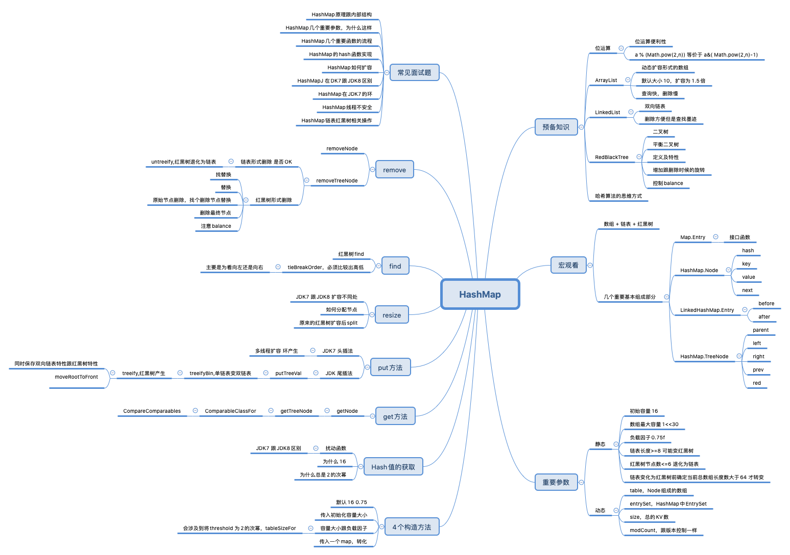

## 预备知识
### 位运算知识

位运算操作是由处理器支持的底层操作，底层硬件只支持01这样的数字，因此位运算运行速度很快。尽管现代计算机处理器拥有了更长的指令流水线和更优的架构设计，使得加法和乘法运算几乎与位运算一样快，但是位运算消耗更少的资源。常用的位运算如下：

 ````
位与 &
(1&1=1 1&0=0 0&0=0)

位或 |
(1|1=1 1|0=1 0|0=0)

位非 ~
（ ~1=0 ~0=1）

位异或 ^
(1^1=0 1^0=1 0^0=0)

有符号右移 >>
在执行右移操作时，若参与运算的数字为正数，则在高位补0；若为负数，则在高位补1。

无符号右移 >>>
无论参与运算的数字为正数或为负数，在执运算时，都会在高位补0。

左移
对于左移是没有正数跟负数这一说的，因为负数在CPU中是以补码的形式存储的，对于正数左移相当于乘以2的N次幂。

 ````

敲重点：上面的重重都是简单的只是为了引出下面的结论：

 ````
a % (Math.pow(2,n)) 等价于 a&( Math.pow(2,n)-1)
 ````


比如a%16最终的结果一定是0～15之间的数字，而a&1111正好把a除16后的余数有效的现实出来了因为如果是1 1111这样的话最前面一位其实代表的16，也就是说二进制从倒数第五位开始只要出现了1那绝对代表的是16的倍数。
结论：位运算比除法运算在运行效率上更高，对一个数取余尽量用a&二进制数这样可以更好的提速。

### ArrayList

我们知道ArrayList是一个数组队列，相当于动态数组。与Java中的基本数组相比，它的容量能动态增长。它具有以下几个重点。

 ````
ArrayList 实际上是通过一个数组去保存数据的。当我们构造ArrayList时；若使用默认构造函数，则ArrayList的默认容量大小JDK7=10，JDK8=0。
当ArrayList容量不足以容纳全部元素时，ArrayList会重新设置容量：原来容量的1.5倍。
ArrayList的克隆函数，即是将全部元素克隆到一个数组中。
克隆的底层是System.arraycopy(0,oldsrc,0,newsrc,length);
ArrayList实现java.io.Serializable的方式。当写入到输出流时，先写入“容量”，再依次写入“每一个元素”；当读出输入流时，先读取“容量”，再依次读取“每一个元素”。
ArrayList是线程不安全的，可以用Vector实现线程安全级别的动态数组 初始值为10，扩容为2倍，底层用synchronized实现的！
 ````

优点：

 ````
根据下标遍历元素效率较高。
根据下标访问元素效率较高。
在数组的基础上封装了对元素操作的方法。
这样的动态数组在内地地址上是空间连续的。
 ````可以自动扩容。


缺点：

 ````
插入和删除的效率比较低。
根据内容查找元素的效率较低。
扩容规则：每次扩容现有容量的50%。
 ````

### LinkedList

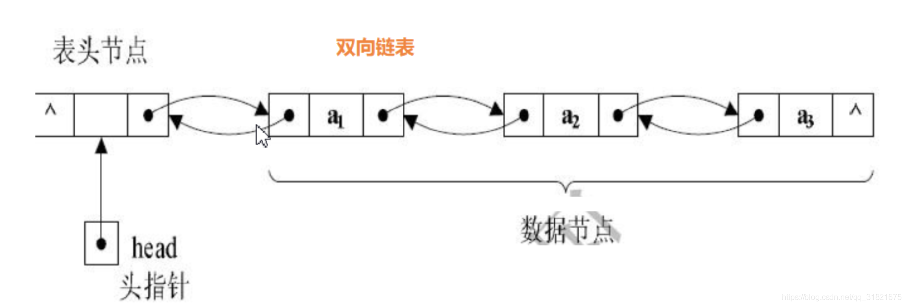

双向链表每一个节点包含三部分(data,prev,next)，它不要求空间是连续的。类似于节点跟节点之间通过前后两条线串联起来的。

ArrayList和LinkedList总结：

````
ArrayList是实现了基于动态数组的数据结构，LinkedList是基于链表结构。
对于随机访问的get和set方法，ArrayList要优于LinkedList，因为LinkedList要移动指针。
对于新增和删除操作add和remove，LinkedList比较占优势，因为ArrayList要移动数据。
ArrayList使用在查询比较多，但是插入和删除比较少的情况，而LinkedList用在查询比较少而插入删除比较多的情况
````

### RedBlackTree

首先你需要对二叉树有个了解，知道这是什么样子的一个数据组合方式，然后知道二叉树查找的时候缺点，可能发生数据倾斜。因此引入了平衡二叉树，平衡二叉树的左右节点深度之差不会超过1，查找方便构建麻烦，因此又出现了红黑树。红黑树是一种平衡的二叉查找树，是一种计算机科学中常用的数据结构，最典型的应用是实现数据的关联，例如map等数据结构的实现，红黑树重要特性是( 左节点 < 根节点 < 右节点)
红黑树有以下限制：

````
节点必须是红色或者是黑色
根节点是黑色的
所有的叶子节点是黑色的。
每个红色节点的两个子节点是黑色的，也就是不能存在父子两个节点全是红色
从任意每个节点到其每个叶子节点的所有简单路径上黑色节点的数量是相同的。
如果您对红黑树还不太了解推荐看下博主以前写的RBT
````


### HashTable
Hash表是一种特殊的数据结构，它同数组、链表以及二叉排序树等相比较有很明显的区别，它能够快速定位到想要查找的记录，而不是与表中存在的记录的关键字进行比较来进行查找。这个源于Hash表设计的特殊性，它采用了函数映射的思想将记录的存储位置与记录的关键字关联起来，从而能够很快速地进行查找。评价函数的性能关键在于装填因子，以及如何合理的解决哈希冲突，具体的可看博主以前写的彻底搞定哈希表

### HashMap源码剖析
### 概述

通常具备前面一些知识点的铺垫就可以很好的开展HashMap的讲解了，既然ArrayList，LinkedList，Red Black Tree各有优缺点，我们能不能集百家之长实现一个综合产物呢 === >HashMap，本文所以讲解都是基于JDK8。

HashMap的组成部分：数组 + 链表 + 红黑树。HashMap的主干是一个Node数组。Node是HashMap的基本组成单元，每一个Node包含一个key-value键值对。HashMap的时间复杂读几乎可以接近O(1)(如果出现了 哈希冲突可能会波动下)，并且HashMap的空间利用率一般就是在40%左右。HashMap的大致图如下：

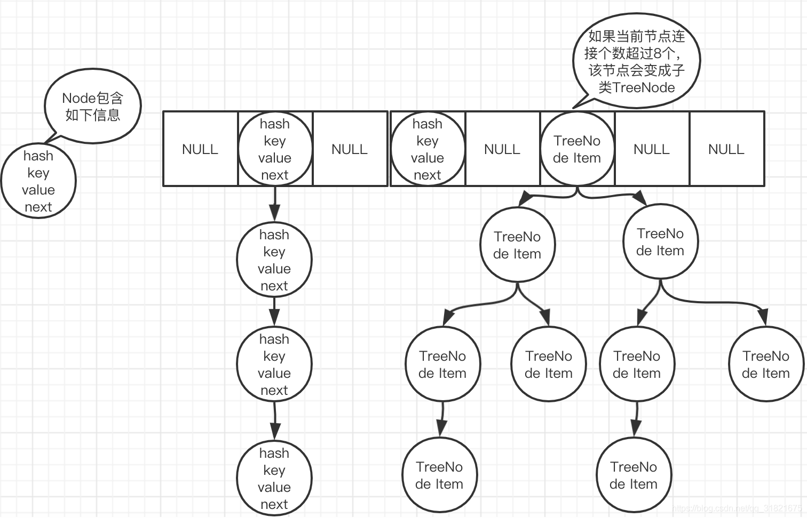

PS:其中几个重要节点关系如下：

1. java.util.Map.Entry
这就是个interface定义了一些比较的接口函数。
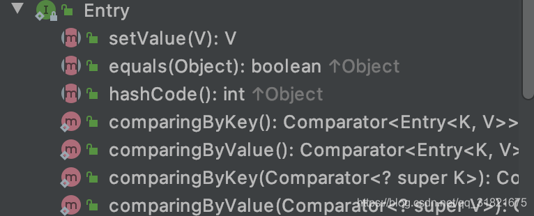

2. java.util.HashMap.Node
就是我们HashMap中存储的基本的KV。


3. java.util.LinkedHashMap.Enrty
Enrty这个类继承自HashMap.Node这个类，Enrty是LIinkedHashMap的一个内部类，


4. java.util.HashMap.TreeNode
TreeNode的构造函数向上追溯继承了LinkedHashMap.Entry，而后者又继承了HashMap.Node。所以TreeNode既保有Node的属性，同时由于添加了prev这个前驱指针使得链表变为了双向。前三个节点跟第五个红黑树相关，第四个跟next跟双向链表相关。


数据存储的大致步骤有三步。
5. 每个数据通过HashTable里的映射函数来决定将该数据放到数组的那个地方，数组初始化时候一定是2的次幂，默认16，初始化传入的任何数字都会经过tableSizeFor调整为2次幂。
6. 如果同一个数组的地方被分配到太多数据就用链表法来解决哈希冲突。
7. 如果同一个节点的链表数据节点个数 > TREEIFY_THRESHOLD=8且数组长度 >= MIN_TREEIFY_CAPACITY=64，则会将该链表进化位RedBlackTree,如果RedBlackTree中节点个数小于UNTREEIFY_THRESHOLD=6会退化为链表。
特别提醒：读HashMap源码之前需要知道它大致特性如下：

````
1. HashMap的存取是没有顺序的
2. KV均允许为NULL
3. 多线程情况下该类安全，可以考虑用HashTable。
4. JDk8底层是数组 + 链表 + 红黑树，JDK7底层是数组 + 链表。
5. 初始容量和装载因子是决定整个类性能的关键点,轻易不要动。
6. HashMap是懒汉式创建的，只有在你put数据时候才会build
7. 单向链表转换为红黑树的时候会先变化为双向链表最终转换为红黑树，双向链表跟红黑树是共存的，切记。
8. 对于传入的两个key，会强制性的判别出个高低，判别高低主要是为了决定向左还是向右。
9. 链表转红黑树后会努力将红黑树的root节点和链表的头节点 跟table[i]节点融合成一个。
10. 在删除的时候是先判断删除节点红黑树个数是否需要转链表，不转链表就跟RBT类似，找个合适的节点来填充已删除的节点。
11 .红黑树的root节点不一定跟table[i]也就是链表的头节点是同一个哦，三者同步是靠MoveRootToFront实现的。而HashIterator.remove()会在调用removeNode的时候movable=false。
````

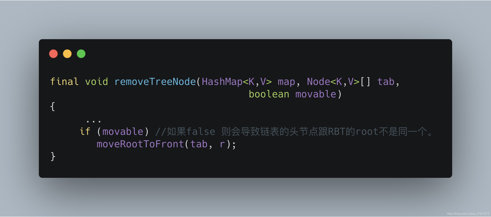

## 重要参数
### 静态参数

1. static final int DEFAULT_INITIAL_CAPACITY = 1 << 4

````
初始容量，默认容量=16，箱子的个数不能太多或太少。如果太少，很容易触发扩容，如果太多，遍历哈希表会比较慢。
````

2. static final int MAXIMUM_CAPACITY = 1 << 30

````
数组的最大容量，一般情况下只要内存够用，哈希表不会出现问题
````

3. static final float DEFAULT_LOAD_FACTOR = 0.75f

````
默认的负载因子。因此初始情况下，当存储的所有节点数 > (16 * 0.75 = 12 )时，就会触发扩容。
默认负载因子（0.75）在时间和空间成本上提供了很好的折衷。较高的值会降低空间开销，但提高查找成本（体现在大多数的HashMap类的操作，包括get和put）。设置初始大小时，应该考虑预计的entry数在map及其负载系数，并且尽量减少rehash操作的次数。如果初始容量大于最大条目数除以负载因子，rehash操作将不会发生。
````

从上面的表中可以看到当桶中元素到达8个的时候，概率已经变得非常小，也就是说用0.75作为加载因子，每个碰撞位置的链表长度超过８个是几乎不可能的。
4. static final int TREEIFY_THRESHOLD = 8

````
这个值表示当某个箱子(数组的某个item)中，链表长度 >= 8 时，有可能会转化成树。设置为8，是系统根据泊松分布的数据分布图来设定的。
````

5. static final int UNTREEIFY_THRESHOLD = 6

````
在哈希表扩容时，如果发现链表长度 <= 6，则会由树重新退化为链表。
设置为6猜测是因为时间和空间的权衡

当链表长度为6时 查询的平均长度为 n/2=3，红黑树 log(6) = 2.6
为8时 :链表 8/2=4， 红黑树 log(8)=3
````


6. static final int MIN_TREEIFY_CAPACITY = 64
````
链表转变成树之前，还会有一次判断，只有数组长度大于 64 才会发生转换。这是为了避免在哈希表建立初期，多个键值对恰好被放入了同一个链表中而导致不必要的转化。
````

### 动态参数
1. transient Node<K,V>[] table
````
HashMap的链表数组。无论我们初始化时候是否传参，它在自扩容时总是2的次幂。
````

2. transient Set<Map.Entry<K,V>> entrySet
````
HashMap实例中的Entry的Set集合
````

3. transient int size
````
HashMap表中存储的实例KV个数。
````

4. transient int modCount

````
凡是我们做的增删改都会引发modCount值的变化，跟版本控制功能类似，可以理解成version，在特定的操作下需要对version进行检查，适用于Fai-Fast机制。

在java的集合类中存在一种Fail-Fast的错误检测机制，当多个线程对同一集合的内容进行操作时，可能就会产生此类异常。
比如当A通过iterator去遍历某集合的过程中，其他线程修改了此集合，此时会抛出ConcurrentModificationException异常。
此类机制就是通过modCount实现的，在迭代器初始化时，会赋值expectedModCount，在迭代过程中判断modCount和expectedModCount是否一致。
````

5. int threshold
````
扩容阈值 threshold = capacity * loadFactor
````

6. final float loadFactor
````
可自定义的负载因子，不过一般都是用系统自带的0.75。
````


## 四种构造方法
1. 默认构造方法
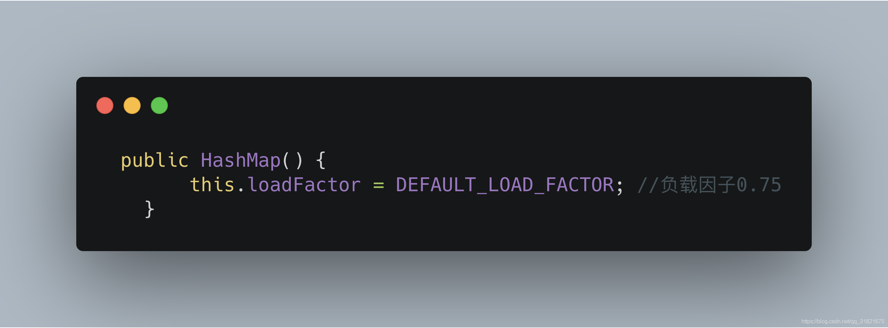
2. 传入初始容量大小
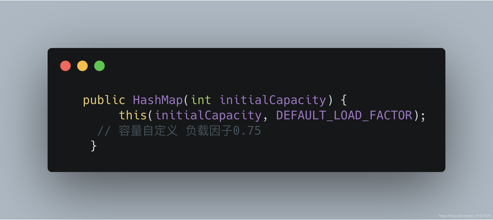
3. 传入初始容量大小及负载因子
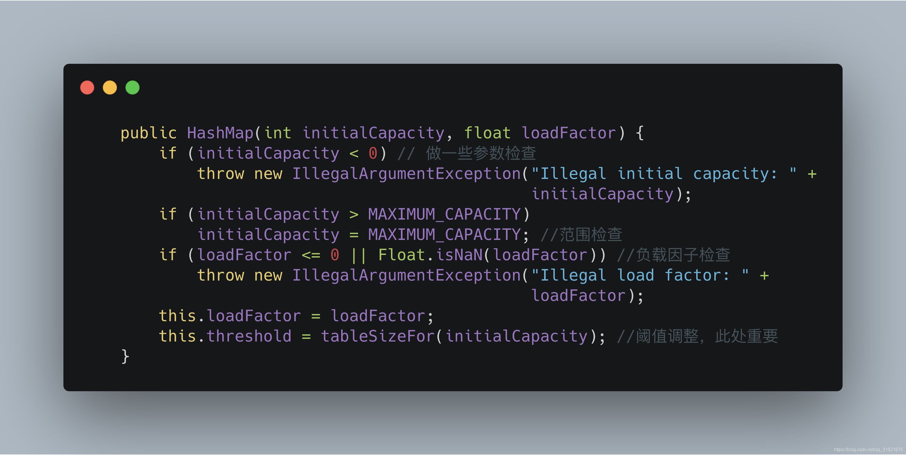
4. tableSizeFor:作用是返回大于输入参数且最小的2的整数次幂的数。比如10，则返回16。
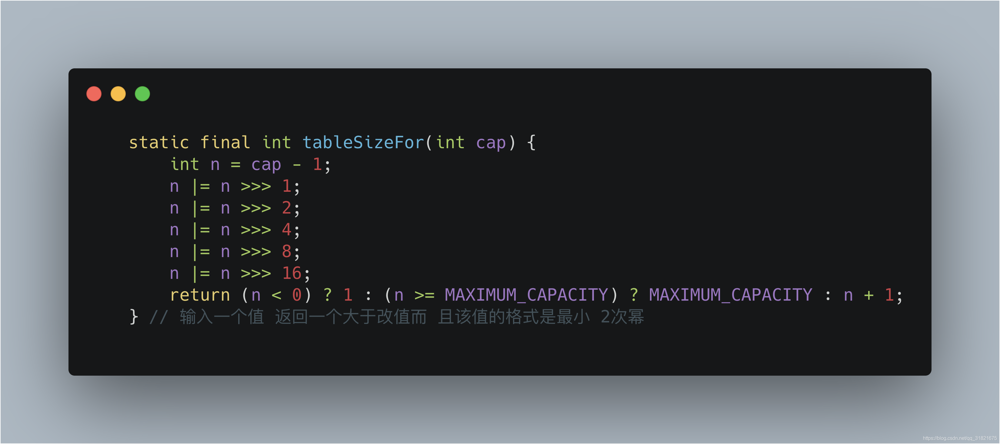

详解如下：

````
先来分析有关n位操作部分：先来假设n的二进制为01xxx…xxx。接着
对n右移1位：001xx…xxx，再位或：011xx…xxx
对n右移2为：00011…xxx，再位或：01111…xxx
此时前面已经有四个1了，再右移4位且位或可得8个1
同理，有8个1，右移8位肯定会让后八位也为1。
````


综上可得，该算法让最高位的1后面的位全变为1。最后再让结果n+1，即得到了2的整数次幂的值了。
现在回来看看第一条语句：

````
int n = cap - 1;
````

让cap-1再赋值给n的目的是另找到的目标值大于或等于原值。例如二进制1000，十进制数值为8。如果不对它减1而直接操作，将得到答案10000，即16。显然不是结果。减1后二进制为111，再进行操作则会得到原来的数值1000，这种二进制方法的效率非常高。

4. 构造函数传入一个map
使用默认的负载因子，然后根据当前map的大小来反推需要的threshold，同时还可能会涉到resize，然后住个put到 容器中。
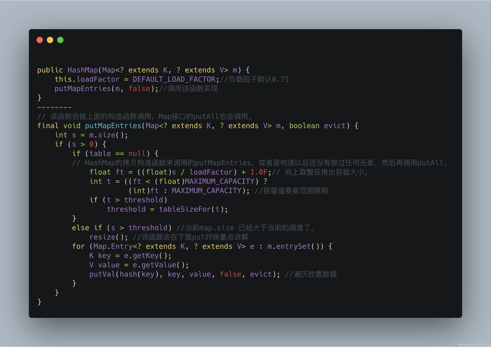

### Hash值
无论我们put数据还是get数据都要先获得该数据在这个哈希表中对应的位置。比如put数据，它的流程分为2步。
````
1.先获得key对应的hash值。
2. 将该数据的hash值A，跟将A右无符号移动16位后再^得到最终值。这个操作叫扰动，原因是怕低几位出现想同的概率太大，尽可能的将数据实现均匀分布。
````

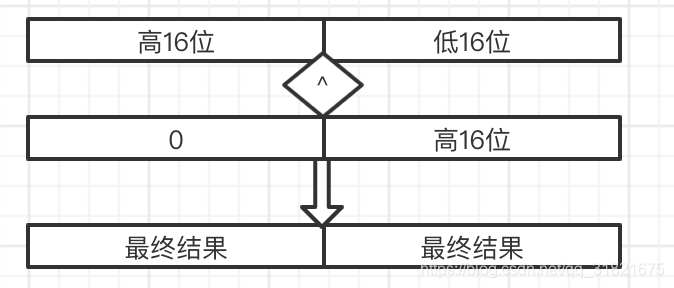

同时JDK8跟JDK7的扰动目的一样，不过复杂程度不一样。
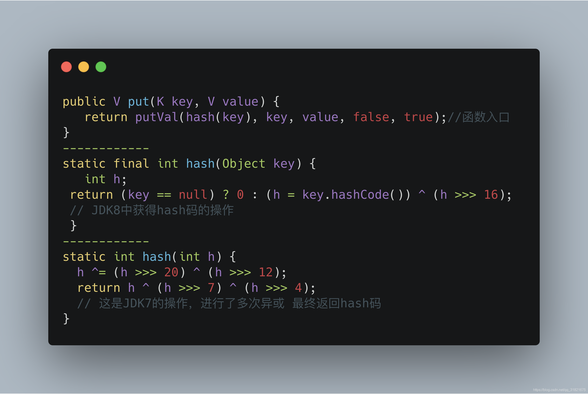


1. get
相对来说很简单,为方便理解先说下代码大致流程思路。

````
获得key的hash然后根据hash和key按照插入时候的思路去查找get。
如果数组位置为NULL则直接返回 NULL。
如果数组位置不为NULL则先直接看数组位置是否符合。
如果数组位置有类型说红黑树类型，则按照红黑树类型查找返回。
如果数组有next，则按照遍历链表的方式查找返回。
````


1.1 getNode
宏观查找函数细节：
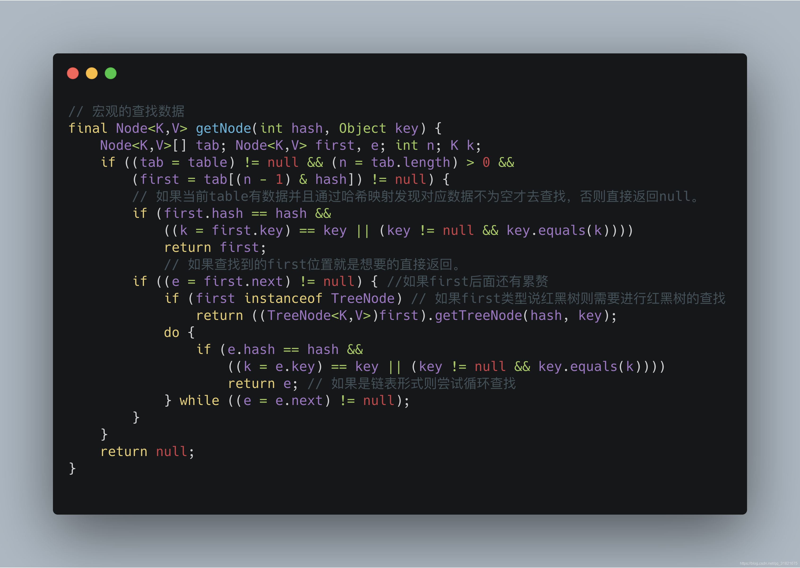

1.3 getTreeNode

````
红黑树查找节点细节：

先获得根节点，左节点，右节点。
根据 左节点 < 根节点 < 右节点 对对数据进行逐步范围的缩小查找。
如果实现了Comparable方法则直接对比。
否则如果根节点不符合则递归性的调用find查找函数。
````

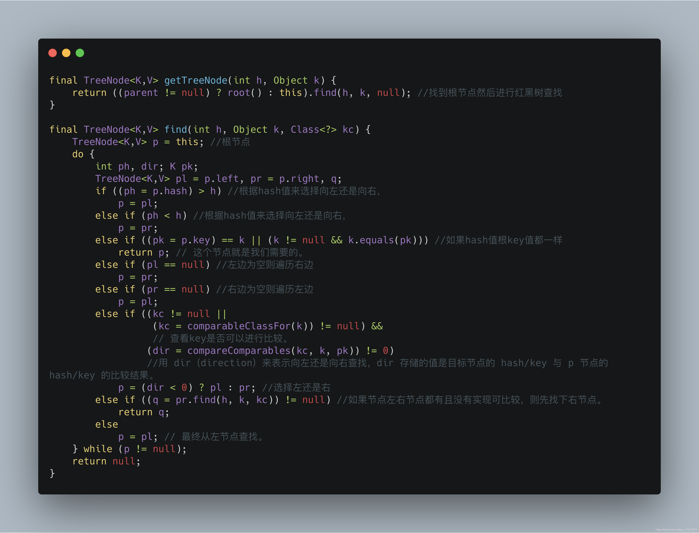

1.4 ComparableClassFor:
查询该key是否实现了Comparable接口。
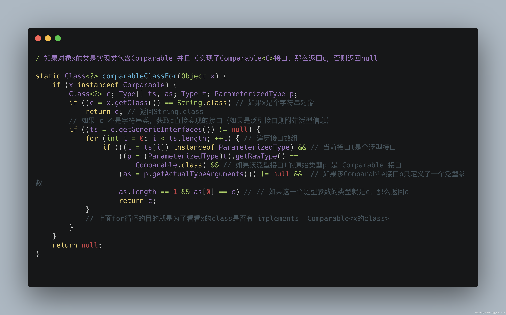

1.5 compareComparables:
既然实现了Comparable接口就用该实现进行对比判断如何何去何从。
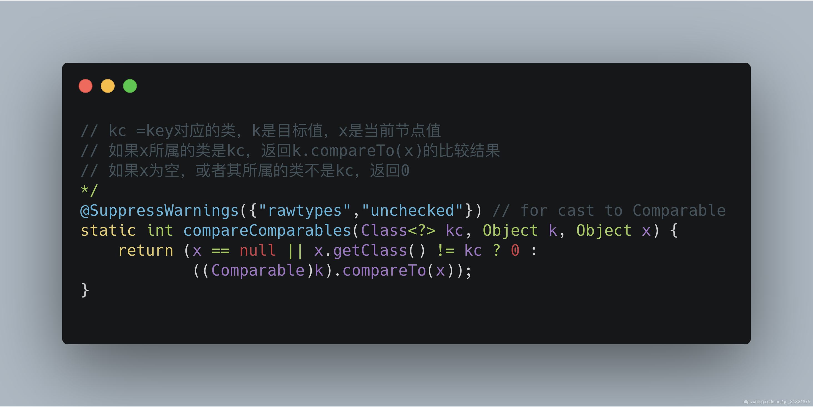

2. put流程
跟随源码梳理下put操作的大致流程。
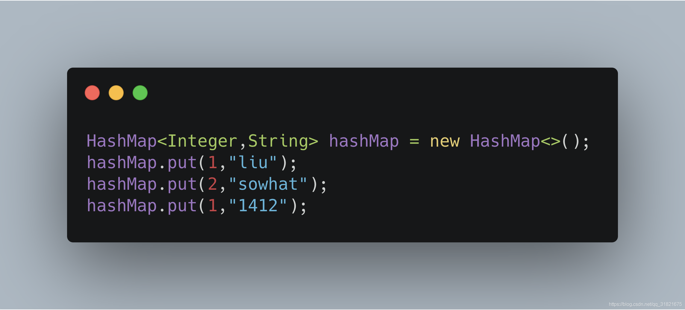
数据插入的时候大致流程如下：

1. 对数据进行Hash值计算。
2. 将数据插入前先查看下当前table的状态，如果table是空需要调用resize来进行初始化。
3. 通过位运算获得key的目标位置。并判断当前位置情况。
4. 如果当前位置为空则直接进行放置，如果跟当前key一直则进行覆盖。
5. 如果当前有数据则看当前数据类型是否是红黑树，是的话需要调用putTreeVal。
6. 否则就认为是个链表，然后循环的查找进行尾部插入。同时还要考虑当前链表转红黑树。

````
 在JDK8中寻找待插入点 e是通过尾插法(类似与排队在最后面)，而在JDK7中是前插法(类似与加塞在最前面，之所以这样做是HashMap发明者认为后插入节被访问概率更大)，对应代码如下。
````

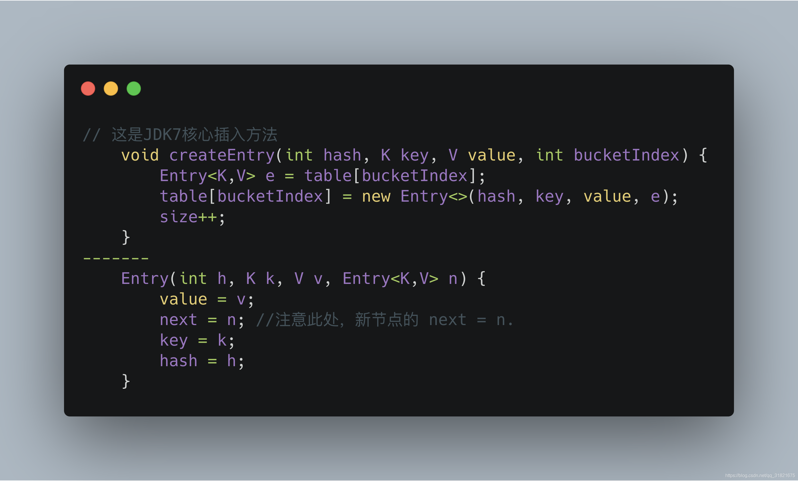

7. 对找到的旧节点e进行判断
````
oldValue对应的旧值如果为NULL，那么无论onlyIfAbsent是否决定替换。都将被替换。
oldValue对应的旧值如果不为NULL，那么如果onlyIfAbsent是false就替换。
onlyIfAbsent:只有在缺席的情况下才替换，不缺席不替换。跟redis Setnx 同样的功能。
````

8. 数据最终添加完毕后要对对修改后的变量modCount加1，同时看最新的总的节点数是否需要扩容了，如果是就扩容。

2 put
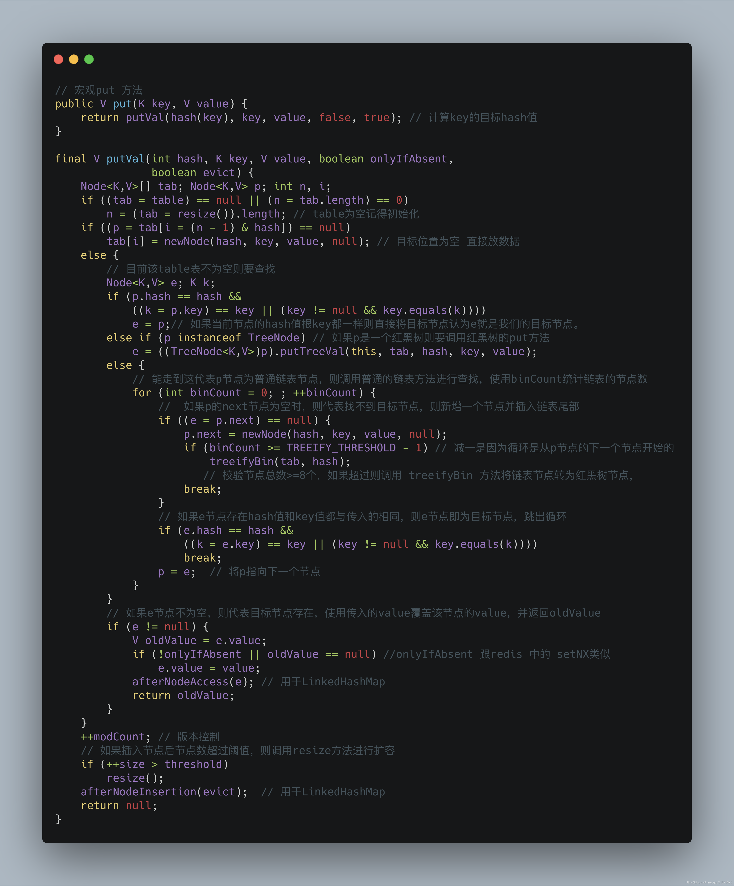

2.1 putTreeVal
先找到根节点，然后判断是从左边找还是右边找key。
找到了则直接返回找到的节点。
没找到则新建节点将该新建节点放到适当的位置，同时考虑红黑树跟双向链表的节点插入情况。
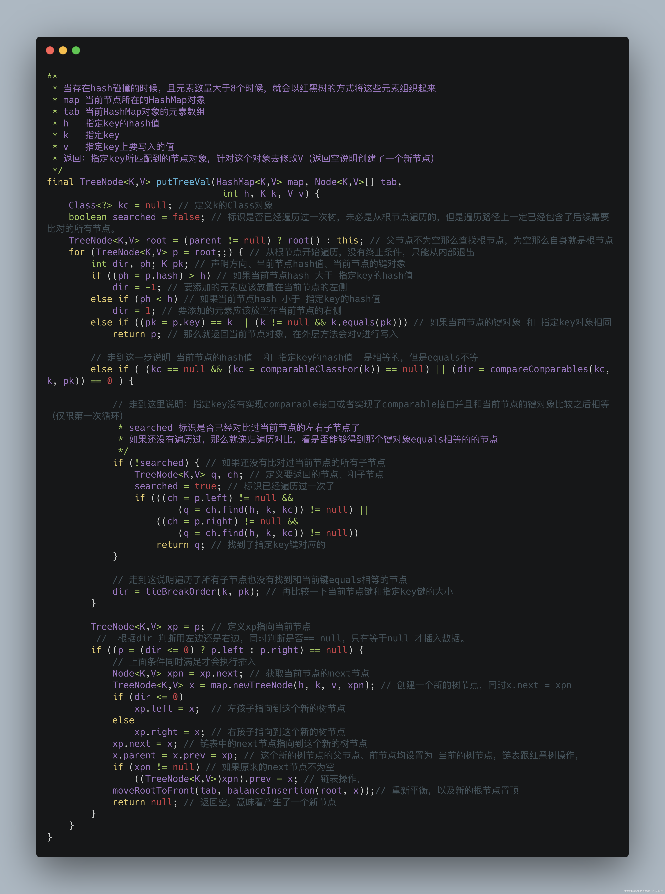
2.2 treeifyBin
主要功能是根据参数的阈值范围绝对是否将链表转化为红黑树，然后首先将单项链表转化为双向链表，再调用treeify以头节点为根节点构建红黑树。


2.3 treeify
双向链表跟红黑树创建，主要步骤分3步。

从该双向链表中找第一个节点为root节点。
每一个双向链表节点都在root节点为根都二叉树中找位置然后将该数据插入到红黑树中，同时要注意balance。
最终要注意将根节点跟当前table[i]对应好。
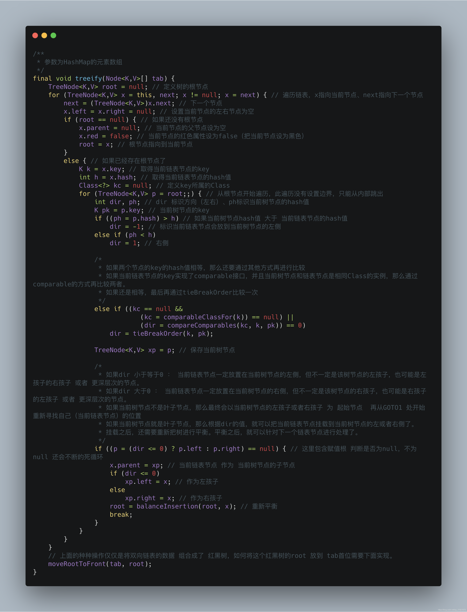

###
2.4 moveRootToFront
确保将root节点挪动到table[first]上，如果红黑树构建成功而没成功执行这个任务会导致tablle[first]对应的节点不是红黑树的root节点。正常执行的时候主要步骤分2步。

1. 找到跟节点然后将root节点放到跟节点，至此关于红黑树到操作搞定。
2. 原来链表头是first节点，现在将可能是中间节点的root节点挪到first节点前面。
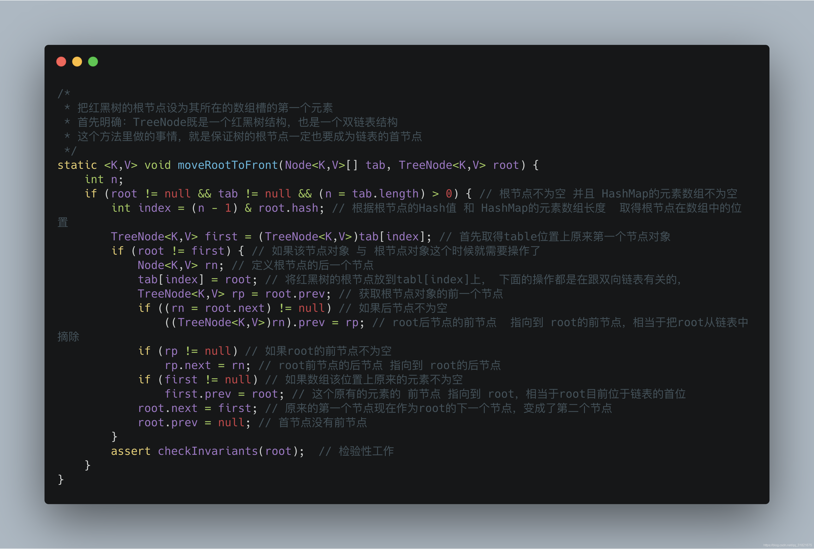
其中 checkInvariants函数的作用：校验TreeNode对象是否满足红黑树和双链表的特性。因为并发情况下会发生很多异常。
3 resize
````
1. 获得老table数据，如果老table已经足够大则不再扩容，只调节阈值。
2. 老table扩容后的范围也符合要求直接将容器大小跟阈值都扩容 。
3. 如果是带参数构造函数则需要将阈值复制给容器容量。
4. 否则认为该容器初始化时未传参，需初始化。
5. 如果老table有数据，新他变了大小设置好了但是阈值没设置成功。此时要设置新阈值。
6. 创建新容器。
7. 老table成功扩容为新table，涉及到数据的转移。
   1. 数据不为空是单独的节点则直接重新hash分配新位置。
   2. 数据不为空后面是一个链表，则要把链表数据进行区分看那些分到老地方那些分到新地方。
   3. 如果该节点类型是个红黑树则调用split.
````

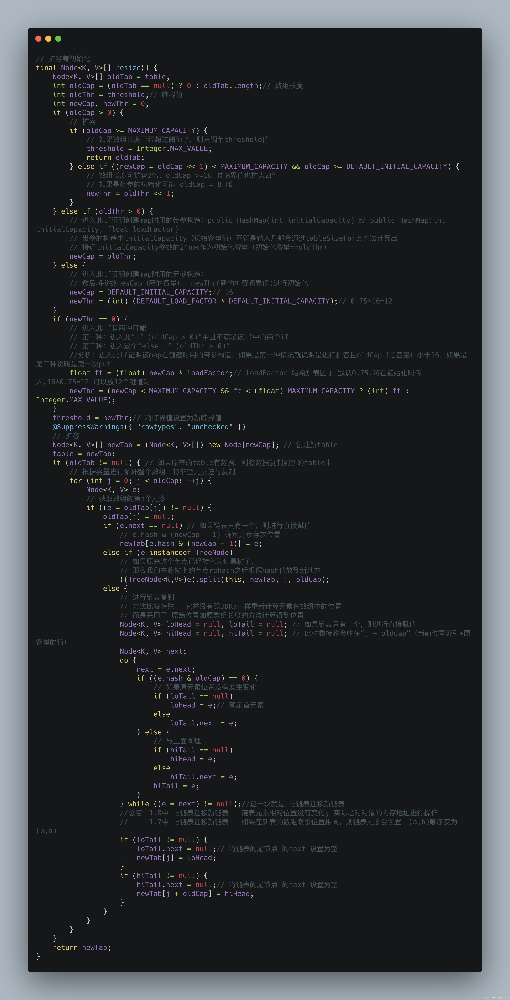
链表形式的重新划分解释如下：
注意：不是(e.hash & (oldCap-1))而是(e.hash & oldCap),
后一个得到的是 元素的在数组中的位置是否需要移动,示例如下

````
示例1：
e.hash= 10 0000 1010
oldCap=16 0001 0000
& =0 0000 0000 比较高位的第一位 0
结论：元素位置在扩容后数组中的位置没有发生改变
示例2：
e.hash= 17 0001 0001
oldCap=16 0001 0000
& =1 0001 0000 比较高位的第一位 1
结论：元素位置在扩容后数组中的位置发生了改变，新的下标位置是原下标位置+原数组长度
````


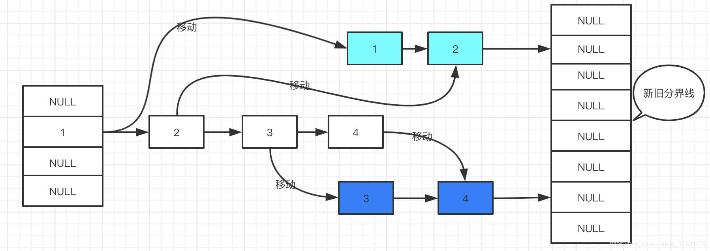

3.1 split
扩容后如何处理原来一个table[i]上的红黑树，代码的整体思路跟处理链表的时候差不多，只要理解节点关系保存红黑树的时候也保存了双向链表就OK了。
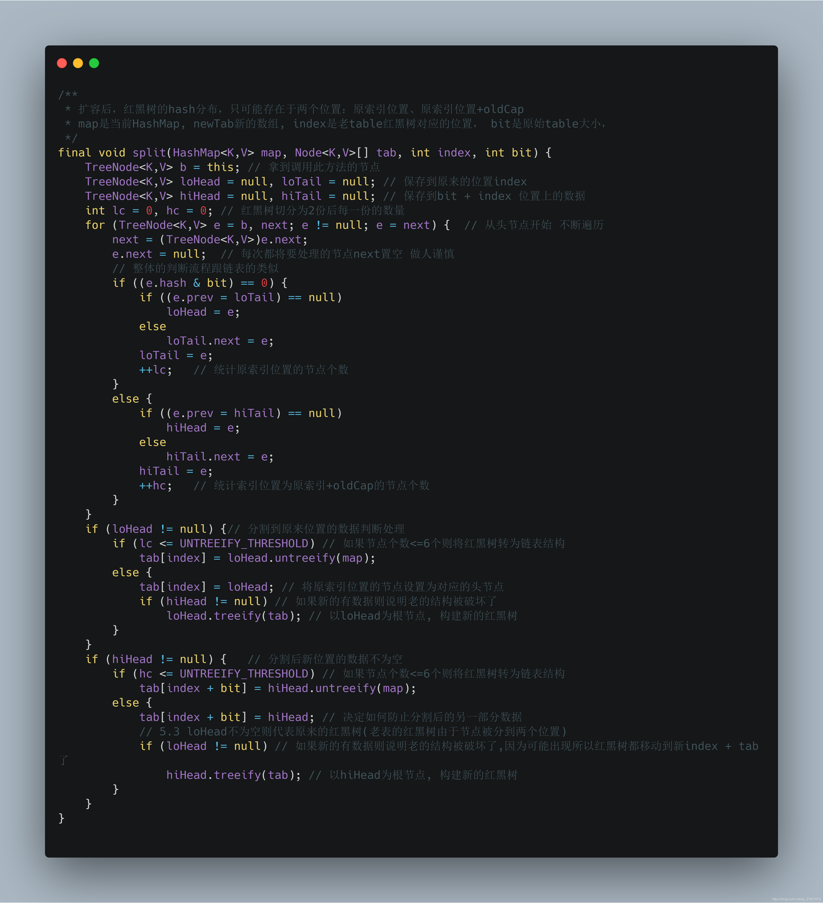

4. find
函数功能就是以指定的一个节点为根节点，根据指定的key跟value进行查找。

````
1. 通过hash值判断 左边找还是右边找。
2. 如果找到的很简单直接返回。
3. 可能出现hash值相等可是key不一样，继续查找分为三种情况。
   1. 左节点为空则找右节点
   2. 右节点为空则找左节点
   3. 左右节点都不会空，尝试通Comparable对数据看向左还是向右。
   4. 无法通过comparable比较或者比较之后还是相等。
4. 直接从右节点递归查找下。
5. 否则就从左边查找。
````

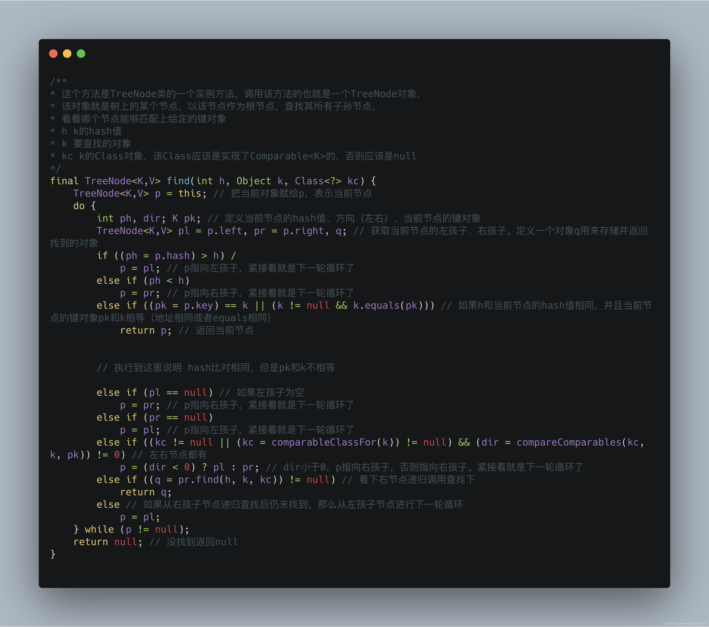

4.1 tieBreakOrder
对两个对象进行比较，一定能比出个高低。

````
1. a 跟 b 都是字符串则直接在if判断里比拼完毕
2. a 跟 b 都是对象则直接查看对象在JVM中的hash地址，然后比较。
````

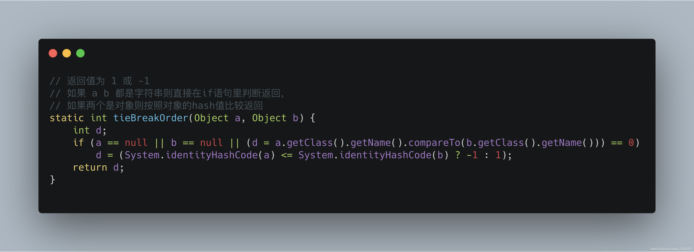

4. remove
函数入口而已：
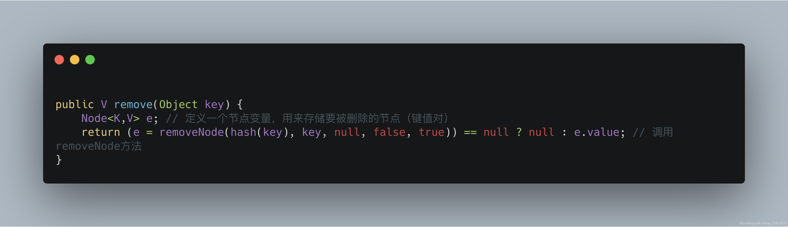

4.1 removeNode
removeNode无非就是查看table[i]是否存在，然后是否在首节点上，是否在红黑树上，是否在链表上。这几种情况，找到了则直接删除，同时注意平衡性。
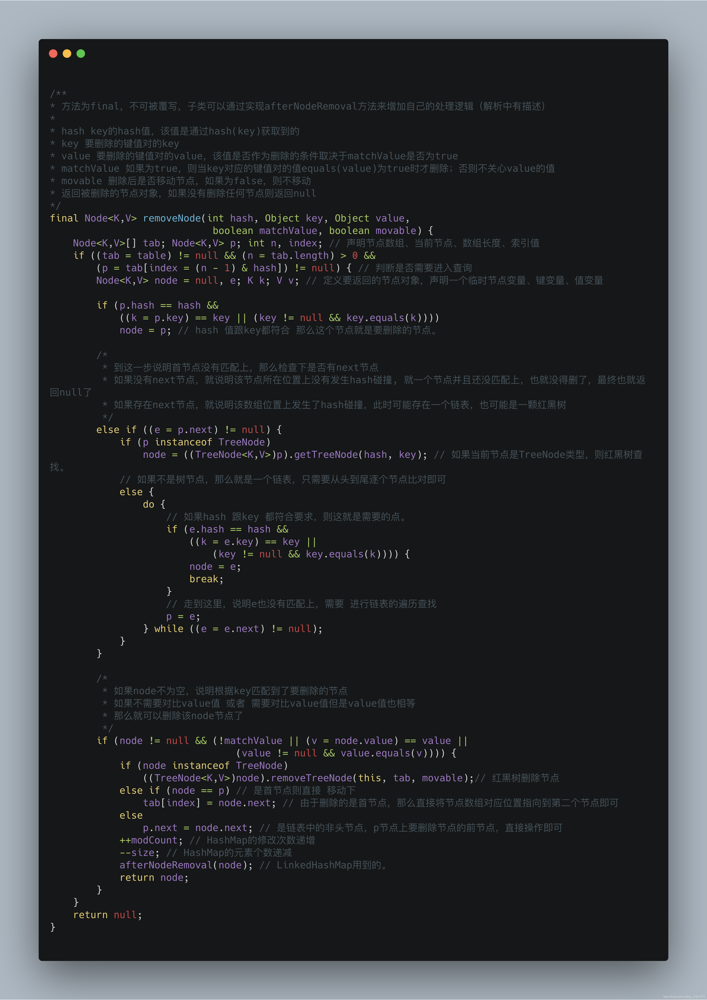

4.2 removeTreeNode
````
1. 该函数的 目的就是移除调用此方法的节点，也就是该方法中的this节点。移除包括链表的处理和红黑树的处理。可以看以前写过的RBT，删除的时候思路大致是一样的，这里大致分为3步骤。

2. 红黑树也是双向链表，以链表的角度来删除节点，然后判断是否需要退化为链表。
3. 根据当前的p节点尝试从pr找最小的或者从pl找最大的目标节点s，将两点兑换。
4. 找到要replacement来跟p进行替换。
5. 实施替换。
6. 替换后为保持红黑树特性可能需要进行balance。
````

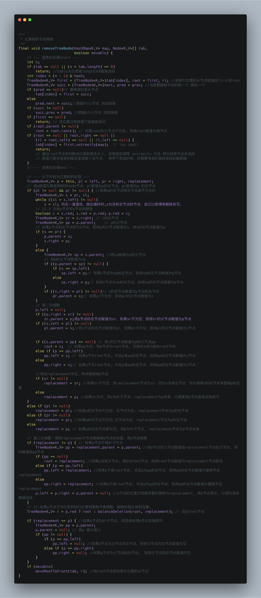

4.3 untreeify
红黑树退化成链表
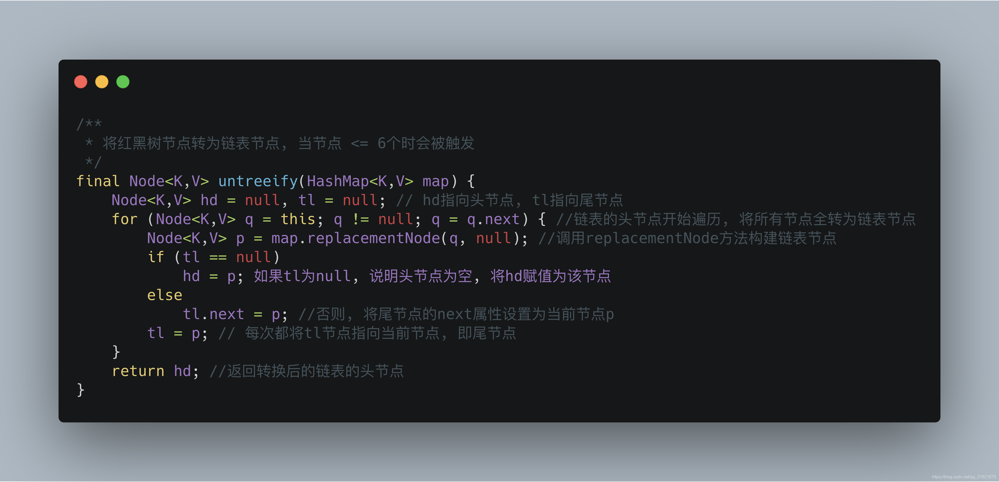

4.4 balanceDeletion
关于这个问题可以直接看博主以前写的红黑叔添加跟删除RBT

## JDK7死环问题
JDK7对旧table数据重定位到新table的函数transfer如下，其中重点关注部分以标出。
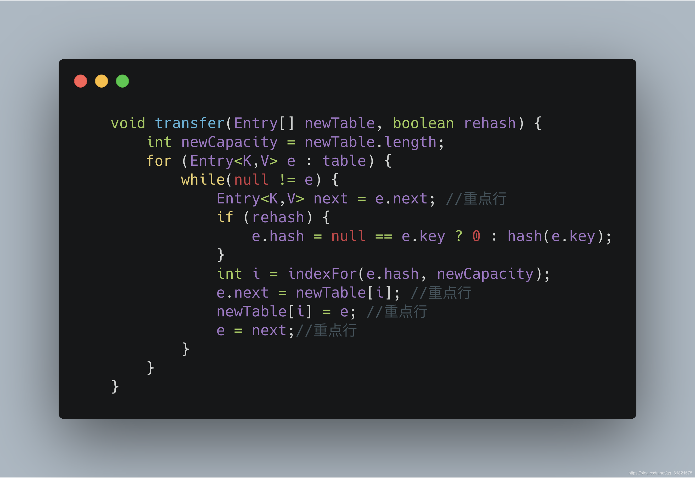

1. 头插法正常情况下：
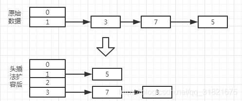
2. 并发情况下
线程1只执行了Entry<K,V> next = e.next就被挂起了，而线程2正常执行完毕，结果图如下：
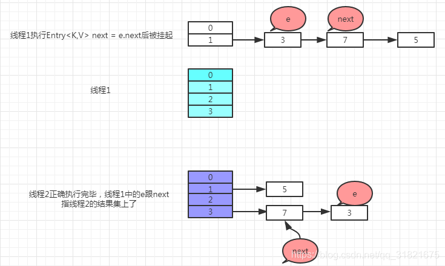
线程1接着下面继续执行：
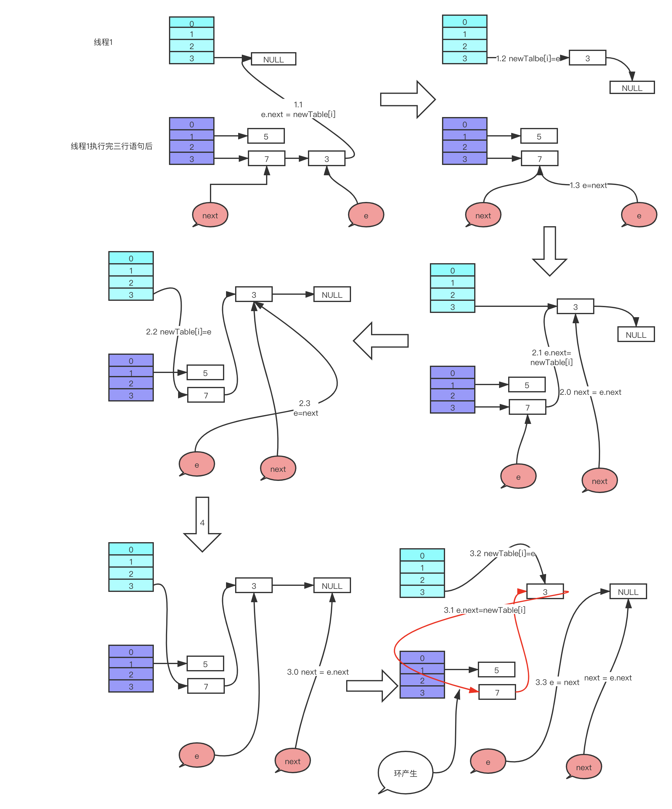
通过逐步分析跟绘图可以知道 会有环产生。
## HashIterator 的 remove 方法
### 7vs8
````
1. 7中找Hash用了4次，8中只用了1次。
2. 7 = 数组 + 链表，8 = 数组 + 链表 + 红黑树
3. 7中是头插法，多线程容易造成环，8中是尾插法。
4. 7的扩容是全部数据重新定位，8中是位置不变+ 移动旧size大小来实现更好些。
5. 7是先判断是否要扩容再插入，8中是先插入再看是否要扩容。
6. HashMap不管78都是现场不安全的，多线程情况下记得用ConcurrentHashmap。ConcurrentHashmap下篇文章说。
````

## 常见问题
随机搜罗了一些常见HashMap问题，如果把上述代码都看懂了应付这些应该没问题。

````
1. HashMap原理，内部数据结构。
2. HashMap中的put,get,remove大致过程。
3. HashMap中 hash函数实现。
4. HashMap如何扩容。
5. HashMap几个重要参数为什么这样设定。
6. HashMap为什么线程不安全，如何替换。
7. HashMap在JDK7跟JDK8中的区别。
8. HashMap中链表跟红黑树切换思路。
````

