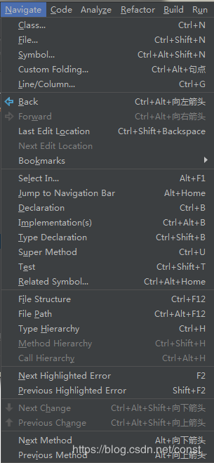

# URL
  - https://blog.csdn.net/const_/article/details/89638117

# 面板说明
## IDEA面板的全貌如下图

## 菜单栏
###一、File文件

1. New：新建一个工程

可以新建project，导入已存在的资源project，从版本控制库导入工程，新建Module，导入已存在的资源Module，新建文件（JS，DB，JSP，Java，CSS……），新建FMXL文件。
2. Open：打开本地的文件或工程
3. Open URL：
4. Open Recent：打开最近已导入过的工程
5. Close Project：关闭工程
6. Setting：IDEA配置文件
7. Project Structure：显示当前工程结构
8. Other Setting：全局默认配置
Default Settings…，Default Project Structure…
IDEA在Setting中某些配置是For当前project的，也就是意味着你新打开的一个project并不能够默认通用这些配置，你需要另外重新配置。你可以在DefaultSetting中进行一些全局通用配置。例如：maven的安装路径，maven仓库地址，git.exe地址等。
9. Import Settings：导入Settins文件
你可以将自己以前保存过的settings文件导入进来，也可以导入外来的settings文件，例如换主题皮肤。
10. Exoort Settings：导出Settings文件
将自己习惯的settings文件导出到本地或云盘，下次在新的地点使用时可以直接导入使用

### 二、Edit编辑 

1. Undo：撤销
2. Redo Duplicate Line or Selection：重新复制行或选择。（返回撤销之前）
3. Cut：剪切
4. Copy：复制
5. Copy：复制文件路径
6. Copy Reference：复制类全路径名，右键 paste simple
7. Paste：粘贴
8. Paste from History…：从剪切板中选择历史复制的内容粘贴
9. Paste simple：粘贴类全路径名
10. Delete：删除
11. Find：

### 三、View视图

1. Tool Windows：一些工具窗口
2. Recent Files：最近打开过的文件（Crtl + E）
3. Recently Changed Files：最近做过修改过的文件
4. Recent Changes：最近修改记录
5. Quick Switch Scheme…：
6. Toolbar：工具栏（显示/关闭）

7. Tool Buttons：工具按钮（IDEA左右和底部的工具框）
11

8. Status Bar：IDEA右下角的状态栏

9. Navigation Bar：

### 四、Navigate导航

1. Class：查询类
2. File：查询文件
……
3. Jump to Navigation Bar：跳到导航栏
4. Declaration：进入光标所在的方法/变量的接口或是定义处
5. Implementations：方法的实现
6. Type Declaration：进入光标当前所在属性的类
……
7. Type Hierarchy：当前类的分层结构
……
### 五、Code编码

这都是些和编码相关的，重写方法，实现方法，环绕（try…catch，if…else，…），上面显示的快捷键基本都需要记住，因为是比较常用的。

### 六、Analyze分析

### 七、Refactor重构
这些在项目重构时会使用的加多，例如类名更改，可以通过Rename(Shift + F6)来快速替换所有使用该类的地方。

### 八、Build构建
构建项目相关的。

### 九、Run运行
启动项目相关的，Run，Debug，……

### 十、Tools工具
文件作为模板保存，项目作为模板保存，生成javaDoc，……

### 十一、VCS版本控制
版本控制相关的。

### 十二、Window窗体
将当前窗体格式作为默认窗体，激活工具窗体，编辑Tabs，……

### 十三、Help帮助
IDEA的使用帮助，注册，检查更新，……

## 工具栏
工具栏可通过 View – Toolbar 来控制显示，如下：

从左至右依次为：
1、打开文件（File – Open）
2、保存全部（Ctrl + S）
3、同步：（Ctrl+Alt+Y）检测所有外部改变的文件并从磁盘加载
4、Undo：（Ctrl + Z）撤销
5、Redo：（Ctrl + Shift + Z）返回撤销前，防止误撤销
6、剪切：（Ctrl + X）
7、复制：（Ctrl + C）
8、粘贴：（Ctrl + V）
9、查找：（Ctrl + F）
10、替换：（Ctrl + R）
11、回退：（Ctrl + Alt + 向左箭头）
12、前进：（Ctrl + Alt + 向右箭头）
13、构建项目：（Ctrl + F9）
14、当前项目(Run/Debug)运行配置
15、运行项目
16、Debug模式运行项目
17、代码覆盖率方式运行项目
何为“代码覆盖率”？这里应用一下百度百科的，读者可以另寻资料。

> 代码覆盖（Code coverage）是软件测试中的一种度量，描述程式中源代码被测试的比例和程度，所得比例称为代码覆盖率。
> 在做单元测试时，代码覆盖率常常被拿来作为衡量测试好坏的指标，甚至，用代码覆盖率来考核测试任务完成情况，比如，代码覆盖率必须达到80%或 90%。于是乎，测试人员费尽心思设计案例覆盖代码。用代码覆盖率来衡量，有利也有弊。

18、停止项目运行
19、AVD管理器（Android开发相关）
20、版本控制更新项目，需要项目加入了版本控制（Ctrl + T）
21、版本控制提交(Commit)项目（Ctrl + K）
22、当前文件与服务器上该文件最新版本的内容进行比较。如果当前编辑的文件没有修改，则是灰色不可点击。
23、版本控制，显示历史操作（commit，merge）
24、恢复代码，返回上一版本，可选择性恢复（Ctrl + Alt + Z）。
25、打开Settings配置界面（Ctrl + Alt + S）
26、项目结构设置（Ctrl + Alt + Shift + S）
27、SDK管理器
28、IDEA帮助文档
29、中英文翻译

————————————————
版权声明：本文为CSDN博主「yyangqqian」的原创文章，遵循CC 4.0 BY-SA版权协议，转载请附上原文出处链接及本声明。
原文链接：https://blog.csdn.net/const_/java/article/details/89638117