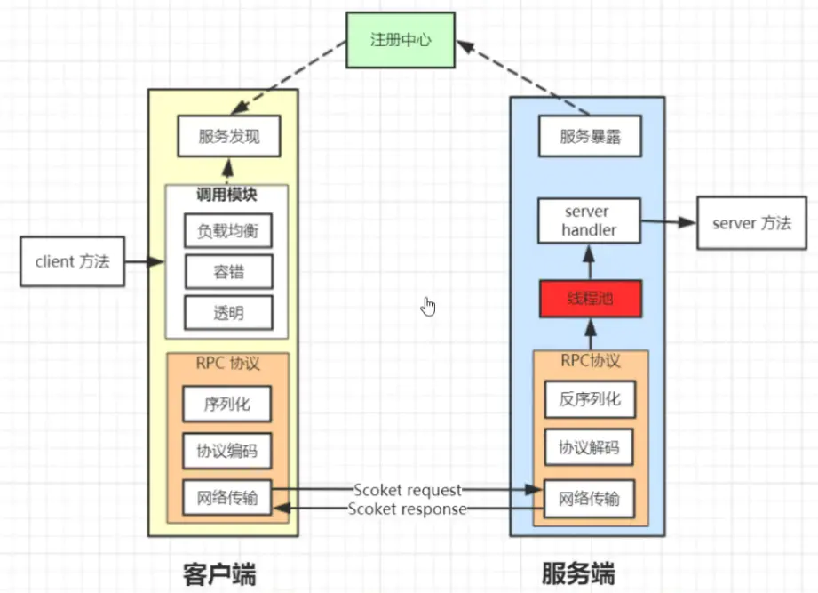
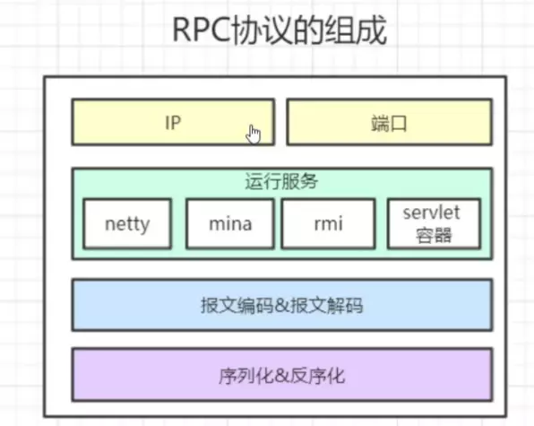
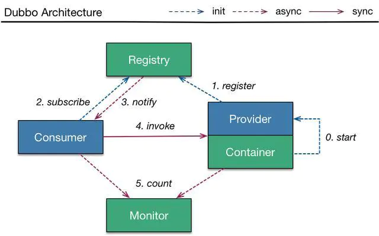
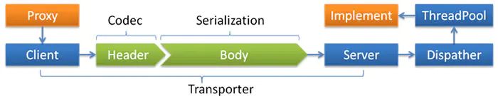
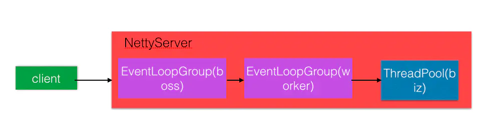
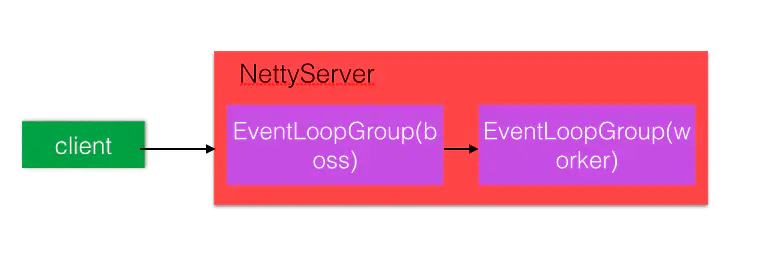
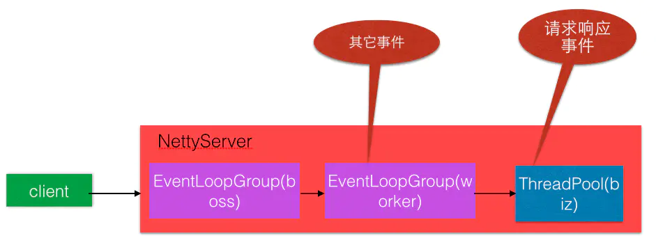
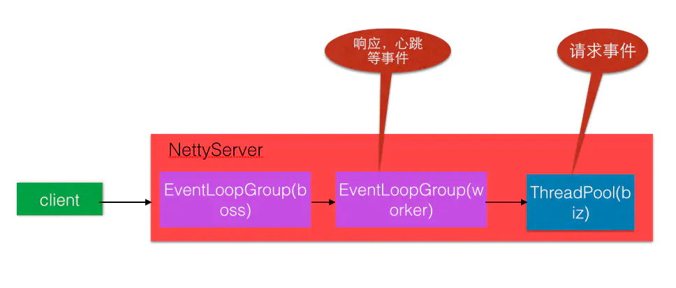

# URL
  - https://www.jianshu.com/p/8ba4b7b834aa

# RPC和Dubbo简介

# RPC协议
RPC:远程过程调用，原则上来说系统间跨进程的调用都属于RPC范畴

RMI/HTTP/dubbo/Spring Cloud/thrift

RPC框架如何实现分布式环境下的远程调用
在一个典型的RPC的使用场景中，包含了服务发现，负载，容错，网络传输，序列化等组件，其中RPC协议指明了程序如何进行网络传输和序列化。

# RPC协议的组成
RPC协议的组成

1. 地址:服务提供者地址

2.端口:协议指定开放的端口

3.报文编码:协议报文编码，分为请求头和请求体两部分

4.序列化方式:将请求体序列化成对象，具体的方式有Hessian2Serialization，DubboSerialization，JavaSerialization，JsonSerization等

5.运行服务:网络传输实现，实现方式主要有netty，mina，RMI服务，Servlet容器（jetty，tomcat，jboss）

# RPC协议报文编码与实现
RPC传输实现
基于TCP/IP作为基础使用Socket或Netty或者Mina等网络编程组件实现。TCP是面向字节流的无边界协议，其只管负责数据传输并不会区分每次请求锁对应的消息，这样就会出现TCP协议中的拆包和粘包的问题。

粘包的原因:TCP协议中发送端和接收端都会有缓冲区

粘包的解决办法:(1)消息固定长度(2)基于特殊字符进行标识分割(3)使用带消息头的协议，消息头中标识消息体的大小,然后根据长度去读取消息的内容，类似于HTTP协议中的content-length

# Dubbo支持的协议
Dubbo框架支持dubbo、rmi、hessian、http、webservice、thrift、redis等多种协议，但是Dubbo官网是推荐我们使用Dubbo协议的，采用单一长连接和 NIO 异步通讯，适合于小数据量大并发的服务调用，以及服务消费者机器数远大于服务提供者机器数的情况。Hessian底层采用HTTP通讯(同步)，采用Servlet暴露服务。适用于传入传出参数数据包较大，提供者比消费者个数多，提供者压力较大，可传文件。下面重点介绍Dubbo协议:

# Dubbo协议头格式
如上图可知header总包含了16个字节的数据，其中前两个字节为**魔数**，类似Class类文件里面的作用，这里用来标识一个帧的开始，固定为0xdabb其中第一个字节固定为0xda,第二个字节固定为0xbb. 

后面紧这的一个字节是请求和序列化标记的组合结果requstflag|serializationId。其中高四位表示请求的requstflag,低四位是序列化的方式:

DubboSerialization：0001

FastJsonSerialization：0110

Hessian2Serialization：0010

JavaSerialization：0011

**response status**:是响应报文里面才设置（请求报文里面不设置），用来标识响应的结果码

**request id**：消息请求ID，long类型，每一个请求的唯一识别id（采用异步通讯的方式，用来把请求request和返回的response对应上）

**body length**:消息体body长度，int类型

# Dubbo简介
Dubbo提供了三个关键功能：基于接口的远程调用，容错与负载均衡，服务自动注册与发现。

Dubbo的结构图

节点角色说明
      Provider: 暴露服务的服务提供方。

      Consumer: 调用远程服务的服务消费方。

      Registry: 服务注册与发现的注册中心。

      Monitor: 统计服务的调用次调和调用时间的监控中心。

      Container: 服务运行容器。

这点我觉得非常好，角色分明，可以根据每个节点角色的状态来确定该服务是否正常。

调用关系说明
0. 服务容器负责启动，加载，运行服务提供者。

1. 服务提供者在启动时，向注册中心注册自己提供的服务。

2. 服务消费者在启动时，向注册中心订阅自己所需的服务。

3. 注册中心返回服务提供者地址列表给消费者，如果有变更，注册中心将基于长连接推送变更数据给消费者。

4. 服务消费者，从提供者地址列表中，基于软负载均衡算法，选一台提供者进行调用，如果调用失败，再选另一台调用。

5. 服务消费者和提供者，在内存中累计调用次数和调用时间，定时每分钟发送一次统计数据到监控中心。

连通性
1. 注册中心负责服务地址的注册与查找，相当于目录服务，服务提供者和消费者只在启动时与注册中心交互，注册中心不转发请求，压力较小

2. 监控中心负责统计各服务调用次数，调用时间等，统计先在内存汇总后每分钟一次发送到监控中心服务器，并以报表展示

3. 服务提供者向注册中心注册其提供的服务，并汇报调用时间到监控中心，此时间不包含网络开销

4. 服务消费者向注册中心获取服务提供者地址列表，并根据负载算法直接调用提供者，同时汇报调用时间到监控中心，此时间包含网络开销

5. 注册中心，服务提供者，服务消费者三者之间均为长连接，监控中心除外

6. 注册中心通过长连接感知服务提供者的存在，服务提供者宕机，注册中心将立即推送事件通知消费者

7. 注册中心和监控中心全部宕机，不影响已运行的提供者和消费者，消费者在本地缓存了提供者列表

8. 注册中心和监控中心都是可选的，服务消费者可以直连服务提供者

健壮性
1. 监控中心宕掉不影响使用，只是丢失部分采样数据

2. 数据库宕掉后，注册中心仍能通过缓存提供服务列表查询，但不能注册新服务

3. 注册中心对等集群，任意一台宕掉后，将自动切换到另一台

4. 注册中心全部宕掉后，服务提供者和服务消费者仍能通过本地缓存通讯

5. 服务提供者无状态，任意一台宕掉后，不影响使用

6. 服务提供者全部宕掉后，服务消费者应用将无法使用，并无限次重连等待服务提供者恢复

Dubbo模型

Transporter：mina, netty, grizzy

Serialization：dubbo, hessian2, java, json

Dispatcher：all, direct, message, execution, connection

ThreadPool：fixed, cached

特点：Dubbo缺省协议采用**单一长连接和NIO异步通讯**，适合于小数据量大并发的服务调用，以及服务消费者机器数远大于服务提供者机器数的情况。

缺点：Dubbo缺省协议不适合传送大数据量的服务，比如传文件，传视频等，除非请求量很低。

## Dubbo协议
缺省协议，使用基于mina1.1.7+hessian3.2.1的tbremoting交互。

连接个数：单连接

连接方式：长连接

传输协议：TCP

传输方式：NIO异步传输

序列化：Hessian二进制序列化

适用范围：传入传出参数数据包较小（建议小于100K），消费者比提供者个数多，单一消费者无法压满提供者，尽量不要用dubbo协议传输大文件或超大字符串。

适用场景：常规远程服务方法调用

## 线程模型
首先明确一个基本概念：IO线程和业务线程的区别

IO线程：配置在netty连接点的用于处理网络数据的线程，主要处理编解码等直接与网络数据打交道的事件。Dubbo默认的底层网络通讯使用的是Netty，服务提供方NettyServer使用两级线程池，其中EventLoopGroup(boss)主要用来接受客户端的链接请求，并把接受的请求分发给EventLoopGroup(worker) 来处理，boss和worker线程组我们称之为IO线程。

业务线程：用于处理具体业务逻辑的线程，可以理解为自己在provider上写的代码所执行的线程环境。

事件处理线程说明
如果事件处理的逻辑能迅速完成，并且不会发起新的IO请求，比如只是在内存中记个标识，则直接在IO线程上处理更快，因为减少了线程池调度。

但如果事件处理逻辑较慢，或者需要发起新的IO请求，比如需要查询数据库，则必须派发到线程池，否则IO线程阻塞，将导致不能接收其它请求。

如果用IO线程处理事件，又在事件处理过程中发起新的IO请求，比如在连接事件中发起登录请求，会报“可能引发死锁”异常，但不会真死锁。

## Dispatcher
**all** 所有消息都派发到线程池，包括请求/响应/连接事件/断开事件/心跳等。

direct 所有消息都不派发到线程池，全部在IO线程上直接执行。

**message** 只有请求响应消息派发到线程池，其它连接断开事件，心跳等消息，直接在IO线程上执行。

**execution** 只将请求消息派发到线程池，响应消息和其它连接断开事件，心跳等消息，直接在IO线程上执行。

**connection** 在IO线程上，将连接断开事件放入队列，有序逐个执行，其它消息派发到线程池。

## ThreadPool
fixed 固定大小线程池，启动时建立线程，不关闭，一直持有。(缺省)

cached 缓存线程池，空闲一分钟自动删除，需要时重建。

limited 可伸缩线程池，但池中的线程数只会增长不会收缩。(为避免收缩时突然来了大流量引起的性能问题)。配置如下：

**<dubbo:protocol name="dubbo" dispatcher="all" threadpool="fixed" threads="100" />**

线程模型其他相关参数
**iothreads**：指定IO线程池（worker）的线程数量，默认情况下为CPU个数+1，因为这个线程的工作内容比较简单，所以一般情况下我们不会去配置这个值，除非IO线程的响应速度明显拖慢了整个工程的响应，IO线程的默认类型是CacheThreadPool，一分钟的线程死亡时间。

**threadpool**：业务线程的具体线程类型，默认采用的fixed线程池，即线程数量一定的线程池，这种线程池的好处就是不会频繁创建线程线程，适合线业务比较密集的应用。因为这个数据只管关系到服务的并发情况，所以在需要的时候可以适当调整该数量来增加工程的并发。

**threads**：该参数就是业务线程池的核心线程数配置，默认情况下为200。如果空间有条件的话可以适当地提升该数量，例如提升至400或者500都是可以的。

**queues**：该数量指定来在初始化业务线程池时候是否需要排队队列，如果不设置的话，业务线程池的排队队列是SynchronousQueue，即不允许业务事件排队，如果线程池没有空闲线程之后会直接排除异常信息。但是如果配置来queues之后则会使用LinkedBlockingQueue作为排队队列，queues则代表队列的初始队列。因为queues的配置直接关系到排队，所以在一般情况下建议不要配置，因为线程池满的情况下一般期望是直接失败，然后调用其他的机器，而不是再次队列继续等待，继续等待不仅可能会拉低响应时间，而且很有可能会超时。

**acceptes**：我们知道threadpool，threads和queues都是控制业务线程池的字段，而acceptes就是控制IO线程池的字段。这个字段标示着服务端可接受的最大长连接数，默认情况下为不限制，但是有时候为来保护服务器防止连接数过多导致请求失败率过高，则可以考虑设置该字段为一个定值。

**connections**：既然服务端可以设置最大接收的连接数，那么客户端也可以设置与服务端建立的连接数。connections可以配置在reference上表示要同对应的服务器建立的长链接数量，默认为只建立一条链接，如果配置来connections的话则会建立N条长链接以提供消费者的吞吐量。但是有一点需要注意是如果conenctions的数量配置大于服务端的accepts的话，超出的部分会直接报错，表示不支持更多的链接，该值不宜配置过多，因为如果多个消费者都配置来该值的话很容易到值服务端的accepts超过预期数量而报错。

