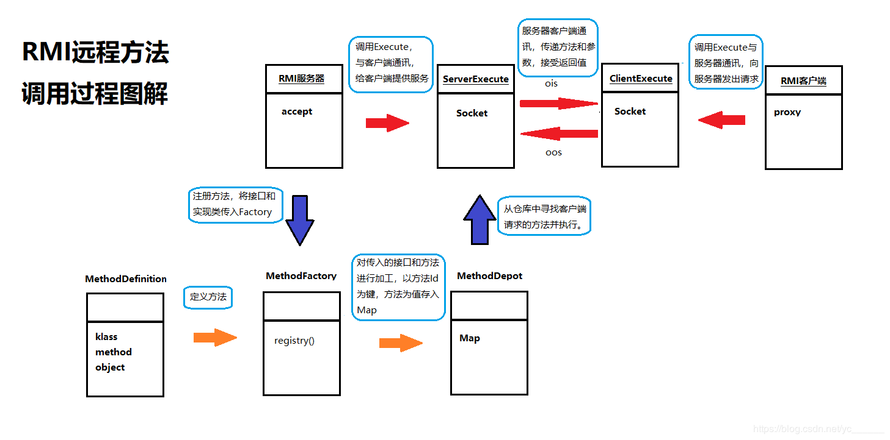

# URL
  - https://blog.csdn.net/yc______/article/details/83927186?depth_1-utm_source=distribute.pc_relevant.none-task-blog-BlogCommendFromBaidu-1&utm_source=distribute.pc_relevant.none-task-blog-BlogCommendFromBaidu-1

轻松理解RPC及RMI

温馨提示：本篇完整代码已上传至https://github.com/Monkey-yc/RMI，欢迎访问！

RPC（Remote Procedure Call Protocol）:远程过程调用协议，通过网络从远程计算机上请求调用某种服务。
RMI(Remote Method Invocation):远程方法调用，能够让在客户端Java虚拟机上的对象像调用本地对象一样调用服务端java 虚拟机中的对象上的方法。

两者的区别在于RPC是一种协议，相对于网络层而言。而RMI则是这种协议在java中的具体实现。在此讲一讲本人编写RMI的一些经历，希望对你有所帮助。

远程方法调用涉及两个网络端。核心思想：一个端可以通过调用另一个端的方法，实现相关功能。
一个端“执行”另一个端的方法，实际上真正执行这个方法还是在另一个端进行！

两端都应该有相同的类，自然会有相同的方法。

一个端所谓的执行这个方法，其实是通过调用这个类的代理对象，在其中拦截这个方法，在这个方法中实际上是将执行这个方法所需要的参数和类名称，方法名称，通过网络通讯传输给另一端；另一端根据得到的方法名称，类名称，和参数，实际执行此方法，再将方法执行的结果回传给对端。下面是我画的图解：


 要注意的问题：
1、实际执行方法的一端，我们可以认为是RMI服务器端，伪执行一端，自然是RMI客户端；
2、伪执行端不应该自己完成参数、方法名称和类名称的传递工作；也就是说，对于RMI客户端用户而言，他只面对一个类的一个方法，
    直接执行就好；
3、RMI服务器端可能接收多个RMI客户端有关这个方法的执行请求，每个客户端的执行当然应该是独立的，应该用线程实现；
4、RMI服务器端在执行了相关方法，并回传方法执行结果后，应该断开与RMI客户端的连接。

 下面根据图讲一讲实现过程


首先，就是服务器端了，服务器端只有两个作用，第一个就是在启动服务器的时候，他会通过传入的接口和实现类进行注册。当然在服务器只是给外部提供一个接口，真正的注册在工厂里边。还有一个作用就是大多数服务器的作用，持续不断的监听，当有客户端发起连接请求时，新建一个和该客户端唯一对应得Execute，和客户端进行通讯。然而可能有多个客户端都会用到该服务器的方法，因此该监听在线程中跑着。
````
@Override
    public void run() {
        while (goon) {
            try {
                Socket client = server.accept();
                new RMIServerExecute(this, client, ++executeId);
            } catch (IOException e) {
                goon = false;
                e.printStackTrace();
            }
        }
        stopRMIServer();
    }
````
然后就来看看神奇的Factory，服务器将接口和实现类传到工厂中，对类进行遍历，根据定义的方法（MethodDefinition），将方法Id和方法对应起来，传到仓库去，仓库中就是以方法Id为键，以方法为值，装到Map中，以供调用。在此要说的是产生方法Id，是通过方法得toString（）方法，这样得到的是一个方法的全名，然后使用hsahcode（）方法将其转换为唯一对应得序列，再强转为字符串进行传输。客户端进行同样的操作，传递过来方法Id，这样服务器就可以直接从Map中取出该方法执行。
````
static void doRegistry(RMIMethodDepot rmiMethodDepot, Class<?> enterface, Object object) {
        Method[] methods = enterface.getDeclaredMethods();
        for (Method method : methods) {
            String methodId = String.valueOf(method.toString().hashCode());
            RMIMethodDefinition rmd = new RMIMethodDefinition();
            rmd.setKlass(enterface);
            rmd.setMethod(method);
            rmd.setObject(object);
            rmiMethodDepot.addMethod(methodId, rmd);
        }
    }
````
ServerExecute就是用来和客户端进行通讯的，接收客户端发过来的方法Id和参数，从仓库中调出该方法执行，将执行的结果返回给客户端，就完成了远程方法的调用。该过程是短链接，所以在做完这些之后就直接断开与客户端的连接。
````
 @Override
    public void run() {
        try {
            //接受RMI客户端传递过来的ID和参数
            String  methodId= ois.readUTF();
            Object[] paras = (Object[]) ois.readObject();
            //定位相关类，方法，对象
            RMIMethodDefinition rmd =
                    rmiServer.getRmiMethodFactory().getMethod(methodId);
            //执行客户端要求执行的方法
            Method method = rmd.getMethod();
            Object object = rmd.getObject();
            Object result = method.invoke(object, paras);
            //向客户端发送执行的结果
            oos.writeObject(result);
        } catch (IOException e) {
            e.printStackTrace();
        } catch (ClassNotFoundException e) {
            e.printStackTrace();
        } catch (InvocationTargetException e) {
            e.printStackTrace();
        } catch (IllegalAccessException e) {
            e.printStackTrace();
        } finally {
			stopExecute();
		}
    }
````	
再来看看客户端，客户端的工作其实很简单，就是产生一个代理，通过该代理去执行需要执行的方法，然后传递到ClientExecute，在Execute中访问服务器，将要执行的方法通过上述步骤转化为字符串，发送到服务器，再将参数传递过去，服务器根据客户端提供的方法Id找到对应的方法，再根据传递的参数执行该方法，执行结束后将结果发送给客户端，这样客户端就执行了一个远在服务器端的方法，这个过程就叫RMI。

 
````
@SuppressWarnings("unchecked")
	public <T> T getProxy(Class<?> klass) throws Exception {
    	//如果是接口，就是用JDK产生代理，否则就使用CGLib
    	if(klass.isInterface()) {
    		System.out.println("使用JDK模式产生代理");
	        return (T) Proxy.newProxyInstance(
	        		klass.getClassLoader(),
	                new Class<?>[] { klass }, 
	                new InvocationHandler() {
	                    @Override
	                    public Object invoke(Object proxy, Method method, Object[] args) throws Throwable {
	                        String methodId = String.valueOf(method.toString().hashCode());
	                        Object result = rmiClientExecute.execute(methodId, args);
	                        
	                        return result;
	                    }
	                });
	    } else {
	    	System.out.println("使用CGLib模式产生代理");
	    	Enhancer enhancer = new Enhancer();
			enhancer.setSuperclass(klass);
			enhancer.setCallback(new MethodInterceptor() {
 
				@Override
				public Object intercept(Object object, Method method, Object[] args, MethodProxy methodProxy)
						throws Throwable {
					Object result = null;
 
					try {
						result = methodProxy.invokeSuper(object, args);
					} catch (Exception e) {
						e.printStackTrace();
					}
					
					return result;
				}
			});
 
			return(T)enhancer.create(); 
	    }
    }
 @SuppressWarnings("unchecked")
	<T> T execute(String methodId, Object[] paras) throws IOException, ClassNotFoundException {
        Socket socket = new Socket(serverIp, serverPort);
        ObjectOutputStream oos = new ObjectOutputStream(socket.getOutputStream());
        ObjectInputStream ois = new ObjectInputStream(socket.getInputStream());
        
        oos.writeUTF(methodId);
        oos.writeObject(paras);
        Object result = ois.readObject();
        stopExecute(socket, ois, oos);
 
        return (T) result;
    }
 ````

这仅仅是一个服务器和一个客户端的例子。客户端不一定只是客户端，服务器也不只是服务器。一个端有时候即使服务器，又是客户端，那么好多个端连接在一起，相互调用彼此的方法，这就是“云”的概念了。
————————————————
版权声明：本文为CSDN博主「不蛋定」的原创文章，遵循 CC 4.0 BY-SA 版权协议，转载请附上原文出处链接及本声明。
原文链接：https://blog.csdn.net/yc______/java/article/details/83927186