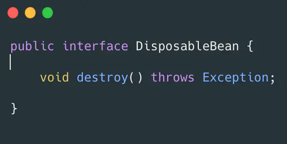
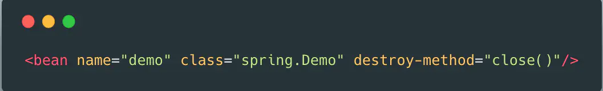

# URL
  - https://www.cnblogs.com/kkdn/p/9685755.html
  
#  聊聊spring的那些扩展机制
## 1.背景

慎入：本文将会有大量代码出入。

在看一些框架源码的时候，可以看见他们很多都会和Spring去做结合。举个例子dubbo的配置:

 

 很多人其实配置了也就配置了，没有去过多的思考:为什么这么配置spring就能识别，dubbo就能启动？
 

如果你也需要做一个框架和Spring结合，或者你想知道Spring其他框架是如何和Spring做结合的，那么你应该了解一下Spring的扩展机制。

## 2.如何扩展

本篇文章想从Spring的两个流程去介绍如何扩展，一个是容器初始化流程，一个是Bean的创建流程。

### 2.1 容器的初始化

要想使用Spring，第一步肯定是需要先让容器初始化。在AbstractApplicationContext中有一个refresh方法定义了容器如何进行刷新:

 
 

 

在refresh中的具体流程如下图:

  

 其中比较常见的扩展在加载BeanDefinition中和执行BeanPostProcessor。下面讲述一下如何进行这两个的扩展。
 

### 2.1.1 加载BeanDefinition
在介绍加载BeanDefinition之前，先让我们了解一下什么是BeanDefinition,顾名思义BeanDefinition描述Bean的信息的，比如他的class信息，属性信息，是否是单例，是否延迟加载等。

如何加载呢？一般有两种手段，一个是通过我们的xml，一个是通过一些扩展手段。

xml加载如下:

 


 

我们在spring的XML中配置这样一个bean的定义，他会进行解析然后转换成我们的BeanDefinition。

还有种方式是通过XML schema扩展的方式，关于xsd的一些详细介绍可以参考这篇文章: Spring中的XML schema扩展机制。有些同学会问不是还有个注解的方式吗？我们在学的时候一般书上都写XML和注解两种方式，注解其实也是使用了XML schema的扩展机制，等会我会细讲。

#### 2.1.1.1 XML schema扩展

什么是XML schema的扩展呢？

Spring允许你自己定义XML的的结构并且可以用自己的bean解析器进行解析。这里参考一下Spring中的XML schema扩展机制进行自定义扩展的4个步骤：

编写一个 XML schema 文件描述的你节点元素。 

 

在resources/META-INF/目录下定义demo.xsd文件。这里定义了一个demo的节点元素，其中定义了一个name字段。
编写一个 NamespaceHandler 的实现类
 


 

编写一个或者多个 BeanDefinitionParser 的实现 (关键步骤).
 


 

注册上述的 schema 和 handler。 在resources/META-INF/ 目录下面创建spring.handler文件输入:

````
http\://www.demo.com/schema/demo = xsd.DemoNameSpaceHandler
````

复制代码
，这一步将我们之前的标签的url映射到我们NamespaceHandler。 再创建一个spring.schemas文件,输入:

````
http\://www.demo.me/schema/demo/demo.xsd= META-INF/demo.xsd
````

复制代码
这一步将xsd的url进行了映射。

回到注解，大家配置注解的时候一般都是使用下图进行配置:


 

但是可以看见其依然是使用XML schema扩展进行处理，在Spring中有个叫ContextNamespaceHandler,注册很多解析器:  


其中有一个解析器是compnent-scan,在他的parse方法中定义了如何进行注解扫描，获取注解:
 

 


 

利用这个扩展机制的还有AOP,MVC,Spring-Cache以及我们的一些开源框架比如Dubbo等。

#### 2.1.1.2 BeanFactoryPostProcessor扩展
这个机制可以让我们在真正的实例化Bean之前对BeanDefinition进行修改。

这里我举例一个实战的例子，想必大家很多都配置过数据库连接池吧，这里拿Druid来举例:

 


 

然后我们创建一个druid.properties输入:

````
url=jdbc:mysql://localhost:3306/test
username=root
password=123456
````

复制代码
对于这种配置自己玩玩已经满足，但是在公司有个问题，密码放在项目中明码存储，这样是不行的，别人只要获得了你项目的查看权限那么密码就会被泄漏，所以一般的公司会有一个统一的密码存储服务，只有足够的权限才能够使用，那么我们可以把密码放在统一存储服务中，通过对服务的调用才能进行密码的使用,那么我们怎么把从远程服务中获取到的密码注入到我们Bean中呢？那么就要使用我们的BeanFactoryPostpRrocessor，下面的代码继承PropertyPlaceholderConfigurer(BeanFactoryPostpRrocessor的实现类)：

 


 

在XML中有:

 


 

通过这种方式我们可以有几个好处:

设置统一配置中心，那么我们不需要修改我们项目中的文件，只需要在配置中心页面中修改即可。
设置统一密码中心，那么我们不需要暴露明文在项目中，密码如何保护那么就直接丢给密码中心即可。
 
## 2.2 Bean的创建 

一般我们在API中获取一个Bean都会如下操作:

 

 通过GetBean操作进行获取，前面我们讲到过如果是非延迟加载的单例Bean那么会在容器刷新的时候进行加载，如果是延迟加载的Bean那么会在我们获取Bean的时候根据BeanDefinition进行加载。 首先在AbstractBeanFactory有两个方法一个是doCreate,一个是create用来描述如何创建一个Bean。这里说一下单例Bean是如何创建的:
 

  

 doCreateBean操作流程如下图:
 

 


 

可以看见真正的创建bean的操作在CreateBean中，对于真正的创建Bean有如下流程:

 

。
 

### 2.2.1 Aware接口 

Spring提供了很多Aware接口用于进行扩展，通过Aware我们可以设置很多想设置的东西:

 
 

 

invokeAwareMethod提供了三种最基本的Aware,如果是ApplicationContext的话那么在ApplicationContextAwareProcessor又进行了一轮Aware注入。

BeanNameAware:如果Spring检测到当前对象实现了该接口，会将该对象实例的beanName设置到对钱对象实例中。
BeanClassLoaderAware:会将加载当前Bean的ClassLoader注入进去。
BeanFactoryAware:将当前BeanFactory容器注入进去。
如果使用ApplicaitonContext类型的容器的话又会有下面几种:

EnvironmentAware:将上下文中Enviroment注入进去，一般获取配置属性时可以使用。

EmbeddedValueResolverAware:将上下文中EmbeddedValueResolver注入进去，一般用于参数解析。 ResourceLoaderAware:将上下文设置进去。

ApplicationEventPublisherAware:在ApplicationContext中实现了ApplicationEventPublisher接口，所以可以将自己注入进去。

MessageSourceAware:将自身注入。

ApplicationContextAware:这个是我们见的比较多的，会将自身容器注入进去。

### 2.2.2 BeanPostProcessor

在前面我们说过BeanFactoryPostProcessor,这两个名字很像，BeanFactoryPostProcessor是用来对我们BeanFactory中的BeanDefinition进行处理，此时Bean还未生成。而BeanPostProcessor用来对我们生成的Bean进行处理。

 

 在BeanPostProcessor分为两个方法，一个是用于初始化前置处理，一个是初始化用于后置处理。
 

有一种特殊的BeanPostProcessor,InstantiationAwareBeanPostProcessor，其会在我们实例化流程之前，如果实现了这个接口，那么就会使用其返回的对象实例，不会进入后续流程。

实战:BeanPostProcessor有什么用呢？

如果你有一个需求，打点项目中方法每个方法的运行时常，你很容易想到用AOP去做，如果不用AOP的话那么你可以使用BeanPostProcessor的后置处理方法,将对应的每个Bean都进行动态代理。

### 2.2.3 InitializingBean/init-method

Spring提供了我们对Bean进行初始化逻辑的扩展:

 

实现InitalizingBean接口:  在afterPropertiesSet()方法中我们可以写入我们的初始化逻辑。
通过xml方式:
 
  


 在init-method中定义了我们初始化方法。
 

### 2.2.4 DisposableBean/destory-method
俗话说，生与死轮回不止。那么我们有了生的扩展，自然Spring提供了死的扩展。我们也可以通过下面两个扩展来实现我们销毁的逻辑:

DisposableBean: 实现DisposableBean接口

  

 实现destroy方法即可。
 
 

实现XML：  在destroy-method中定义销毁方法。

````
PS: 在我们Spring容器中如果要在JVM关闭时自动调用关闭的方法那么我们可以((ClassPathXmlApplicationContext) applicationContext).registerShutdownHook();注册关闭钩子，这样在关闭JVM的时候我们的Bean也能安全销毁。
````


# 3.总结

本篇文章从Spring容器启动原理，以及Bean的初始化原理介绍，引出了多个基本的扩展点。当然这部分扩展点还仅仅是Spring中的一部分，感兴趣的可以阅读Spring的文档，或者阅读Spring源码。如果能掌握这些扩展，以后自己造轮子的时候和Spring结合这些扩展是不能少的。
