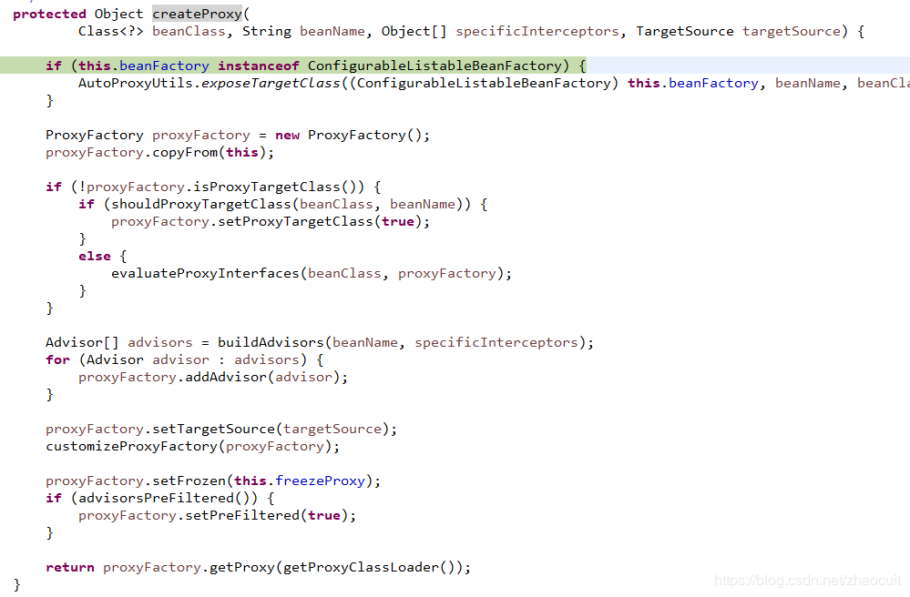
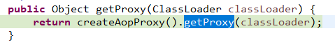

# URL
  - https://blog.csdn.net/zhaocuit/article/details/83659523

# springboot(4) 启动过程及实现对bean动态代理源码分析


在springboot项目中，如果在类上加有@Component、@service等注解时，spring会为该类生成一个jdk或cglib的动态代理，并缓存到beanFactory中，当其他类需要注入该类时，实际得到的是该类的代理，本文主要将从源码的角度介绍springboot启动过程以及如何利用jdk或cglib生成目标对象的代理类。

1. springboot启动过程分析

+ springboot启动过程run方法：

````
public ConfigurableApplicationContext run(String... args) {
  //创建一个StopWatch对象并调用它的start方法，该类是Spring提供的一个计时器类
  StopWatch stopWatch = new StopWatch();
  stopWatch.start();
  
  ConfigurableApplicationContext context = null;
  FailureAnalyzers analyzers = null;
  
  //设置系统属性java.awt.headless，这里设置为true，表示运行在服务器端
  configureHeadlessProperty();
  
  /**
   * 获取SpringApplicationRunListeners对象，这个对象是一个SpringBoot事件广播器的管理者，
   * 它主要是管理SpringApplicationRunListener对象的，
   * SpringApplicationRunListener接口规定了SpringBoot的生命周期，并在各个生命周期广播相应的事件
   * springboot默认为EventPublishingRunListener
   * 具体可见另外一篇博文springboot（2）生命周期和监听器。
   */
  SpringApplicationRunListeners listeners = getRunListeners(args);
  //广播启动事件
  listeners.starting();
  
  try {
   ApplicationArguments applicationArguments = new DefaultApplicationArguments(
     args);
   
   //准备运行的环境，比如开发环境dev，测试环境test然后根据环境解析不同的配置文件，并广播环境准备事件
   ConfigurableEnvironment environment = prepareEnvironment(listeners,
     applicationArguments);
   
   //打印SpringBoot的LOGO
   Banner printedBanner = printBanner(environment);
   
   //创建SpringBoot的上下文 判断当前是否是web环境，
   //如果是web程序，创建AnnotationConfigEmbeddedWebApplicationContext的实例，
   //否则创建AnnotationConfigApplicationContext的实例
   context = createApplicationContext();
   
   //创建FailureAnalyzers的对象,主要是用来处理启动时发生一些异常时的一些分析
   analyzers = new FailureAnalyzers(context);
   
   //准备上下文
   prepareContext(context, environment, listeners, applicationArguments,
     printedBanner);
   //刷新上下文
   refreshContext(context);
   afterRefresh(context, applicationArguments);   //发送启动完成事件
   listeners.finished(context, null);
   stopWatch.stop();
   if (this.logStartupInfo) {
    new StartupInfoLogger(this.mainApplicationClass)
      .logStarted(getApplicationLog(), stopWatch);
   }
   return context;
  }
  catch (Throwable ex) {
   handleRunFailure(context, listeners, analyzers, ex);
   throw new IllegalStateException(ex);
  }
 }
````

+ 准备运行的环境

````
private ConfigurableEnvironment prepareEnvironment(
   SpringApplicationRunListeners listeners,
   ApplicationArguments applicationArguments) {
 
  // 检查之前设置的webEnvironment属性，如果是web程序，那么创建一个StandardServletEnvironment对象，否则创建StandardEnvironment对象
  ConfigurableEnvironment environment = getOrCreateEnvironment();
 
  //准备运行环境配置，根据环境，比如开发环境dev，加载相关配置文件
  configureEnvironment(environment, applicationArguments.getSourceArgs());
 
  //发布运行环境加载完毕的事件
  listeners.environmentPrepared(environment);
  if (!this.webEnvironment) {
   environment = new EnvironmentConverter(getClassLoader())
     .convertToStandardEnvironmentIfNecessary(environment);
  }
  return environment;
 }
````

+ 准备上下文：

````
private void prepareContext(ConfigurableApplicationContext context,
   ConfigurableEnvironment environment, SpringApplicationRunListeners listeners,
   ApplicationArguments applicationArguments, Banner printedBanner) {
  //设置上下文环境
  context.setEnvironment(environment);
 
  //设置上下文的beanNameGenerator和resourceLoader(如果SpringApplication有的话)
  postProcessApplicationContext(context);
 
  //利用初始化器，对上下文做初始化
  //具体可见另外一篇博文 springboot （3）应用上下文初始化器ApplicationContextInitializer
  applyInitializers(context);
  //发布上下文准备好的事件
  listeners.contextPrepared(context);
 
  //打印启动日志
  if (this.logStartupInfo) {
   logStartupInfo(context.getParent() == null);
   logStartupProfileInfo(context);
  }

  //向上下文的beanFactory中注册一个singleton的bean，bean的名字是springApplicationArguments，
  //bean的实例是之前实例化的ApplicationArguments对象
  context.getBeanFactory().registerSingleton("springApplicationArguments",
    applicationArguments);
  //向上下文的beanFactory中注册一个singleton的bean，bean的名字是springBootBanner，bean的实例就是这个printedBanner
  if (printedBanner != null) {
   context.getBeanFactory().registerSingleton("springBootBanner", printedBanner);
  }

  //向上下文注册启动类的bean，也就是调用SpringApplication.run(Application.class, args);的类，这里只有一个
  Set<Object> sources = getSources();
  Assert.notEmpty(sources, "Sources must not be empty");
  load(context, sources.toArray(new Object[sources.size()]));
 
  //发布上下文加载完毕事件
  listeners.contextLoaded(context);
 }
````

+ 刷新上下文

````
public void refresh() throws BeansException, IllegalStateException {
  synchronized (this.startupShutdownMonitor) {
   //为刷新上下文信息做准备。例如清空缓存，初始化属性信息，验证必要的属性等
   prepareRefresh();

   //获取到beanFactory,把refreshed属性设置成true，表示已经刷新了，下次再刷新就会抛出异常，不允许重复刷新，
   //然后给beanFactory设置serializationId，就是之前通过ContextIdApplicationContextInitializer生成的id
   //然后通过getBeanFactory方法拿到上下文的beanFactory(之前创建上下文的时候，创建了一个DefaultListableBeanFactory对象)
   ConfigurableListableBeanFactory beanFactory = obtainFreshBeanFactory();

   //对beanFactory设置相关参数
   prepareBeanFactory(beanFactory);

   try {
    //为beanFactory添加后置处理器WebApplicationContextServletContextAwareProcessor，并忽略ServletContextAware
    postProcessBeanFactory(beanFactory);

    //扫描路径下的所有类，如果被@Component等注解的类，生成BeanDefinition对象，并回调BeanFactoryPostProcessor后置处理器
    invokeBeanFactoryPostProcessors(beanFactory);

    //注册bean的后置处理器，这些后置处理器将在bean的创建过程中被调用
    registerBeanPostProcessors(beanFactory);

    //初始化上下文的消息源
    initMessageSource();

    //初始化事件广播器，springboot在广播事件的时候，默认是同步的，如果想要实现事件异步传播，
    //就需要自定义一个名叫applicationEventMulticaster的bean,
    //这里就是看是否有自定义的bean，如果有则用用户创建的，否则就用默认的。
    initApplicationEventMulticaster();

    //初始化其他特殊的bean，比如创建serverlet容器相关的bean（TomcatEmbeddedServletContainerFactory）
    onRefresh();

    //想事件广播器中添加各种事件监听器
    registerListeners();

    //实例化所有单例bean
    finishBeanFactoryInitialization(beanFactory);

    //发布容器事件，结束刷新过程
    finishRefresh();
   }

   catch (BeansException ex) {
    if (logger.isWarnEnabled()) {
     logger.warn("Exception encountered during context initialization - " +
       "cancelling refresh attempt: " + ex);
    }

    // Destroy already created singletons to avoid dangling resources.
    destroyBeans();

    // Reset 'active' flag.
    cancelRefresh(ex);

    // Propagate exception to caller.
    throw ex;
   }

   finally {
    // Reset common introspection caches in Spring's core, since we
    // might not ever need metadata for singleton beans anymore...
    resetCommonCaches();
   }
  }
 }
````

+ 对beanFactory设置相关参数prepareBeanFactory

````
protected void prepareBeanFactory(ConfigurableListableBeanFactory beanFactory) {
  //设置用于加载bean的类加载器
  beanFactory.setBeanClassLoader(getClassLoader());
  //设置可以解析bean表达式的 表达式解析器 (使用"#{xxx}"配置的属性)
  beanFactory.setBeanExpressionResolver(new StandardBeanExpressionResolver(beanFactory.getBeanClassLoader()));
  //添加属性注册器
  beanFactory.addPropertyEditorRegistrar(new ResourceEditorRegistrar(this, getEnvironment()));

  //添加ApplicationContextAwareProcessor后置处理器
  beanFactory.addBeanPostProcessor(new ApplicationContextAwareProcessor(this));
 
  //设置了6个忽略自动注入的接口，为什么要忽略呢？因为上一步添加的ApplicationContextAwareProcessor，会在bean初始化前后调用相应的方法，
  //而相应的方法里有如下6个设置对应的接口
  beanFactory.ignoreDependencyInterface(EnvironmentAware.class);
  beanFactory.ignoreDependencyInterface(EmbeddedValueResolverAware.class);
  beanFactory.ignoreDependencyInterface(ResourceLoaderAware.class);
  beanFactory.ignoreDependencyInterface(ApplicationEventPublisherAware.class);
  beanFactory.ignoreDependencyInterface(MessageSourceAware.class);
  beanFactory.ignoreDependencyInterface(ApplicationContextAware.class);

  //设置了几个自动装配的特殊规则，如果注入的是BeanFactory类型，则注入beanFactory对象，
  //如果是ResourceLoader、ApplicationEventPublisher、ApplicationContext类型，则注入当前对象(Spring上下文 - context)
  beanFactory.registerResolvableDependency(BeanFactory.class, beanFactory);
  beanFactory.registerResolvableDependency(ResourceLoader.class, this);
  beanFactory.registerResolvableDependency(ApplicationEventPublisher.class, this);
  beanFactory.registerResolvableDependency(ApplicationContext.class, this);

  //注册ApplicationListenerDetector，应用监听检查器，
  //该检测器的主要作用是在bean初始化后，会检查该bean是否是ApplicationListener，
  //如果是，那么会验证它是否是单例，如果不是单例，那么删除singletonNames中对应的key，singletonNames中记录了bean的名称及是否是单例
  beanFactory.addBeanPostProcessor(new ApplicationListenerDetector(this));

  // Detect a LoadTimeWeaver and prepare for weaving, if found.
  if (beanFactory.containsBean(LOAD_TIME_WEAVER_BEAN_NAME)) {
   beanFactory.addBeanPostProcessor(new LoadTimeWeaverAwareProcessor(beanFactory));
   // Set a temporary ClassLoader for type matching.
   beanFactory.setTempClassLoader(new ContextTypeMatchClassLoader(beanFactory.getBeanClassLoader()));
  }

  //注册几个特殊的bean
  if (!beanFactory.containsLocalBean(ENVIRONMENT_BEAN_NAME)) {
   beanFactory.registerSingleton(ENVIRONMENT_BEAN_NAME, getEnvironment());
  }
  if (!beanFactory.containsLocalBean(SYSTEM_PROPERTIES_BEAN_NAME)) {
   beanFactory.registerSingleton(SYSTEM_PROPERTIES_BEAN_NAME, getEnvironment().getSystemProperties());
  }
  if (!beanFactory.containsLocalBean(SYSTEM_ENVIRONMENT_BEAN_NAME)) {
   beanFactory.registerSingleton(SYSTEM_ENVIRONMENT_BEAN_NAME, getEnvironment().getSystemEnvironment());
  }
 }
````

run方法步骤总结：
1. 获取spring应用执行监听器(SpringApplicationRunListeners)
2. 利用spring应用执行监听器广播启动事件
3. 准备运行的环境(dev，test)，根据环境解析不同的配置文件
 3.1 检查webEnvironment属性，如果是web程序，那么创建一个StandardServletEnvironment对象，否则创建StandardEnvironment对象
 3.2 准备运行环境配置，根据环境(dev，test)，加载相关配置文件
 3.3 利用spring应用执行监听器广播运行环境加载完毕的事件
4. 创建spring应用上下文，如果是web程序，创建web应用上下文实例
5. 准备spring应用上下文
 5.1 利用spring初始化器，对上下文做初始化操作
 5.2 利用spring应用执行监听器广播上下文准备好的事件
 5.3 向beanFactory注册springApplicationArguments和springBootBanner单例bean
 5.4 向上下文注册启动类的bean，也就是调用SpringApplication.run(Application.class, args);的类
 5.5 利用spring应用执行监听器广播上下文加载完毕事件
6. 刷新spring应用上下文
 6.1 为刷新上下文信息做准备。例如清空缓存，初始化属性信息，验证必要的属性等
 6.2 获取应用上下文的beanFactory
 6.3 对beanFactory设置相关参数
 6.4 为beanFactory添加后置处理器WebApplicationContextServletContextAwareProcessor，并忽略ServletContextAware
 6.5 调用beanFactory的后置处理器
 6.6 注册bean的后置处理器，这些后置处理器将在bean的创建过程中被调用
 6.7 初始化事件广播器(EventMulticaster)，看是否有自定义的事件广播bean(applicationEventMulticaster)，如果有则使用自定义的，否则就用默认的。
 6.8 初始化其他特殊的bean，比如创建serverlet容器相关的bean
 6.9 向事件广播器EventMulticaster中添加各种事件监听器
 6.10 实例化所有单例bean
 6.11 结束刷新，利用EventMulticaster广播上下文刷新完成事件
7. 执行应用runner(或命令行runner)
8. 利用spring应用执行监听器广播启动完成事件
    

# 2. 动态代理源码分析


spring容器或者ApplicationContext中包含很多组件，其中比较重要的如上图所示，包括beanFactory（对象定义描述信息池，单例池、bean的后置处理器池）、BeanFactoryPostProcessor bean工厂后置处理器池、BeanDefinition注册器、BeanDefinitiond读取器等。

在容器启动的时候，springboot会将需要扫描的路径下的所有包进行扫描，并将符合要求的class对象进行封装成beandefinition对象，并从bean工厂后置处理器池中获取后置处理器进行处理，最后将处理过后的beanDefinition对象放入beanFactory的beanDefinition池中。

bean创建过程为：springboot从beanDefinition池中获取对象，并判断需要实例化的bean是否已经在单例池中，如果不在，则进行对象的实例化过程。首先实例化对象，并调用后置处理器的实例化前处理方法，然后初始化bean对象中的属性，再调用后置处理器的后置处理方法，如果对象被切面了（用户自定义的AOP或者被类似Transactional注解修饰的类），则创建代理对象，最后将创建出来的对象，即spring bean对象放到单例池中。

springboot加载实例化bean是在刷新上下文步骤完成的，一般实例化用户自定义类是在finishBeanFactoryInitialization方法中完成的。既然要为用户创建并管理bean，那么需要跟踪代码到创建bean处，即DefaultListableBeanFactory的父类AbstractAutowireCapableBeanFactory的doCreateBean方法处，该方法很长，重点在下图部分：


初始化bean对象，initializeBean方法如下图所示：


该方法主要是在对象初始化时，调用beanFactory中的各个后置处理器，即实现了BeanPostProcessor接口的处理器。


在这些后置处理器中，有一个叫AnnotationAwareAspectJAutoProxyCreator的处理器，在其父类AbstractAutoProxyCreator中实现了BeanPostProcessor接口的前后处理方法，前置处理方法直接返回bean，后置方法如下图所示：


wrapIfNecessary方法内容如下：


这个方法先从缓存中获取，如果获取到对象了则直接返回，否则就会创建一个对象的代理，缓存代理并返回代理对象。createProxy源码如下：



该方法主要是创建一个代理工厂，并对代理工厂进行相关设置，重点在最后一句代理工厂获取代理。


进入createAopProxy方法


getAopProxyFactory返回一个AopProxyFactory类型对象。AopProxyFactory是一个接口，并且只有一个实现类DefaultAopProxyFactory。接下来看看createAopProxy方法。


该方法根据给定的类配置来创建不同的代理 AopProxy，该方法返回一个AopProxy，AopProxy是一个接口，有3个实现类：CglibAopProxy、JdkDynamicAopProxy、ObjenesisCglibAopProxy(该类为CglibAopProxy的子类)。

JdkDynamicAopProxy的继承关系如下：


CglibAopProxyCglibAopProxy 继承结构没什么，主要是众多内部类，这些内部类是为了实现了 Cglib 的各种回调而实现的。主要实现了 MethodInterceptor 接口， 

Callback 接口，Joinpoint 接口，Invocation 接口等待，总之是实现了Spring 的 cglib 模块的各种接口。

最终返回一个AopProxy对象，可能是jdk动态代理也可能是CGLIB的动态代理。回到getProxy方法中，根据AopProxy创建具体对象。



下图为JdkDynamicAopProxy方式创建代理：


下图为CglibAopProxy方式创建代理：


如上2图所示，这里我们能看到jdk或者CGLIB包中的相关类了，到此，代理对象创建完毕。重点类和方法调用时序图：


