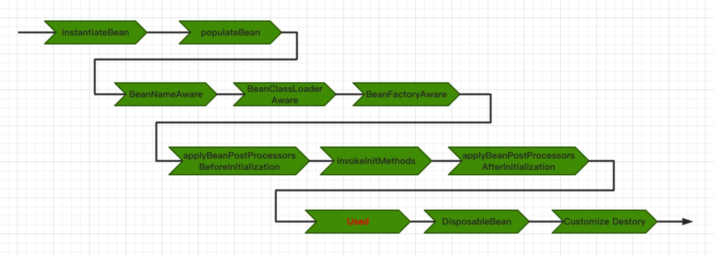
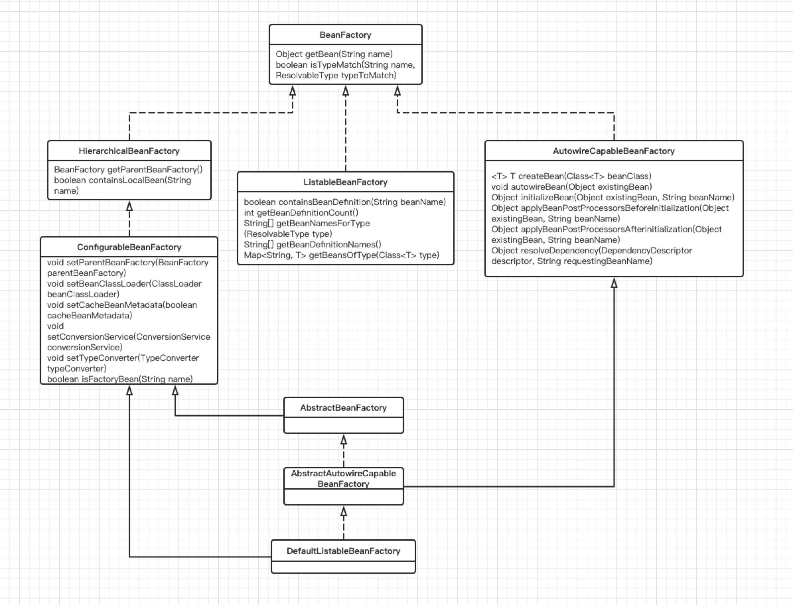
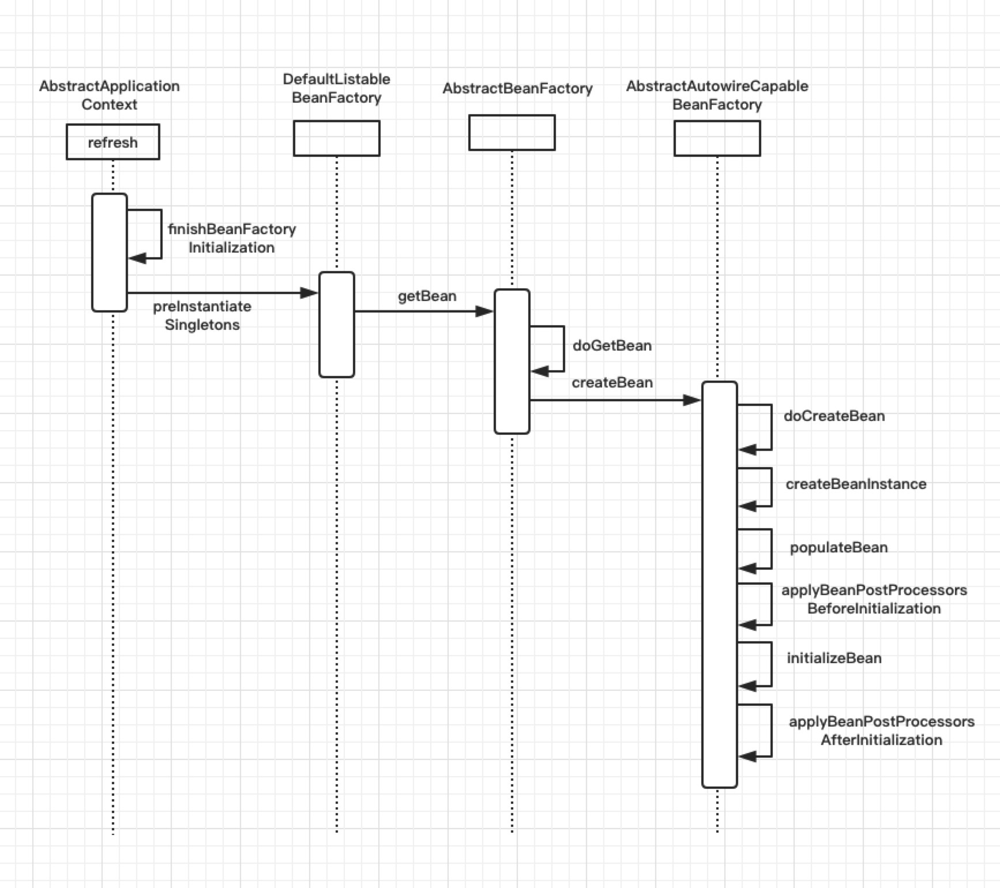
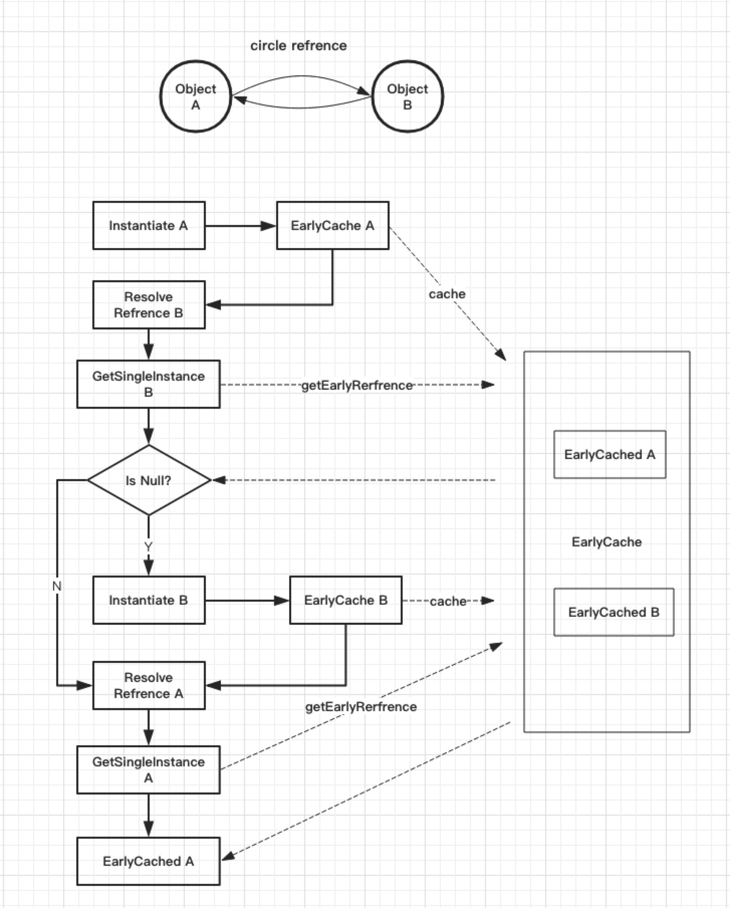

# URL
  - https://www.cnblogs.com/lxyit/p/10120886.html
  ````
  ````
  


# Spring源码系列 — Bean生命周期
前言
上篇文章中介绍了Spring容器的扩展点，这个是在Bean的创建过程之前执行的逻辑。承接扩展点之后，就是Spring容器的另一个核心：Bean的生命周期过程。这个生命周期过程大致经历了一下的几个阶段



在本节中重点介绍实例化、填充装配、唤醒Aware方法、BeanPostProcessor后置处理、初始化等过程。关于Bean的销毁过程这里不再介绍。由于Bean的生命周期的维护过程实际上都是由BeanFactory负责，所以在开始Bean的生命周期过程详解之前，先概览性了解BeanFactory。本文目录：

+ BeanFactory概览
+ Bean的实例化
+ Bean的装配
+ Bean的后置处理
+ Bean的初始化

# BeanFactory概览
简单点说，BeanFactory就是Spring框架的内核，它负责Bean的整个生命周期的管理。在Spring中对该抽象出了一套BeanFactory的接口，仍然遵守接口隔离，单一职责原则。



Spring将BeanFactory抽象出了最顶层接口，主要提供给client一个Spring容器的视图。
下面都是根据BeanFactory的功能进行划分拆分隔离出不同功能的Bean工厂：

1. 具有层次的BeanFactory，存在父子关系
2. 可罗列的BeanFactory，提供获取Bean定义个数、获取所有的Bean名称、获取所有Bean定义等等的可罗列的能力
3. 具有装配能力的BeanFactory，提供自动装配Bean的能力，这个可谓是Spring的核心，自动装配依赖注入
4. 可配置的BeanFactory，提供配置父BeanFactory、类加载器、转换服务等等能力

这一套BeanFactory可谓抽象的淋漓尽致。从这里也可以看出Spring设计上的优秀程度，也提现作者们的面向对象的思维和设计模式的功底。

再者就是实现，其中AbstractBeanFactory无疑是核心，它是BeanFactory的基本能力的实现，提供了以下几点特性：

1. 能够获取BeanDefinition，所以可以被实现可罗列的BeanFactory继承扩展
2. 提供基本的单例创建的模板方法doGetBean，同时继承了SingletonBeanRegistry的实现DefaultSingletonBeanRegistry，从而具有单例缓存能力
3. 实现了HierarchicalBeanFactory和ConfigurableBeanFactory接口，从而具有BeanFactory的层次能力，也具有配置BeanFactory的能力

AbstractAutowireCapableBeanFactory在AbstractBeanFactory的基础上扩展实现AutowireCapableBeanFactory接口，从而具有装配能力的BeanFactory。

DefaultListableBeanFactory是继承AbstractAutowireCapableBeanFactory并且实现ListableBeanFactory接口，从而具有可罗列的功能。它也是Spring中核心实现。基本上所有的上下文都是通过持有该BeanFactory实现，从而具有管理Bean的能力。

为了更形象直观的了解Bean的实现细节，先看下Bean的实例化、装配、后置处理、初始化的时序图：



# Bean的实例化

Bean的实例化过程非常复杂，但是简单的概括，也就一个逻辑：**从BeanDefinition华丽的转身至配置的Bean对象的过程**，这节承接上篇文章扩展点，继续看AbstractApplicationContext的模板方法refresh后续的实例化Bean的逻辑流程。关于Bean的属性，如：Lazy-Init/Scope/Autowired Way等等，这里不再介绍，读者可以移步至Spring官网翻阅文档。

首先依然从源头refresh的模板方法着手：

````
try {
	// Allows post-processing of the bean factory in context subclasses.
	postProcessBeanFactory(beanFactory);
	// Invoke factory processors registered as beans in the context.
	invokeBeanFactoryPostProcessors(beanFactory);
	// Register bean processors that intercept bean creation.
	registerBeanPostProcessors(beanFactory);
	
	... 忽略

	// 模板方法中，这一步完成Bean工厂中遗留下的非惰性的Bean的实例化
	// Instantiate all remaining (non-lazy-init) singletons.
	finishBeanFactoryInitialization(beanFactory);
	// Last step: publish corresponding event.
	finishRefresh();
}catch (BeansException ex) {
	... 忽略
}
````

finishBeanFactoryInitialization该方法是正式开始实例化应用配置的Bean的核心步骤（并不是所有的Bean都是这一步骤中实例化，如前篇文章中的那些扩张点，在这之前就已经实例化）

````
protected void finishBeanFactoryInitialization(ConfigurableListableBeanFactory beanFactory) {
	// 在实例化剩余的Bean之前，需要针对BeanFactory进行配置
	// 1. 配置BeanFactory的转换service
	// Initialize conversion service for this context.
	if (beanFactory.containsBean(CONVERSION_SERVICE_BEAN_NAME) &&
			beanFactory.isTypeMatch(CONVERSION_SERVICE_BEAN_NAME, ConversionService.class)) {
		beanFactory.setConversionService(
				beanFactory.getBean(CONVERSION_SERVICE_BEAN_NAME, ConversionService.class));
	}
	// 配置值解析器
	// Register a default embedded value resolver if no bean post-processor
	// (such as a PropertyPlaceholderConfigurer bean) registered any before:
	// at this point, primarily for resolution in annotation attribute values.
	if (!beanFactory.hasEmbeddedValueResolver()) {
		beanFactory.addEmbeddedValueResolver(new StringValueResolver() {
			@Override
			public String resolveStringValue(String strVal) {
				return getEnvironment().resolvePlaceholders(strVal);
			}
		});
	}
	// 过早实例化LoadTimeWeaverAware
	// Initialize LoadTimeWeaverAware beans early to allow for registering their transformers early.
	String[] weaverAwareNames = beanFactory.getBeanNamesForType(LoadTimeWeaverAware.class, false, false);
	for (String weaverAwareName : weaverAwareNames) {
		getBean(weaverAwareName);
	}
	// 停止使用temporary ClassLoader
	// Stop using the temporary ClassLoader for type matching.
	beanFactory.setTempClassLoader(null);
	// 冻结配置，已经在实例化阶段且经过了BeanFactoryPostProcessor，不允许修改Bean定义
	// Allow for caching all bean definition metadata, not expecting further changes.
	beanFactory.freezeConfiguration();
	// 实例化遗留的非惰性单例Bean
	// Instantiate all remaining (non-lazy-init) singletons.
	beanFactory.preInstantiateSingletons();
}
````

preInstantiateSingletons是ConfigurableListableBeanFactory工厂接口抽象的接口，确保非惰性的单例能够被实例化。默认实现是DefaultListableBeanFactory：

````
@Override
public void preInstantiateSingletons() throws BeansException {
	if (logger.isDebugEnabled()) {
		logger.debug("Pre-instantiating singletons in " + this);
	}
	// 在bean定义的拷贝上迭代，当是非规则的factory，初始化方法仍然能增加bean定义，也能正常规则
	// 非规则的factory，很少使用，这里不做太多关注
	// Iterate over a copy to allow for init methods which in turn register new bean definitions.
	// While this may not be part of the regular factory bootstrap, it does otherwise work fine.
	List<String> beanNames = new ArrayList<String>(this.beanDefinitionNames);
	// 这里出发非惰性的单例的实例化
	// Trigger initialization of all non-lazy singleton beans...
	// 迭代每个bean名称，按名称逐个实例化
	for (String beanName : beanNames) {
		// 根据bean名称获取其对应的RootBeanDefinition
		RootBeanDefinition bd = getMergedLocalBeanDefinition(beanName);
		// 当是非抽象，且是单例，非惰性bean，则进行初始化；否则迭代下一个bean
		if (!bd.isAbstract() && bd.isSingleton() && !bd.isLazyInit()) {
			// 判断该名称的bean是否为工厂bean
			if (isFactoryBean(beanName)) {
				// 是工厂bean，则先获取该Bean对应的FactoryBean，在Spring中FactoryBean的名称命名规则为："&" + "beanName"
				final FactoryBean<?> factory = (FactoryBean<?>) getBean(FACTORY_BEAN_PREFIX + beanName);
				boolean isEagerInit;
				// 判断该工厂Bean是否可以过早实例化
				// 标准的FactoryBean是不过早实例化的，只有在被调用进行实际访问时才实例化
				// 而SmartFactoryBean提供了可以设置是否尽早实例化
				if (System.getSecurityManager() != null && factory instanceof SmartFactoryBean) {
					isEagerInit = AccessController.doPrivileged(new PrivilegedAction<Boolean>() {
						@Override
						public Boolean run() {
							return ((SmartFactoryBean<?>) factory).isEagerInit();
						}
					}, getAccessControlContext());
				}
				else {
					// 非SmartFactoryBean时，则不实例化；如果是，则判断SmartFactoryBean的尽早实例化的设置参数
					isEagerInit = (factory instanceof SmartFactoryBean &&
							((SmartFactoryBean<?>) factory).isEagerInit());
				}
				// 如果非过早实例化，则迭代下一个Bean名称
				if (isEagerInit) {
					getBean(beanName);
				}
			}
			// 非工厂bean
			else {
				// 获取该Bean名称对应的单例对象
				// getBean是BeanFactory接口定义的接口，是面向Spring内部和应用的接口
				// 其中包含了Bean的生命周期的部分
				// getBean非常重要，是触发Bean的入口，也是获取Bean工厂中已存在单例的手段
				getBean(beanName);
			}
		}
	}
	// Trigger post-initialization callback for all applicable beans...
	// 针对所有Bean触发后置实例化回调，这里忽略
	for (String beanName : beanNames) {
		Object singletonInstance = getSingleton(beanName);
		if (singletonInstance instanceof SmartInitializingSingleton) {
			final SmartInitializingSingleton smartSingleton = (SmartInitializingSingleton) singletonInstance;
			if (System.getSecurityManager() != null) {
				AccessController.doPrivileged(new PrivilegedAction<Object>() {
					@Override
					public Object run() {
						smartSingleton.afterSingletonsInstantiated();
						return null;
					}
				}, getAccessControlContext());
			}
			else {
				smartSingleton.afterSingletonsInstantiated();
			}
		}
	}
}
````

以上就是实例化Bean的触发点，逻辑也是非常直观，只要满足**非惰性、单例**的Bean才能进行实例化。其中分为两种情形：

工厂Bean，对于工厂Bean判断是否为SmartFactoryBean，决定是否可以尽早实例化
非工厂Bean
由于篇幅原因，关于isFactoryBean的实现这里不再详细介绍，可以自行阅读。接下来再继续看getBean的实现。getBean是AbstractBeanFactory中的基础实现：

````
@Override
public Object getBean(String name) throws BeansException {
	return doGetBean(name, null, null, false);
}
````

其中内部调用doGetBean方法，方法参数较多：

1. 第一个参数是Bean名称
2. 第二个参数是被要求的类型
3. 第三个参数是创建单例时需要使用的构造参数
4. 第三个参标志是否为只仅仅类型检查获取，而非实际使用

doGetBean是AbstractBeanFactory中实现获取Bean的模板方法，作为BeanFactory的基础实现类，子类可以扩展实现创建Bean的逻辑。其中实现以下模板步骤：

1. 从单例缓存中获取Bean
2. 从父BeanFactory中获取该Bean
3. 先获取该Bean的依赖Bean
4. 按照不同的Bean作用域创建该Bean，该步骤被抽象为抽象接口，由子类实现扩展
5. 如果该Bean是工厂Bean，则调用工厂Bean的生产方法getObject生成新的Bean
6. 检查类型是否匹配，如果不匹配，则进行类型转换

````
protected <T> T doGetBean(
		final String name, final Class<T> requiredType, final Object[] args, boolean typeCheckOnly)
		throws BeansException {
	// 组装bean名称
	final String beanName = transformedBeanName(name);
	Object bean;
	// 检查缓存，检查是否已经过早实例化了该bean
	// Eagerly check singleton cache for manually registered singletons.
	Object sharedInstance = getSingleton(beanName);
	// 如果不为空，则表示已经过早的实例化了该bean
	if (sharedInstance != null && args == null) {
		// 日志打印
		if (logger.isDebugEnabled()) {
			// Spring中使用singletonsCurrentlyInCreation Set集合来存储正在创建的单例Bean的名称
			// 如果其中包含该beanName，则表示是循环引用
			if (isSingletonCurrentlyInCreation(beanName)) {
				logger.debug("Returning eagerly cached instance of singleton bean '" + beanName +
						"' that is not fully initialized yet - a consequence of a circular reference");
			}
			else {
				logger.debug("Returning cached instance of singleton bean '" + beanName + "'");
			}
		}
		// 如果该bean是工厂bean，则返回生产后的bean
		bean = getObjectForBeanInstance(sharedInstance, name, beanName, null);
	}
	// 如果没有过早的实例化
	else {
		// Fail if we're already creating this bean instance:
		// We're assumably within a circular reference.
		if (isPrototypeCurrentlyInCreation(beanName)) {
			throw new BeanCurrentlyInCreationException(beanName);
		}
		// 	检查是否有父BeanFactory
		// Check if bean definition exists in this factory.
		BeanFactory parentBeanFactory = getParentBeanFactory();
		// 如果父BeanFactory不为空，则该Bean的Bean定义被包含在BeanFactory中
		// 则使用父BeanFactory获取该Bean，并返回创建的Bean
		// 这里实现了层次BeanFactory的能力，有点类似Java中的类加载器委托机制
		if (parentBeanFactory != null && !containsBeanDefinition(beanName)) {
			// Not found -> check parent.
			String nameToLookup = originalBeanName(name);
			if (args != null) {
				// Delegation to parent with explicit args.
				return (T) parentBeanFactory.getBean(nameToLookup, args);
			}
			else {
				// No args -> delegate to standard getBean method.
				return parentBeanFactory.getBean(nameToLookup, requiredType);
			}
		}
		// 如果父BeanFactory为空且非只仅仅类型检查，则标记该Bean正在被创建
		if (!typeCheckOnly) {
			markBeanAsCreated(beanName);
		}
		try {
			// 获取该Bean对应的RootBeanDefinition
			final RootBeanDefinition mbd = getMergedLocalBeanDefinition(beanName);
			checkMergedBeanDefinition(mbd, beanName, args);
			// Guarantee initialization of beans that the current bean depends on.
			// 获取该Bean依赖的Bean名称
			String[] dependsOn = mbd.getDependsOn();
			// 遍历获取依赖的Bean
			// 实例化该bean前，先实例化其依赖的Bean
			if (dependsOn != null) {
				for (String dep : dependsOn) {
					if (isDependent(beanName, dep)) {
						throw new BeanCreationException(mbd.getResourceDescription(), beanName,
								"Circular depends-on relationship between '" + beanName + "' and '" + dep + "'");
					}
					registerDependentBean(dep, beanName);
					try {
						getBean(dep);
					}
					catch (NoSuchBeanDefinitionException ex) {
						throw new BeanCreationException(mbd.getResourceDescription(), beanName,
								"'" + beanName + "' depends on missing bean '" + dep + "'", ex);
					}
				}
			}
			// 再根据不同的作用域创建该Bean
			// Create bean instance.
			// 这里只重点看单例Bean的创建过程，对于其他作用域类型，读者自行阅读
			// 这里就是模板方法的扩展点，createBean是定义的抽象接口，由子类扩展实现创建Bean的过程
			if (mbd.isSingleton()) {
				sharedInstance = getSingleton(beanName, new ObjectFactory<Object>() {
					@Override
					public Object getObject() throws BeansException {
						try {
							return createBean(beanName, mbd, args);
						}
						catch (BeansException ex) {
							// Explicitly remove instance from singleton cache: It might have been put there
							// eagerly by the creation process, to allow for circular reference resolution.
							// Also remove any beans that received a temporary reference to the bean.
							destroySingleton(beanName);
							throw ex;
						}
					}
				});
				bean = getObjectForBeanInstance(sharedInstance, name, beanName, mbd);
			}
			else if (mbd.isPrototype()) {
				// It's a prototype -> create a new instance.
				Object prototypeInstance = null;
				try {
					beforePrototypeCreation(beanName);
					prototypeInstance = createBean(beanName, mbd, args);
				}
				finally {
					afterPrototypeCreation(beanName);
				}
				bean = getObjectForBeanInstance(prototypeInstance, name, beanName, mbd);
			}
			else {
				String scopeName = mbd.getScope();
				final Scope scope = this.scopes.get(scopeName);
				if (scope == null) {
					throw new IllegalStateException("No Scope registered for scope name '" + scopeName + "'");
				}
				try {
					Object scopedInstance = scope.get(beanName, new ObjectFactory<Object>() {
						@Override
						public Object getObject() throws BeansException {
							beforePrototypeCreation(beanName);
							try {
								return createBean(beanName, mbd, args);
							}
							finally {
								afterPrototypeCreation(beanName);
							}
						}
					});
					bean = getObjectForBeanInstance(scopedInstance, name, beanName, mbd);
				}
				catch (IllegalStateException ex) {
					throw new BeanCreationException(beanName,
							"Scope '" + scopeName + "' is not active for the current thread; consider " +
							"defining a scoped proxy for this bean if you intend to refer to it from a singleton",
							ex);
				}
			}
		}
		catch (BeansException ex) {
			cleanupAfterBeanCreationFailure(beanName);
			throw ex;
		}
	}
	// 创建完Bean后，做类型检查，是否与要求的类型匹配，如果不匹配，则进行类型转换并返回
	// Check if required type matches the type of the actual bean instance.
	if (requiredType != null && bean != null && !requiredType.isInstance(bean)) {
		try {
			return getTypeConverter().convertIfNecessary(bean, requiredType);
		}
		catch (TypeMismatchException ex) {
			if (logger.isDebugEnabled()) {
				logger.debug("Failed to convert bean '" + name + "' to required type '" +
						ClassUtils.getQualifiedName(requiredType) + "'", ex);
			}
			throw new BeanNotOfRequiredTypeException(name, requiredType, bean.getClass());
		}
	}
	return (T) bean;
}
````

这里有三点需要注意：

+ getSingleton，从单例缓存中获取该Bean，因为由于循环关系可能会导致过早初始化该Bean
+ markBeanAsCreated，防止Bean重复创建，当Bean准备开始创建钱，需要记录
+ getMergedLocalBeanDefinition，任何Bean都有可能存在父Bean，所以需要获取合并的Bean定义，在Spring中创建Bean时，都会将Bean定义转为RootBeanDefinition进行统一处理

createBean是子类的扩展实现Bean的创建过程，在Spring中默认由AbstractAutowireCapableBeanFactory中实现了Bean的实际创建：

````
@Override
protected Object createBean(String beanName, RootBeanDefinition mbd, Object[] args) throws BeanCreationException {
	if (logger.isDebugEnabled()) {
		logger.debug("Creating instance of bean '" + beanName + "'");
	}
	RootBeanDefinition mbdToUse = mbd;
	// Make sure bean class is actually resolved at this point, and
	// clone the bean definition in case of a dynamically resolved Class
	// which cannot be stored in the shared merged bean definition.
	// 解析该Bean的Class类型
	Class<?> resolvedClass = resolveBeanClass(mbd, beanName);
	// 如果该Bean没有BeanClass，则设置。这里深度复制，不修改原有的Bean定义
	if (resolvedClass != null && !mbd.hasBeanClass() && mbd.getBeanClassName() != null) {
		mbdToUse = new RootBeanDefinition(mbd);
		mbdToUse.setBeanClass(resolvedClass);
	}
	// Prepare method overrides.
	try {
		mbdToUse.prepareMethodOverrides();
	}
	catch (BeanDefinitionValidationException ex) {
		throw new BeanDefinitionStoreException(mbdToUse.getResourceDescription(),
				beanName, "Validation of method overrides failed", ex);
	}
	try {
		// 给BeanPostProcessors返回目标Bean的代理对象
		// Give BeanPostProcessors a chance to return a proxy instead of the target bean instance.
		Object bean = resolveBeforeInstantiation(beanName, mbdToUse);
		// 如果代理对象存在，则返回
		if (bean != null) {
			return bean;
		}
	}
	catch (Throwable ex) {
		throw new BeanCreationException(mbdToUse.getResourceDescription(), beanName,
				"BeanPostProcessor before instantiation of bean failed", ex);
	}
	// 如果没有代理对象，则这里创建该Bean
	Object beanInstance = doCreateBean(beanName, mbdToUse, args);
	if (logger.isDebugEnabled()) {
		logger.debug("Finished creating instance of bean '" + beanName + "'");
	}
	return beanInstance;
}
````

这里主要逻辑是：在实例化Bean钱确保解析Bean Class，在实例化之前增加扩展点，最后调用实际的创建Bean的逻辑。

关于实例化之前的扩张点，这里不再详述，后续再介绍AOP的篇幅中再详述描述。读者也可以自行阅读**InstantiationAwareBeanPostProcessor**的抽象。

接下来再继续阅读创建Bean的细节doCreateBean：

````
protected Object doCreateBean(final String beanName, final RootBeanDefinition mbd, final Object[] args)
		throws BeanCreationException {
	// Instantiate the bean.
	// 实例化的Bean的包装器
	BeanWrapper instanceWrapper = null;
	if (mbd.isSingleton()) {
		instanceWrapper = this.factoryBeanInstanceCache.remove(beanName);
	}
	// 如果实例化的Bean的包装器是空，则创建Bean
	if (instanceWrapper == null) {
		instanceWrapper = createBeanInstance(beanName, mbd, args);
	}
	// 获取实例化的Bean
	final Object bean = (instanceWrapper != null ? instanceWrapper.getWrappedInstance() : null);
	Class<?> beanType = (instanceWrapper != null ? instanceWrapper.getWrappedClass() : null);
	mbd.resolvedTargetType = beanType;
	// 后置处理修改合并的RootBeanDefinition，笔者也没遇到过这种情形，这里忽略
	// Allow post-processors to modify the merged bean definition.
	synchronized (mbd.postProcessingLock) {
		if (!mbd.postProcessed) {
			try {
				applyMergedBeanDefinitionPostProcessors(mbd, beanType, beanName);
			}
			catch (Throwable ex) {
				throw new BeanCreationException(mbd.getResourceDescription(), beanName,
						"Post-processing of merged bean definition failed", ex);
			}
			mbd.postProcessed = true;
		}
	}
	// 尽早缓存该Bean，以便后续循环引用时可以正常解析（循环引用时，直接从缓存中获取即可，不会再重新创建Bean）
	// Eagerly cache singletons to be able to resolve circular references
	// even when triggered by lifecycle interfaces like BeanFactoryAware.
	boolean earlySingletonExposure = (mbd.isSingleton() && this.allowCircularReferences &&
			isSingletonCurrentlyInCreation(beanName));
	if (earlySingletonExposure) {
		if (logger.isDebugEnabled()) {
			logger.debug("Eagerly caching bean '" + beanName +
					"' to allow for resolving potential circular references");
		}
		addSingletonFactory(beanName, new ObjectFactory<Object>() {
			@Override
			public Object getObject() throws BeansException {
				return getEarlyBeanReference(beanName, mbd, bean);
			}
		});
	}
	
	... 省略部分是Bean装配和初始化的逻辑

	// 返回创建的Bean
	return exposedObject;
}
````

这里需要重点关注的是尽早缓存该Bean实例，主要是为了解决循环引用的问题。在下节Bean的装配中，再回到这里重点介绍。

前文中介绍到CreateBean是由子类扩展实现相应的实例化Bean的逻辑，在Spring中，这里使用回调的方式，再回到回调的点细看getSingleton方法的实现：

````
// 该方法是由单例注册器DefaultSingletonBeanRegistry实现，它具有缓存单例的能力
public Object getSingleton(String beanName, ObjectFactory<?> singletonFactory) {
	Assert.notNull(beanName, "'beanName' must not be null");
	// 同步singletonObjects，保证线程安全，数据一致
	// singletonObjects存储Spring容器中的所有单例Bean
	synchronized (this.singletonObjects) {
		// 首先从单例容器中获取该单例
		Object singletonObject = this.singletonObjects.get(beanName);
		// 如果单例不存在，则创建该单例Bean
		if (singletonObject == null) {
			// 判断该单例是否正在销毁中，如果正在销毁，则抛出异常
			if (this.singletonsCurrentlyInDestruction) {
				throw new BeanCreationNotAllowedException(beanName,
						"Singleton bean creation not allowed while singletons of this factory are in destruction " +
						"(Do not request a bean from a BeanFactory in a destroy method implementation!)");
			}
			if (logger.isDebugEnabled()) {
				logger.debug("Creating shared instance of singleton bean '" + beanName + "'");
			}
			// 这里是一个扩展点，用于在创键单例钱进行回调
			// 默认实现中是判断该单例是否正在创建，防重创建，其中使用Set保证唯一
			beforeSingletonCreation(beanName);
			// 创键是否为新的单例标志
			boolean newSingleton = false;
			boolean recordSuppressedExceptions = (this.suppressedExceptions == null);
			if (recordSuppressedExceptions) {
				this.suppressedExceptions = new LinkedHashSet<Exception>();
			}
			// 这里回调对象工厂创建单例，调用将回到CreateBean那里
			// 并更新为新的单例的表示
			try {
				singletonObject = singletonFactory.getObject();
				newSingleton = true;
			}
			catch (IllegalStateException ex) {
				// Has the singleton object implicitly appeared in the meantime ->
				// if yes, proceed with it since the exception indicates that state.
				singletonObject = this.singletonObjects.get(beanName);
				if (singletonObject == null) {
					throw ex;
				}
			}
			catch (BeanCreationException ex) {
				if (recordSuppressedExceptions) {
					for (Exception suppressedException : this.suppressedExceptions) {
						ex.addRelatedCause(suppressedException);
					}
				}
				throw ex;
			}
			finally {
				if (recordSuppressedExceptions) {
					this.suppressedExceptions = null;
				}
				//　创建单例的后置回调
				afterSingletonCreation(beanName);
			}
			// 将新的单例存入单例容器中
			if (newSingleton) {
				addSingleton(beanName, singletonObject);
			}
		}
		return (singletonObject != NULL_OBJECT ? singletonObject : null);
	}
}
````

比较这里的单例容器和之前提到的尽早缓存单例的容器：

# 1. 创建单例完成，将单例存入单例容器中

````
protected void addSingleton(String beanName, Object singletonObject) {
	// 同步单例容器singletonObjects
	synchronized (this.singletonObjects) {
		// 存入单例，使用映射表 beanName -> singletonObject
		this.singletonObjects.put(beanName, (singletonObject != null ? singletonObject : NULL_OBJECT));
		// 单例已经创建完成，则清理之前的尽早缓存的单例工厂对象
		this.singletonFactories.remove(beanName);
		// 清理过早缓存的该单例对象
		this.earlySingletonObjects.remove(beanName);
		// 在已经注册的单例中，注册上该单例名称，表示该单例已经注册
		this.registeredSingletons.add(beanName);
	}
}
````

# 2. 过早缓存单例，解决循环引用

````
// 如果是单例，且Spring容器允许循环引用，该bean当前正在被创建
boolean earlySingletonExposure = (mbd.isSingleton() && this.allowCircularReferences &&
		isSingletonCurrentlyInCreation(beanName));
// 如果允许过早暴露单例
if (earlySingletonExposure) {
	if (logger.isDebugEnabled()) {
		logger.debug("Eagerly caching bean '" + beanName +
				"' to allow for resolving potential circular references");
	}
	// 将单例的对象工厂缓存
	addSingletonFactory(beanName, new ObjectFactory<Object>() {
		@Override
		public Object getObject() throws BeansException {
			return getEarlyBeanReference(beanName, mbd, bean);
		}
	});
}
````

````
protected void addSingletonFactory(String beanName, ObjectFactory<?> singletonFactory) {
	Assert.notNull(singletonFactory, "Singleton factory must not be null");
	// 同步singletonObjects
	synchronized (this.singletonObjects) {
		// 如果singletonObjects中不包含该单例，则过早缓存
		if (!this.singletonObjects.containsKey(beanName)) {
			// 缓存创建这个bean对象的工厂
			this.singletonFactories.put(beanName, singletonFactory);
			// 从过早缓存容器中移除该bean，下次过早引用该bean时，重新从上面缓存的工厂中重新获取
			this.earlySingletonObjects.remove(beanName);
			// 将该bean注册到单例中
			this.registeredSingletons.add(beanName);
		}
	}
}
````

````
// 过早获取该bean的单例，这里主要是为了解决循环引用问题
protected Object getSingleton(String beanName, boolean allowEarlyReference) {
	// 首先从singletonObjects中获取，如果有直接返回
	Object singletonObject = this.singletonObjects.get(beanName);
	// 如果不存在，且正在创建中
	if (singletonObject == null && isSingletonCurrentlyInCreation(beanName)) {
		// 同步singletonObjects
		synchronized (this.singletonObjects) {
			// 从过早缓存的容器中获取
			singletonObject = this.earlySingletonObjects.get(beanName);
			// 如果过早缓存的容器中也没有且支持过早引用
			if (singletonObject == null && allowEarlyReference) {
				// 获取上述中提到的过早缓存的工厂
				ObjectFactory<?> singletonFactory = this.singletonFactories.get(beanName);
				// 缓存工厂不为空
				if (singletonFactory != null) {
					// 获取该对象，将会调用getEarlyBeanReference方法
					singletonObject = singletonFactory.getObject();
					//　将其缓存到过早缓存中，避免下次再使用工厂获取
					this.earlySingletonObjects.put(beanName, singletonObject);
					// 将该工厂存缓存中移除
					this.singletonFactories.remove(beanName);
				}
			}
		}
	}
	// 返回该对象
	return (singletonObject != NULL_OBJECT ? singletonObject : null);
}
````

Spring处理循环引用的方式非常巧妙，为了帮助理解，笔者这里整理了下流程图帮助理解：

  

到这里Bean的创键基本上完成，后续就是依赖注入，将Bean装配起来。

# Bean的装配
什么是Bean的装配，即自动解决Bean之间的相互引用，能够将其各自Set进彼此之中。比如，BeanA引用了BeanB，则Spring能自动的将连个Bean都实例化，然后将BeanB Set至BeanA中，这就是依赖注入，自动装配。

Bean的装配发生在Bean的实例化之后，在Spring中由**AbstractAutowireCapableBeanFactoryBean**工厂完成。继续阅读源码：

````
protected Object doCreateBean(final String beanName, final RootBeanDefinition mbd, final Object[] args)
			throws BeanCreationException {
		...省略，这部分是实例化逻辑，上节中已经详解
		// Initialize the bean instance.
		Object exposedObject = bean;
		try {
			// 这里处理Bean的装配
			populateBean(beanName, mbd, instanceWrapper);
			if (exposedObject != null) {
				这里处理Bean的初始化
				exposedObject = initializeBean(beanName, exposedObject, mbd);
			}
		}
		catch (Throwable ex) {
			if (ex instanceof BeanCreationException && beanName.equals(((BeanCreationException) ex).getBeanName())) {
				throw (BeanCreationException) ex;
			}
			else {
				throw new BeanCreationException(
						mbd.getResourceDescription(), beanName, "Initialization of bean failed", ex);
			}
		}
		... 省略
		return exposedObject;
	}
````
	
Bean的装配由populateBean中实现：

````
// 该实现中处理Spring中的Bean装配
// 有按照名称、按照类型两种范式装配
protected void populateBean(String beanName, RootBeanDefinition mbd, BeanWrapper bw) {
	// 获取Bean定义的属性值，Bean定义的属性值代表着需要装配的成员域
	PropertyValues pvs = mbd.getPropertyValues();
	// 如果是空实例，则跳过返回，不装配
	if (bw == null) {
		if (!pvs.isEmpty()) {
			throw new BeanCreationException(
					mbd.getResourceDescription(), beanName, "Cannot apply property values to null instance");
		}
		else {
			// Skip property population phase for null instance.
			return;
		}
	}
	// 这里是一个扩展点，用于实例化后的后置处理InstantiationAwareBeanPostProcessor
	// InstantiationAwareBeanPostProcessor是BeanPostProcessor的扩展实现，前文中也稍微提过
	// 对于后置处理返回false，表示不需要装配，否则需要装配
	// Give any InstantiationAwareBeanPostProcessors the opportunity to modify the
	// state of the bean before properties are set. This can be used, for example,
	// to support styles of field injection.
	boolean continueWithPropertyPopulation = true;
	if (!mbd.isSynthetic() && hasInstantiationAwareBeanPostProcessors()) {
		for (BeanPostProcessor bp : getBeanPostProcessors()) {
			if (bp instanceof InstantiationAwareBeanPostProcessor) {
				InstantiationAwareBeanPostProcessor ibp = (InstantiationAwareBeanPostProcessor) bp;
				if (!ibp.postProcessAfterInstantiation(bw.getWrappedInstance(), beanName)) {
					continueWithPropertyPopulation = false;
					break;
				}
			}
		}
	}
	// 如果不需要按照属性装配，则直接返回
	if (!continueWithPropertyPopulation) {
		return;
	}
	// 获取Bean定义中的装配模式
	if (mbd.getResolvedAutowireMode() == RootBeanDefinition.AUTOWIRE_BY_NAME ||
			mbd.getResolvedAutowireMode() == RootBeanDefinition.AUTOWIRE_BY_TYPE) {
		// 重新copy一份属性值
		MutablePropertyValues newPvs = new MutablePropertyValues(pvs);
		// 按照名称进行属性装配
		// Add property values based on autowire by name if applicable.
		if (mbd.getResolvedAutowireMode() == RootBeanDefinition.AUTOWIRE_BY_NAME) {
			autowireByName(beanName, mbd, bw, newPvs);
		}
		// 按照类型进行属性装配
		// Add property values based on autowire by type if applicable.
		if (mbd.getResolvedAutowireMode() == RootBeanDefinition.AUTOWIRE_BY_TYPE) {
			autowireByType(beanName, mbd, bw, newPvs);
		}
		pvs = newPvs;
	}

	// 同样是InstantiationAwareBeanPostProcessor后置处理属性值的扩展点
	boolean hasInstAwareBpps = hasInstantiationAwareBeanPostProcessors();
	boolean needsDepCheck = (mbd.getDependencyCheck() != RootBeanDefinition.DEPENDENCY_CHECK_NONE);
	if (hasInstAwareBpps || needsDepCheck) {
		PropertyDescriptor[] filteredPds = filterPropertyDescriptorsForDependencyCheck(bw, mbd.allowCaching);
		if (hasInstAwareBpps) {
			for (BeanPostProcessor bp : getBeanPostProcessors()) {
				if (bp instanceof InstantiationAwareBeanPostProcessor) {
					InstantiationAwareBeanPostProcessor ibp = (InstantiationAwareBeanPostProcessor) bp;
					pvs = ibp.postProcessPropertyValues(pvs, filteredPds, bw.getWrappedInstance(), beanName);
					if (pvs == null) {
						return;
					}
				}
			}
		}
		if (needsDepCheck) {
			checkDependencies(beanName, mbd, filteredPds, pvs);
		}
	}
	// 应用属性值到Bean中
	applyPropertyValues(beanName, mbd, bw, pvs);
}
````

其中非常重要的三个逻辑是：

1. 按照名称进行属性装配
2. 按照类型进行属性装配
3. 应用属性值到Bean中

其次是InstantiationAwareBeanPostProcessor扩展点，它提供了实例化前后的扩展。
实例化前可以扩展实现自定义的实例化Bean逻辑；实例化后扩展可以实现自定义的装配方式。同时也提供了后置处理即将被工厂应用到Bean的属性值的扩展点。这里由于篇幅不再详述，同样在后续AOP章节中讲解。

这里围绕按照类型进行属性装配和应用属性值到Bean中做详细讲解。其中关于如何配置装配方式，这里不再赘述，可以翻阅文档。

Notes:
需要注意以上的实现中由重新复制MutablePropertyValues的操作，因为在按名称和按类型进行装配的过程中，会修改Bean定义的属性，故这里将其冲洗copy一份用于修改：将装配的值解析后，覆盖写入Bean定义属性中。

````
// 完成按照类型装配Bean
// 第一个参数是Bean名称、第二个参数是该Bean对应的Bean定义，第三个参数是该bean的包装对象，第四个参数是该Bean的属性值描述
protected void autowireByType(
		String beanName, AbstractBeanDefinition mbd, BeanWrapper bw, MutablePropertyValues pvs) {
	// 获取BeanFactory中配置的自定义类型转换器，如果未配置，则使用BeanWrapper
	TypeConverter converter = getCustomTypeConverter();
	if (converter == null) {
		converter = bw;
	}
	// 指定大小，创建需要自动装配的Bean名称
	Set<String> autowiredBeanNames = new LinkedHashSet<String>(4);
	// 从Bean的属性描述pvs中筛选出非简单的满足装配的属性名称
	String[] propertyNames = unsatisfiedNonSimpleProperties(mbd, bw);
	// 遍历需要装配的属性名称
	for (String propertyName : propertyNames) {
		try {
			// 这里使用javabeans技术，获取属性描述器
			PropertyDescriptor pd = bw.getPropertyDescriptor(propertyName);
			// 如果装配的类型是Object类型，则没有任何意义，无法装配，直接迭代下一个
			// Don't try autowiring by type for type Object: never makes sense,
			// even if it technically is a unsatisfied, non-simple property.
			// 非Object类型
			if (Object.class != pd.getPropertyType()) {
				// 获取该成员属性的方法参数
				MethodParameter methodParam = BeanUtils.getWriteMethodParameter(pd);
				// Do not allow eager init for type matching in case of a prioritized post-processor.
				boolean eager = !PriorityOrdered.class.isAssignableFrom(bw.getWrappedClass());
				DependencyDescriptor desc = new AutowireByTypeDependencyDescriptor(methodParam, eager);
				// 这里解析该属性成员，这里会从BeanFactory中寻找该属性的候选者，找到后，再进行实例化。返回属性对应的Bean
				// 如A -> B，正在解析B，则这里将返回B
				Object autowiredArgument = resolveDependency(desc, beanName, autowiredBeanNames, converter);
				// 将属性和候选者添加到属性值中
				if (autowiredArgument != null) {
					pvs.add(propertyName, autowiredArgument);
				}
				// 注册依赖关系，正向依赖和反向依赖
				for (String autowiredBeanName : autowiredBeanNames) {
					registerDependentBean(autowiredBeanName, beanName);
					if (logger.isDebugEnabled()) {
						logger.debug("Autowiring by type from bean name '" + beanName + "' via property '" +
								propertyName + "' to bean named '" + autowiredBeanName + "'");
					}
				}
				// 清理autowiredBeanNames，继续下一个迭代
				autowiredBeanNames.clear();
			}
		}
		catch (BeansException ex) {
			throw new UnsatisfiedDependencyException(mbd.getResourceDescription(), beanName, propertyName, ex);
		}
	}
}
````

这里的逻辑和后续解析依赖的逻辑比较复杂，这里通过举例帮助理解。

假如：Bean A持有成员域B。配置如下：

````
public class A {

	private B b;
}


<bean id="a" class=".....A" autowire="byType">
</bean>

<bean id="b" class=".....B" autowire-candidate="true">
</bean>
````

A自动装配方式按照类型装配，当a实例化后，在装配时，需要对b成员进行填充。那么unsatisfiedNonSimpleProperties方法返回的属性数组中将会包含"b"。

````
// 获取Bean的不满足非简单的属性
// 这里主要使用的是javabeans的自省技术，如果对这里感兴趣可以参考oracle java中的javabeans技术
protected String[] unsatisfiedNonSimpleProperties(AbstractBeanDefinition mbd, BeanWrapper bw) {
	// 
	Set<String> result = new TreeSet<String>();
	// 获取bean定义中的属性值
	PropertyValues pvs = mbd.getPropertyValues();
	// 获取该Bean实例中所有属性描述器
	PropertyDescriptor[] pds = bw.getPropertyDescriptors();
	// 遍历属性描述器
	for (PropertyDescriptor pd : pds) {
		// 属性描述器有写方法，且该属性没有被排除依赖，且bean定义的属性中不包含该属性，且非简单属性，则认为需要自动装配
		if (pd.getWriteMethod() != null && !isExcludedFromDependencyCheck(pd) && !pvs.contains(pd.getName()) &&
				!BeanUtils.isSimpleProperty(pd.getPropertyType())) {
			result.add(pd.getName());
		}
	}
	return StringUtils.toStringArray(result);
}
````

以上的b属性是满足，首先通过PropertyDescriptor[] pds = bw.getPropertyDescriptors()能获取到属性b的描述，然后b又未被排除依赖，在a的bean定义配置中也未配置b，且b是非简单属性。在Spring中认为这些属性是简单属性：

````
public static boolean isSimpleValueType(Class<?> clazz) {
	return (ClassUtils.isPrimitiveOrWrapper(clazz) ||
			Enum.class.isAssignableFrom(clazz) ||
			CharSequence.class.isAssignableFrom(clazz) ||
			Number.class.isAssignableFrom(clazz) ||
			Date.class.isAssignableFrom(clazz) ||
			URI.class == clazz || URL.class == clazz ||
			Locale.class == clazz || Class.class == clazz);
}
````

且如果是以上这些类型的元素数组类型，也被认为是简单类型。故b是需要被自动装配。

后续便是从BeanFactory的Bean定义中寻找b的候选者：

````
@Override
public Object resolveDependency(DependencyDescriptor descriptor, String requestingBeanName,
		Set<String> autowiredBeanNames, TypeConverter typeConverter) throws BeansException {
	// 以下javaxInjectProviderClass、javaUtilOptionalClass、ObjectFactory、ObjectProvider这些都是特殊类型
	// 这里不做讲解
	descriptor.initParameterNameDiscovery(getParameterNameDiscoverer());
	if (javaUtilOptionalClass == descriptor.getDependencyType()) {
		return new OptionalDependencyFactory().createOptionalDependency(descriptor, requestingBeanName);
	}
	else if (ObjectFactory.class == descriptor.getDependencyType() ||
			ObjectProvider.class == descriptor.getDependencyType()) {
		return new DependencyObjectProvider(descriptor, requestingBeanName);
	}
	else if (javaxInjectProviderClass == descriptor.getDependencyType()) {
		return new Jsr330ProviderFactory().createDependencyProvider(descriptor, requestingBeanName);
	}
	else {
		// 应用配置的Bean大多数进入该分支
		// 对实际依赖的惰性对象构造一个代理作为需要被装配成员实例
		Object result = getAutowireCandidateResolver().getLazyResolutionProxyIfNecessary(
				descriptor, requestingBeanName);
		// 如果为空，则解析依赖
		if (result == null) {
			result = doResolveDependency(descriptor, requestingBeanName, autowiredBeanNames, typeConverter);
		}
		return result;
	}
}
````

显然解析a对b的依赖，会进入最后一条分支，descriptor是b的属性描述器，requestingBeanName是a，autowiredBeanNames是包含"b"，类型转换器是a实例的Bean包装器。

````
// 这里逻辑非常复杂，只重点关注核心逻辑
public Object doResolveDependency(DependencyDescriptor descriptor, String beanName,
		Set<String> autowiredBeanNames, TypeConverter typeConverter) throws BeansException {
	InjectionPoint previousInjectionPoint = ConstructorResolver.setCurrentInjectionPoint(descriptor);
	try {
		Object shortcut = descriptor.resolveShortcut(this);
		if (shortcut != null) {
			return shortcut;
		}
		// 根据属性描述器获取依赖对象的类型
		Class<?> type = descriptor.getDependencyType();
		Object value = getAutowireCandidateResolver().getSuggestedValue(descriptor);
		if (value != null) {
			if (value instanceof String) {
				String strVal = resolveEmbeddedValue((String) value);
				BeanDefinition bd = (beanName != null && containsBean(beanName) ? getMergedBeanDefinition(beanName) : null);
				value = evaluateBeanDefinitionString(strVal, bd);
			}
			TypeConverter converter = (typeConverter != null ? typeConverter : getTypeConverter());
			return (descriptor.getField() != null ?
					converter.convertIfNecessary(value, type, descriptor.getField()) :
					converter.convertIfNecessary(value, type, descriptor.getMethodParameter()));
		}
		Object multipleBeans = resolveMultipleBeans(descriptor, beanName, autowiredBeanNames, typeConverter);
		if (multipleBeans != null) {
			return multipleBeans;
		}
		// 按照类型寻找bean候选者的bean名称
		Map<String, Object> matchingBeans = findAutowireCandidates(beanName, type, descriptor);
		if (matchingBeans.isEmpty()) {
			if (isRequired(descriptor)) {
				raiseNoMatchingBeanFound(type, descriptor.getResolvableType(), descriptor);
			}
			return null;
		}

		// 决定候选者中的一个成为被装配的Bean
		String autowiredBeanName;
		Object instanceCandidate;
		if (matchingBeans.size() > 1) {
			autowiredBeanName = determineAutowireCandidate(matchingBeans, descriptor);
			if (autowiredBeanName == null) {
				if (isRequired(descriptor) || !indicatesMultipleBeans(type)) {
					return descriptor.resolveNotUnique(type, matchingBeans);
				}
				else {
					// In case of an optional Collection/Map, silently ignore a non-unique case:
					// possibly it was meant to be an empty collection of multiple regular beans
					// (before 4.3 in particular when we didn't even look for collection beans).
					return null;
				}
			}
			instanceCandidate = matchingBeans.get(autowiredBeanName);
		}
		else {
			// We have exactly one match.
			Map.Entry<String, Object> entry = matchingBeans.entrySet().iterator().next();
			autowiredBeanName = entry.getKey();
			instanceCandidate = entry.getValue();
		}
		if (autowiredBeanNames != null) {
			autowiredBeanNames.add(autowiredBeanName);
		}
		// 实例化被装配的Bean并返回
		return (instanceCandidate instanceof Class ?
				descriptor.resolveCandidate(autowiredBeanName, type, this) : instanceCandidate);
	}
	finally {
		ConstructorResolver.setCurrentInjectionPoint(previousInjectionPoint);
	}
}
````

当按照类型B从BeanFactory中寻找后选择时，会寻找到"b"的bean名称，后续在实例化时，将实例化b配置的Bean。

其中descriptor.resolveCandidate实例化需要重点关注：

````
// 是不是很熟悉，又是调用BeanFactory的getBean，这是BeanFactory的基本能力
// 当解析依赖的时候，这里是间接递归调用
public Object resolveCandidate(String beanName, Class<?> requiredType, BeanFactory beanFactory)
		throws BeansException {
	return beanFactory.getBean(beanName, requiredType);
}
````

当解析依赖的时候，将会间接递归调用getBean方法。这里将会getBean("b", .....B)。

当解析到被装配的Bean后，就会加入至属性映射pvs中。最后再调用applyPropertyValues将属性填入。这里即将b填充至a中。

````
protected void applyPropertyValues(String beanName, BeanDefinition mbd, BeanWrapper bw, PropertyValues pvs) {
	// 如果没有属性，则直接返回，无可应用
	if (pvs == null || pvs.isEmpty()) {
		return;
	}
	if (System.getSecurityManager() != null && bw instanceof BeanWrapperImpl) {
		((BeanWrapperImpl) bw).setSecurityContext(getAccessControlContext());
	}
	MutablePropertyValues mpvs = null;
	List<PropertyValue> original;
	// 如果MutablePropertyValues是已经被转换，则直接短路填充
	if (pvs instanceof MutablePropertyValues) {
		mpvs = (MutablePropertyValues) pvs;
		if (mpvs.isConverted()) {
			// Shortcut: use the pre-converted values as-is.
			try {
				bw.setPropertyValues(mpvs);
				return;
			}
			catch (BeansException ex) {
				throw new BeanCreationException(
						mbd.getResourceDescription(), beanName, "Error setting property values", ex);
			}
		}
		original = mpvs.getPropertyValueList();
	}
	else {
		original = Arrays.asList(pvs.getPropertyValues());
	}
	// 否则获取自定义转换器
	TypeConverter converter = getCustomTypeConverter();
	if (converter == null) {
		converter = bw;
	}
	// 构建Bean定义值解析器
	BeanDefinitionValueResolver valueResolver = new BeanDefinitionValueResolver(this, beanName, mbd, converter);
	// Create a deep copy, resolving any references for values.
	List<PropertyValue> deepCopy = new ArrayList<PropertyValue>(original.size());
	boolean resolveNecessary = false;
	// 遍历属性值
	for (PropertyValue pv : original) {
		// 如果属性值已经被转换，直接加入到列表中
		if (pv.isConverted()) {
			deepCopy.add(pv);
		}
		else {
			// 获取属性名，属性值
			String propertyName = pv.getName();
			Object originalValue = pv.getValue();
			// 解析属性值
			Object resolvedValue = valueResolver.resolveValueIfNecessary(pv, originalValue);
			Object convertedValue = resolvedValue;
			boolean convertible = bw.isWritableProperty(propertyName) &&
					!PropertyAccessorUtils.isNestedOrIndexedProperty(propertyName);
			if (convertible) {
				convertedValue = convertForProperty(resolvedValue, propertyName, bw, converter);
			}
			// 避免重新装换，存入到合并的bean定义中
			// Possibly store converted value in merged bean definition,
			// in order to avoid re-conversion for every created bean instance.
			if (resolvedValue == originalValue) {
				if (convertible) {
					pv.setConvertedValue(convertedValue);
				}
				deepCopy.add(pv);
			}
			else if (convertible && originalValue instanceof TypedStringValue &&
					!((TypedStringValue) originalValue).isDynamic() &&
					!(convertedValue instanceof Collection || ObjectUtils.isArray(convertedValue))) {
				pv.setConvertedValue(convertedValue);
				deepCopy.add(pv);
			}
			else {
				resolveNecessary = true;
				deepCopy.add(new PropertyValue(pv, convertedValue));
			}
		}
	}
	if (mpvs != null && !resolveNecessary) {
		mpvs.setConverted();
	}
	// 填充属性值
	// Set our (possibly massaged) deep copy.
	try {
		bw.setPropertyValues(new MutablePropertyValues(deepCopy));
	}
	catch (BeansException ex) {
		throw new BeanCreationException(
				mbd.getResourceDescription(), beanName, "Error setting property values", ex);
	}
}
````

这里需要关注的是resolveValueIfNecessary方法。当未按照类型和名称进行自动装配时，BeanDefinitionValueResolver帮助类将会解析被包含在Bean定义中的值为实际的Bean并且将其填充到目标Bean实例中，

上述的Notes中提到有MutablePropertyValues重新copy，然后将解析的依赖值覆盖写入到属性中，这里resolveValueIfNecessary中将会抉择Bean定义属性值的类型，如果是实际待装配填充的值，则不做任何处理；否则将会根据Bean定义属性的值类型，做相应处理，具体细节这里不再赘述。

# Bean的后置处理
在Bean装配完毕后，这个Bean就已经初具形态，基本上是一个完整的Bean。因为对象就是成员与行为的集合，装配即补齐其依赖的成员。这是便可以执行Bean的初始化了，但是Spring提供了扩展点，在初始化前后都为应用预留了扩张点。

上篇文章中介绍到BeanPostProcessor的容器扩展点，只是讲解了Spring上下文如何实例化和注册BeanPostProcessor，单对于BeanPostProcessor的唤醒调用没有提及，这里有了Bean创建的基础，再来看该问题。

继续源码分析，在装配完成后，开始初始化：


````
protected Object initializeBean(final String beanName, final Object bean, RootBeanDefinition mbd) {
	// 由于部分对象可能会有访问安全控制，所以需要做权限访问
	// 在初始化和后置处理前，需要处理Spring中的另一个扩展点Aware接口
	if (System.getSecurityManager() != null) {
		AccessController.doPrivileged(new PrivilegedAction<Object>() {
			@Override
			public Object run() {
				// 带有权限控制，唤醒Aware接口，注入相应的Bean
				invokeAwareMethods(beanName, bean);
				return null;
			}
		}, getAccessControlContext());
	}
	else {
		// 唤醒Aware接口，注入相应的Bean
		invokeAwareMethods(beanName, bean);
	}
	// 初始化前的后置处理，唤醒BeanPostProcessor的applyBeanPostProcessorsBeforeInitialization
	Object wrappedBean = bean;
	if (mbd == null || !mbd.isSynthetic()) {
		wrappedBean = applyBeanPostProcessorsBeforeInitialization(wrappedBean, beanName);
	}
	try {
		// 唤醒初始化方法，初始化Bean
		invokeInitMethods(beanName, wrappedBean, mbd);
	}
	catch (Throwable ex) {
		throw new BeanCreationException(
				(mbd != null ? mbd.getResourceDescription() : null),
				beanName, "Invocation of init method failed", ex);
	}
	// 初始化完成后的后置处理，唤醒BeanPostProcessor的applyBeanPostProcessorsAfterInitialization
	if (mbd == null || !mbd.isSynthetic()) {
		wrappedBean = applyBeanPostProcessorsAfterInitialization(wrappedBean, beanName);
	}
	return wrappedBean;
}
````

这里重点看前后的后置处理，至于Aware接口的处理和初始化的执行，下节再详细分析。

# 1. 初始化前的后置处理

````
@Override
public Object applyBeanPostProcessorsBeforeInitialization(Object existingBean, String beanName)
		throws BeansException {
	// 遍历调用BeanFactory中的BeanPostProcessor，然后后置处理该Bean
	Object result = existingBean;
	for (BeanPostProcessor processor : getBeanPostProcessors()) {
		result = processor.postProcessBeforeInitialization(result, beanName);
		if (result == null) {
			return result;
		}
	}
	// 返回结果
	return result;
}
````

# 2. 初始化后的后置处理

````
@Override
public Object applyBeanPostProcessorsAfterInitialization(Object existingBean, String beanName)
		throws BeansException {
	// 遍历调用BeanFactory中的BeanPostProcessor后置处理初始化后的Bean
	Object result = existingBean;
	for (BeanPostProcessor processor : getBeanPostProcessors()) {
		result = processor.postProcessAfterInitialization(result, beanName);
		if (result == null) {
			return result;
		}
	}
	// 返回处理后的结果
	return result;
}
````

# Bean的初始化
上节Bean的后置处理中已经初步提及到初始化的过程：

处理Spring的Aware系列接口
初始化前的后置处理
唤醒Bean的初始化
初始化后的后置处理
## 1. 处理Aware接口

````
private void invokeAwareMethods(final String beanName, final Object bean) {
	// 首先如果该Bean是Aware实例
	if (bean instanceof Aware) {
		// 如果该bean是BeanNameAware实例
		if (bean instanceof BeanNameAware) {
			// 则将该Beand的beanName set进该Bean中
			((BeanNameAware) bean).setBeanName(beanName);
		}
		// 如果该Bean是BeanClassLoaderAware实例
		if (bean instanceof BeanClassLoaderAware) {
			// 则将加载该Bean的类加载器set进该beanzhong 
			((BeanClassLoaderAware) bean).setBeanClassLoader(getBeanClassLoader());
		}
		// 如果该Bean是BeanFactoryAware的实例
		if (bean instanceof BeanFactoryAware) {
			// 则将BeanFactory set进该Bean中
			((BeanFactoryAware) bean).setBeanFactory(AbstractAutowireCapableBeanFactory.this);
		}
	}
}
````

这里只处理BeanNameAware、BeanClassLoaderAware和BeanFactoryAware三个Aware接口。但是在Spring中还有很多Aware接口，如：

+ 经常使用的ApplicationContextAware接口
+ ResourceLoaderAware接口
+ MessageSourceAware接口
+ EnvironmentAware接口

等等，它们是在何处处理的？Spring中针对这些接口使用了BeanPostProcessor的方式注入相应的Bean。

以上的这些Aware接口要求注入分别是ApplicationContext，ResourceLoader，MessageSource，Environment。

但是这些都是更偏上层应用，BeanFactory属于更底层的基础组件，所以不可能依赖倒转，在BeanFactory中处理这些Aware接口，将处理这些Aware接口的依赖注入。这样势必会造成BeanFactory依赖反转，与上层的这些接口耦合，那样违背设计。

同时需要注意到的是，ApplicationContext，ResourceLoader，MessageSource，Environment这些组件都是可以通过ApplicationContext一致对外提供接口，所以只要向实现这些接口的Bean中注入ApplicationContext即可。

Spring中使用ApplicationContextAwareProcessor的BeanPostProcessor后置处理，完成ApplicationContext注入到实现以上接口的Bean中：

````
@Override
public Object postProcessBeforeInitialization(final Object bean, String beanName) throws BeansException {
	// 后置处理注入ApplicationContext至实现了Aware接口中
	// 区分访问安全权限
	AccessControlContext acc = null;
	if (System.getSecurityManager() != null &&
			(bean instanceof EnvironmentAware || bean instanceof EmbeddedValueResolverAware ||
					bean instanceof ResourceLoaderAware || bean instanceof ApplicationEventPublisherAware ||
					bean instanceof MessageSourceAware || bean instanceof ApplicationContextAware)) {
		acc = this.applicationContext.getBeanFactory().getAccessControlContext();
	}
	if (acc != null) {
		AccessController.doPrivileged(new PrivilegedAction<Object>() {
			@Override
			public Object run() {
				invokeAwareInterfaces(bean);
				return null;
			}
		}, acc);
	}
	else {
		invokeAwareInterfaces(bean);
	}
	// 返回Bean，Spring需要处理返回结果，将其注册到单例容器中
	return bean;
}
````

````
// 唤醒Aware接口处理，这里处理逻辑与之前的处理Aware接口基本类似
private void invokeAwareInterfaces(Object bean) {
	// 如果该Bean是Aware接口实例，则再按照不同的具体的接口，注入相应的对象进入该Bean
	if (bean instanceof Aware) {
		// 如果是EnvironmentAware实例，注入Environment
		if (bean instanceof EnvironmentAware) {
			((EnvironmentAware) bean).setEnvironment(this.applicationContext.getEnvironment());
		}
		// 如果是EmbeddedValueResolverAware实例，注入解析器
		if (bean instanceof EmbeddedValueResolverAware) {
			((EmbeddedValueResolverAware) bean).setEmbeddedValueResolver(this.embeddedValueResolver);
		}
		// 如果是ResourceLoaderAware实例，注入上下文
		if (bean instanceof ResourceLoaderAware) {
			((ResourceLoaderAware) bean).setResourceLoader(this.applicationContext);
		}
		// 如果是ApplicationEventPublisherAware实例，注入上下文
		if (bean instanceof ApplicationEventPublisherAware) {
			((ApplicationEventPublisherAware) bean).setApplicationEventPublisher(this.applicationContext);
		}
		// 如果是EmbeddedValueResolverAware实例，注入上下文
		if (bean instanceof MessageSourceAware) {
			((MessageSourceAware) bean).setMessageSource(this.applicationContext);
		}
		// 如果是ApplicationContextAware实例，注入上下文
		if (bean instanceof ApplicationContextAware) {
			((ApplicationContextAware) bean).setApplicationContext(this.applicationContext);
		}
	}
}
````

在处理完Aware接口后，就是Bean的初始化。但是Spring针对初始化做了增强处理，能够支持多种形态的初始化方式：

+ 实现了InitializingBean的方式
+ 自定义指定init-method方式
+ j2EE中定义的@PostConstruct初始化方式

下面就让我们逐个进行分析

````
// 该方法主要是针对Bean进行初始化
protected void invokeInitMethods(String beanName, final Object bean, RootBeanDefinition mbd)
		throws Throwable {
	// 判断该Bean是否为InitializingBean实例
	boolean isInitializingBean = (bean instanceof InitializingBean);
	// 如果是InitializingBean实例且afterPropertiesSet方法不是额外的管理初始化方法
	// 则调用afterPropertiesSet方法执行Bean的初始化逻辑
	if (isInitializingBean && (mbd == null || !mbd.isExternallyManagedInitMethod("afterPropertiesSet"))) {
		if (logger.isDebugEnabled()) {
			logger.debug("Invoking afterPropertiesSet() on bean with name '" + beanName + "'");
		}
		if (System.getSecurityManager() != null) {
			try {
				AccessController.doPrivileged(new PrivilegedExceptionAction<Object>() {
					@Override
					public Object run() throws Exception {
						((InitializingBean) bean).afterPropertiesSet();
						return null;
					}
				}, getAccessControlContext());
			}
			catch (PrivilegedActionException pae) {
				throw pae.getException();
			}
		}
		else {
			((InitializingBean) bean).afterPropertiesSet();
		}
	}
	// 如果bean定义不为空
	if (mbd != null) {
		// 获取Bean定义的初始化方法
		String initMethodName = mbd.getInitMethodName();
		// 如果初始化方法不为空，且不是isInitializingBean和afterPropertiesSet方法，则执行自定义的初始化方法
		if (initMethodName != null && !(isInitializingBean && "afterPropertiesSet".equals(initMethodName)) &&
				!mbd.isExternallyManagedInitMethod(initMethodName)) {
			invokeCustomInitMethod(beanName, bean, mbd);
		}
	}
}
````

初始化中分为两种情况，一种是实现InitializingBean，另一种是非实现的InitializingBean。前者执行afterPropertiesSet初始化，后者执行自定义配置的initMethod进行初始化。

3 总结
至此Spring的Bean生命周期的大部分就讲完了，主要过程就是：

+ 实例化Bean
+ 实例化的后置处理
+ 装配Bean
+ 执行Aware接口处理
+ 初始化前的后置处理
+ 初始化Bean
+ 初始化后的后置处理
+ Bean使用阶段
+ 执行DisposableBean销毁Bean
+ 执行自定义销毁方法
+ 被GC回收

同样至此，Spring源码系列的基于XML配置的IOC也结束了，后续Spring源码分析将进入第二阶段：基于注解配置的IOC源码。

第三阶段将是Spring框架的另一个模块：Spring AOP的源码解析。