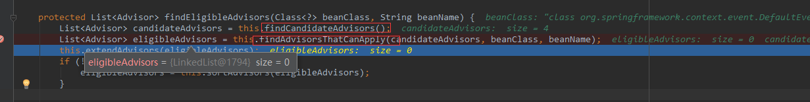
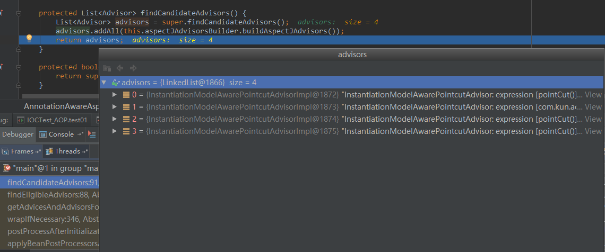

# URL
  - https://www.cnblogs.com/liuyk-code/p/9886033.html
  ````
  ````
  

# 一、准备工作

　　在这里我先简单记录下如何实现一个aop：


 ````
 AOP：【动态代理】
          指在程序运行期间动态的将某段代码切入到指定方法指定位置进行运行的编程方式；
  
  1、导入aop模块；Spring AOP：(spring-aspects)
  2、定义一个业务逻辑类（MathCalculator）；在业务逻辑运行的时候将日志进行打印（方法之前、方法运行结束、方法出现异常，xxx）
  3、定义一个日志切面类（LogAspects）：切面类里面的方法需要动态感知MathCalculator.div运行到哪里然后执行；
          通知方法：
              前置通知(@Before)：logStart：在目标方法(div)运行之前运行
              后置通知(@After)：logEnd：在目标方法(div)运行结束之后运行（无论方法正常结束还是异常结束）
              返回通知(@AfterReturning)：logReturn：在目标方法(div)正常返回之后运行
              异常通知(@AfterThrowing)：logException：在目标方法(div)出现异常以后运行
              环绕通知(@Around)：动态代理，手动推进目标方法运行（joinPoint.procced()）
  4、给切面类的目标方法标注何时何地运行（通知注解）；
  5、将切面类和业务逻辑类（目标方法所在类）都加入到容器中;
  6、必须告诉Spring哪个类是切面类(给切面类上加一个注解：@Aspect)
  7、给配置类中加 @EnableAspectJAutoProxy 【开启基于注解的aop模式】
          在Spring中很多的 @EnableXXX;
  
  三步：
      1）、将业务逻辑组件和切面类都加入到容器中；告诉Spring哪个是切面类（@Aspect）
      2）、在切面类上的每一个通知方法上标注通知注解，告诉Spring何时何地运行（切入点表达式）
      3）、开启基于注解的aop模式；@EnableAspectJAutoProxy
 ````	  
	  

 

 

 

　　我定义了一个除法方法，作为一个切面：


````
package com.kun.aop;

public class MathCalculator {
    
    public int div(int i,int j){
        System.out.println("MathCalculator...div...");
        return i/j;    
    }

}
````


 

　　定义一个切面类：


````
package com.kun.aop;

import java.util.Arrays;

import org.aspectj.lang.JoinPoint;
import org.aspectj.lang.annotation.After;
import org.aspectj.lang.annotation.AfterReturning;
import org.aspectj.lang.annotation.AfterThrowing;
import org.aspectj.lang.annotation.Aspect;
import org.aspectj.lang.annotation.Before;
import org.aspectj.lang.annotation.Pointcut;

/**
 * 切面类
 * @author lfy
 * 
 * @Aspect： 告诉Spring当前类是一个切面类
 *
 */
@Aspect
public class LogAspects {
    
    //抽取公共的切入点表达式
    //1、本类引用
    //2、其他的切面引用
    @Pointcut("execution(public int com.kun.aop.MathCalculator.*(..))")
    public void pointCut(){};
    
    //@Before在目标方法之前切入；切入点表达式（指定在哪个方法切入）
    @Before("pointCut()")
    public void logStart(JoinPoint joinPoint){
        Object[] args = joinPoint.getArgs();
        System.out.println(""+joinPoint.getSignature().getName()+"运行。。。@Before:参数列表是：{"+Arrays.asList(args)+"}");
    }
    
    @After("com.kun.aop.LogAspects.pointCut()")
    public void logEnd(JoinPoint joinPoint){
        System.out.println(""+joinPoint.getSignature().getName()+"结束。。。@After");
    }
    
    //JoinPoint一定要出现在参数表的第一位
    @AfterReturning(value="pointCut()",returning="result")
    public void logReturn(JoinPoint joinPoint,Object result){
        System.out.println(""+joinPoint.getSignature().getName()+"正常返回。。。@AfterReturning:运行结果：{"+result+"}");
    }
    
    @AfterThrowing(value="pointCut()",throwing="exception")
    public void logException(JoinPoint joinPoint,Exception exception){
        System.out.println(""+joinPoint.getSignature().getName()+"异常。。。异常信息：{"+exception+"}");
    }

}
````


　　接下来是一个aop的配置：


````
package com.kun.config;


import org.springframework.context.annotation.Bean;
import org.springframework.context.annotation.Configuration;
import org.springframework.context.annotation.EnableAspectJAutoProxy;

import com.kun.aop.LogAspects;
import com.kun.aop.MathCalculator;

@EnableAspectJAutoProxy
@Configuration
public class MainConfigOfAOP {
     
    //业务逻辑类加入容器中
    @Bean
    public MathCalculator calculator(){
        return new MathCalculator();
    }

    //切面类加入到容器中
    @Bean
    public LogAspects logAspects(){
        return new LogAspects();
    }
}
````


　　通过以上代码我们就完成了一个简单的aop操作，接下来我们根据源码来探究一下springAOP的实现原理。

# 二、从@EnableAspectJAutoProxy看起

　　查看一下@EnableAspectJAutoProxy的定义：


````
@Target(ElementType.TYPE)
@Retention(RetentionPolicy.RUNTIME)
@Documented
@Import(AspectJAutoProxyRegistrar.class)
public @interface EnableAspectJAutoProxy {

    /**
     * Indicate whether subclass-based (CGLIB) proxies are to be created as opposed
     * to standard Java interface-based proxies. The default is {@code false}.
     */
    boolean proxyTargetClass() default false;

}
````


　　我们发现它导入了一个AspectJAutoProxyRegistrar组件，进一步查看其代码：


````
/*
 * Copyright 2002-2012 the original author or authors.
 *
 * Licensed under the Apache License, Version 2.0 (the "License");
 * you may not use this file except in compliance with the License.
 * You may obtain a copy of the License at
 *
 *      http://www.apache.org/licenses/LICENSE-2.0
 *
 * Unless required by applicable law or agreed to in writing, software
 * distributed under the License is distributed on an "AS IS" BASIS,
 * WITHOUT WARRANTIES OR CONDITIONS OF ANY KIND, either express or implied.
 * See the License for the specific language governing permissions and
 * limitations under the License.
 */

package org.springframework.context.annotation;

import org.springframework.aop.config.AopConfigUtils;
import org.springframework.beans.factory.support.BeanDefinitionRegistry;
import org.springframework.core.annotation.AnnotationAttributes;
import org.springframework.core.type.AnnotationMetadata;

import static org.springframework.context.annotation.MetadataUtils.*;

/**
 * Registers an {@link org.springframework.aop.aspectj.annotation.AnnotationAwareAspectJAutoProxyCreator
 * AnnotationAwareAspectJAutoProxyCreator} against the current {@link BeanDefinitionRegistry}
 * as appropriate based on a given @{@link EnableAspectJAutoProxy} annotation.
 *
 * @author Chris Beams
 * @see EnableAspectJAutoProxy
 * @since 3.1
 */
class AspectJAutoProxyRegistrar implements ImportBeanDefinitionRegistrar {

    /**
     * Register, escalate, and configure the AspectJ auto proxy creator based on the value
     * of the @{@link EnableAspectJAutoProxy#proxyTargetClass()} attribute on the importing
     * {@code @Configuration} class.
     */
    public void registerBeanDefinitions(
            AnnotationMetadata importingClassMetadata, BeanDefinitionRegistry registry) {

        AopConfigUtils.registerAspectJAnnotationAutoProxyCreatorIfNecessary(registry);

        AnnotationAttributes enableAJAutoProxy =
                attributesFor(importingClassMetadata, EnableAspectJAutoProxy.class);
        if (enableAJAutoProxy.getBoolean("proxyTargetClass")) {
            AopConfigUtils.forceAutoProxyCreatorToUseClassProxying(registry);
        }
    }

}
````


我们发现它实现了ImportBeanDefinitionRegistrar接口，这个接口可以向IOC容器中注册bean。 由此可以推测aop利用AspectJAutoProxyRegistrar自定义给容器中注册bean；BeanDefinetion。通过断点我们发现

 

IOC容器中注入了一个internalAutoProxyCreator=AnnotationAwareAspectJAutoProxyCreator的bean，到此可以得出结论，@EnableAspectJAutoProxy给容器中注册一个AnnotationAwareAspectJAutoProxyCreator。

# 三、AnnotationAwareAspectJAutoProxyCreator创建过程


　　首先查看类图：


　　在此需要关注两点内容：

1. 关注后置处理器SmartInstantiationAwareBeanPostProcessor（在bean初始化完成前后做事情）

2. 关注自动装配BeanFactory。

　　通过代码查看，发现父类AbstractAutoProxyCreator中有后置处理器的内容；AbstactAdvisorAutoProxyCreator类中重写了其父类AbstractAutoProxyCreator中setBeanFactory()方法，在AnnotationAwareAspectJAutoProxyCreator类中initBeanFactory()方法完成了自动装配BeanFactory。分别在这两处关注点打断点来查看其流程：


````
/**
     * Instantiate and invoke all registered BeanPostProcessor beans,
     * respecting explicit order if given.
     * <p>Must be called before any instantiation of application beans.
     */
    protected void registerBeanPostProcessors(ConfigurableListableBeanFactory beanFactory) {
        String[] postProcessorNames = beanFactory.getBeanNamesForType(BeanPostProcessor.class, true, false);

        // Register BeanPostProcessorChecker that logs an info message when
        // a bean is created during BeanPostProcessor instantiation, i.e. when
        // a bean is not eligible for getting processed by all BeanPostProcessors.
        int beanProcessorTargetCount = beanFactory.getBeanPostProcessorCount() + 1 + postProcessorNames.length;
        beanFactory.addBeanPostProcessor(new BeanPostProcessorChecker(beanFactory, beanProcessorTargetCount));

        // Separate between BeanPostProcessors that implement PriorityOrdered,
        // Ordered, and the rest.
        List<BeanPostProcessor> priorityOrderedPostProcessors = new ArrayList<BeanPostProcessor>();
        List<BeanPostProcessor> internalPostProcessors = new ArrayList<BeanPostProcessor>();
        List<String> orderedPostProcessorNames = new ArrayList<String>();
        List<String> nonOrderedPostProcessorNames = new ArrayList<String>();
        for (String ppName : postProcessorNames) {
            if (isTypeMatch(ppName, PriorityOrdered.class)) {
                BeanPostProcessor pp = beanFactory.getBean(ppName, BeanPostProcessor.class);
                priorityOrderedPostProcessors.add(pp);
                if (pp instanceof MergedBeanDefinitionPostProcessor) {
                    internalPostProcessors.add(pp);
                }
            }
            else if (isTypeMatch(ppName, Ordered.class)) {
                orderedPostProcessorNames.add(ppName);
            }
            else {
                nonOrderedPostProcessorNames.add(ppName);
            }
        }

        // First, register the BeanPostProcessors that implement PriorityOrdered.
        OrderComparator.sort(priorityOrderedPostProcessors);
        registerBeanPostProcessors(beanFactory, priorityOrderedPostProcessors);

        // Next, register the BeanPostProcessors that implement Ordered.
        List<BeanPostProcessor> orderedPostProcessors = new ArrayList<BeanPostProcessor>();
        for (String ppName : orderedPostProcessorNames) {
            BeanPostProcessor pp = beanFactory.getBean(ppName, BeanPostProcessor.class);
            orderedPostProcessors.add(pp);
            if (pp instanceof MergedBeanDefinitionPostProcessor) {
                internalPostProcessors.add(pp);
            }
        }
        OrderComparator.sort(orderedPostProcessors);
        registerBeanPostProcessors(beanFactory, orderedPostProcessors);

        // Now, register all regular BeanPostProcessors.
        List<BeanPostProcessor> nonOrderedPostProcessors = new ArrayList<BeanPostProcessor>();
        for (String ppName : nonOrderedPostProcessorNames) {
            BeanPostProcessor pp = beanFactory.getBean(ppName, BeanPostProcessor.class);
            nonOrderedPostProcessors.add(pp);
            if (pp instanceof MergedBeanDefinitionPostProcessor) {
                internalPostProcessors.add(pp);
            }
        }
        registerBeanPostProcessors(beanFactory, nonOrderedPostProcessors);

        // Finally, re-register all internal BeanPostProcessors.
        OrderComparator.sort(internalPostProcessors);
        registerBeanPostProcessors(beanFactory, internalPostProcessors);

        beanFactory.addBeanPostProcessor(new ApplicationListenerDetector());
    }
````
	


 


　　总结如下：


````
1）、传入配置类，创建ioc容器
          2）、注册配置类，调用refresh（）刷新容器；
          3）、registerBeanPostProcessors(beanFactory);注册bean的后置处理器来方便拦截bean的创建；
              1）、先获取ioc容器已经定义了的需要创建对象的所有BeanPostProcessor
              2）、给容器中加别的BeanPostProcessor
              3）、优先注册实现了PriorityOrdered接口的BeanPostProcessor；
              4）、再给容器中注册实现了Ordered接口的BeanPostProcessor；
              5）、注册没实现优先级接口的BeanPostProcessor；
              6）、注册BeanPostProcessor，实际上就是创建BeanPostProcessor对象，保存在容器中；
                  创建internalAutoProxyCreator的BeanPostProcessor【AnnotationAwareAspectJAutoProxyCreator】
                  1）、创建Bean的实例
                  2）、populateBean；给bean的各种属性赋值
                  3）、initializeBean：初始化bean；
                          1）、invokeAwareMethods()：处理Aware接口的方法回调
                          2）、applyBeanPostProcessorsBeforeInitialization()：应用后置处理器的postProcessBeforeInitialization（）
                          3）、invokeInitMethods()；执行自定义的初始化方法
                          4）、applyBeanPostProcessorsAfterInitialization()；执行后置处理器的postProcessAfterInitialization（）；
                  4）、BeanPostProcessor(AnnotationAwareAspectJAutoProxyCreator)创建成功；--》aspectJAdvisorsBuilder
              7）、把BeanPostProcessor注册到BeanFactory中；
                  beanFactory.addBeanPostProcessor(postProcessor);
				  
=======以上是创建和注册AnnotationAwareAspectJAutoProxyCreator的过程========
				  
````
				  


 # 四、AnnotationAwareAspectJAutoProxyCreator的执行时机

　　通过以上步骤我们发现在IOC容器启动时候，会通过一个@EnableAspectJAutoProxy注解注入AnnotationAwareAspectJAutoProxyCreator对象，并分析了该对象在IOC容器的启动时进行创建的过程。接下来我们重点来分析一下AnnotationAwareAspectJProxyCreator对象执行的时机。

　　之前分析到AnnotationAwareAspectJAutoProxyCreator是一个后置处理器，可以猜测它在其他bean的初始化前后进行了特殊处理。我在它父类的postProcessBeforeInstantiation方法进行了断点调试，其方法调用栈如下：


　　通过对方法栈中源码的简单查看，我继续完善了流程：


````
流程：
 　        1）、传入配置类，创建ioc容器
          2）、注册配置类，调用refresh（）刷新容器；
          3）、registerBeanPostProcessors(beanFactory);注册bean的后置处理器来方便拦截bean的创建；
              1）、先获取ioc容器已经定义了的需要创建对象的所有BeanPostProcessor
              2）、给容器中加别的BeanPostProcessor
              3）、优先注册实现了PriorityOrdered接口的BeanPostProcessor；
              4）、再给容器中注册实现了Ordered接口的BeanPostProcessor；
              5）、注册没实现优先级接口的BeanPostProcessor；
              6）、注册BeanPostProcessor，实际上就是创建BeanPostProcessor对象，保存在容器中；
                  创建internalAutoProxyCreator的BeanPostProcessor【AnnotationAwareAspectJAutoProxyCreator】
                  1）、创建Bean的实例
                  2）、populateBean；给bean的各种属性赋值
                  3）、initializeBean：初始化bean；
                          1）、invokeAwareMethods()：处理Aware接口的方法回调
                          2）、applyBeanPostProcessorsBeforeInitialization()：应用后置处理器的postProcessBeforeInitialization（）
                          3）、invokeInitMethods()；执行自定义的初始化方法
                          4）、applyBeanPostProcessorsAfterInitialization()；执行后置处理器的postProcessAfterInitialization（）；
                  4）、BeanPostProcessor(AnnotationAwareAspectJAutoProxyCreator)创建成功；--》aspectJAdvisorsBuilder
              7）、把BeanPostProcessor注册到BeanFactory中；
                  beanFactory.addBeanPostProcessor(postProcessor);
  =======以上是创建和注册AnnotationAwareAspectJAutoProxyCreator的过程========
  
              AnnotationAwareAspectJAutoProxyCreator => InstantiationAwareBeanPostProcessor
          4）、finishBeanFactoryInitialization(beanFactory);完成BeanFactory初始化工作；创建剩下的单实例bean
              1）、遍历获取容器中所有的Bean，依次创建对象getBean(beanName);
                  getBean->doGetBean()->getSingleton()->
              2）、创建bean
                  【AnnotationAwareAspectJAutoProxyCreator在所有bean创建之前会有一个拦截，InstantiationAwareBeanPostProcessor，
　　　　　　　　　　　　会调用postProcessBeforeInstantiation()】
                  1）、先从缓存中获取当前bean，如果能获取到，说明bean是之前被创建过的，直接使用，否则再创建；
                      只要创建好的Bean都会被缓存起来
                  2）、createBean（）;创建bean；
                      AnnotationAwareAspectJAutoProxyCreator 会在任何bean创建之前先尝试返回bean的实例
                      【BeanPostProcessor是在Bean对象创建完成初始化前后调用的】
                      【InstantiationAwareBeanPostProcessor是在创建Bean实例之前先尝试用后置处理器返回对象的】
                      1）、resolveBeforeInstantiation(beanName, mbdToUse);解析BeforeInstantiation
                          希望后置处理器在此能返回一个代理对象；如果能返回代理对象就使用，如果不能就继续
                          1）、后置处理器先尝试返回对象；
                              bean = applyBeanPostProcessorsBeforeInstantiation（）：
                                  拿到所有后置处理器，如果是InstantiationAwareBeanPostProcessor;
                                  就执行postProcessBeforeInstantiation
                              if (bean != null) {
                                bean = applyBeanPostProcessorsAfterInitialization(bean, beanName);
                            }
  
                      2）、doCreateBean(beanName, mbdToUse, args);真正的去创建一个bean实例；和3.6流程一样；
                      3）、
````					  
					  

# 五、创建AOP代理

　　上一步我发现AnnotationAwareAspectJAutoProxyCreator在所有bean创建时进行了拦截，执行其中的postProcessBeforeInstantiation方法，接下来我们继续通过断点调试查看该方法的进行的操作。


　　首先方法内部会进行一系列的判断，判断当前bean是否在advisedBeans中（保存了所有需要增强bean）、判断当前bean是否是基础类型的Advice、Pointcut、Advisor、AopInfrastructureBean、判断是否是切面（是否实现了注解@Aspect）、判断是否需要跳过等。


　　在判断的过程中会拿到增强bean的相关的通知方法，并通过这些切面进行逻辑判断。

　　执行完postProcessBeforeInstantiation方法进行通知方法的判断后，执行postProcessAfterInitialization方法。


　　我们发现postProcessAfterInitialization方法会对切面进行一次包装的处理。


　　在对对象包装的过程中创建了一个代理对象。





 


 

　　我们细看创建代理对象的过程，发现在创建之前首先会根据切入点表达式对增强器进行一一匹配，最终拿到所有的增强器。


````
 protected Object createProxy(Class<?> beanClass, String beanName, Object[] specificInterceptors, TargetSource targetSource) {
        if (this.beanFactory instanceof ConfigurableListableBeanFactory) {
            AutoProxyUtils.exposeTargetClass((ConfigurableListableBeanFactory)this.beanFactory, beanName, beanClass);
        }

        ProxyFactory proxyFactory = new ProxyFactory();
        proxyFactory.copyFrom(this);
        if (!proxyFactory.isProxyTargetClass()) {
            if (this.shouldProxyTargetClass(beanClass, beanName)) {
                proxyFactory.setProxyTargetClass(true);
            } else {
                this.evaluateProxyInterfaces(beanClass, proxyFactory);
            }
        }

        Advisor[] advisors = this.buildAdvisors(beanName, specificInterceptors);
        proxyFactory.addAdvisors(advisors);
        proxyFactory.setTargetSource(targetSource);
        this.customizeProxyFactory(proxyFactory);
        proxyFactory.setFrozen(this.freezeProxy);
        if (this.advisorsPreFiltered()) {
            proxyFactory.setPreFiltered(true);
        }

        return proxyFactory.getProxy(this.getProxyClassLoader());
    }
````	
	

　　创建代理对象过程中，会先创建一个代理工厂，获取到所有的增强器（通知方法），将这些增强器和目标类注入代理工厂，再用代理工厂创建对象。

	

````
public AopProxy createAopProxy(AdvisedSupport config) throws AopConfigException {
        if (!config.isOptimize() && !config.isProxyTargetClass() && !this.hasNoUserSuppliedProxyInterfaces(config)) {
            return new JdkDynamicAopProxy(config);
        } else {
            Class<?> targetClass = config.getTargetClass();
            if (targetClass == null) {
                throw new AopConfigException("TargetSource cannot determine target class: Either an interface or a target is required for proxy creation.");
            } else {
                return (AopProxy)(!targetClass.isInterface() && !Proxy.isProxyClass(targetClass) ? new ObjenesisCglibAopProxy(config) : new JdkDynamicAopProxy(config));
            }
        }
    }
````	
	

　　代理工厂会选择JdkDynamicAopProxy或者CglibAopProxy，主要通过是否接口和是否配置cglib代理来选择。最终工厂会创建一个代理增强的对象。我们继续完善之前的流程.。


````
流程：
 　        1）、传入配置类，创建ioc容器
          2）、注册配置类，调用refresh（）刷新容器；
          3）、registerBeanPostProcessors(beanFactory);注册bean的后置处理器来方便拦截bean的创建；
              1）、先获取ioc容器已经定义了的需要创建对象的所有BeanPostProcessor
              2）、给容器中加别的BeanPostProcessor
              3）、优先注册实现了PriorityOrdered接口的BeanPostProcessor；
              4）、再给容器中注册实现了Ordered接口的BeanPostProcessor；
              5）、注册没实现优先级接口的BeanPostProcessor；
              6）、注册BeanPostProcessor，实际上就是创建BeanPostProcessor对象，保存在容器中；
                  创建internalAutoProxyCreator的BeanPostProcessor【AnnotationAwareAspectJAutoProxyCreator】
                  1）、创建Bean的实例
                  2）、populateBean；给bean的各种属性赋值
                  3）、initializeBean：初始化bean；
                          1）、invokeAwareMethods()：处理Aware接口的方法回调
                          2）、applyBeanPostProcessorsBeforeInitialization()：应用后置处理器的postProcessBeforeInitialization（）
                          3）、invokeInitMethods()；执行自定义的初始化方法
                          4）、applyBeanPostProcessorsAfterInitialization()；执行后置处理器的postProcessAfterInitialization（）；
                  4）、BeanPostProcessor(AnnotationAwareAspectJAutoProxyCreator)创建成功；--》aspectJAdvisorsBuilder
              7）、把BeanPostProcessor注册到BeanFactory中；
                  beanFactory.addBeanPostProcessor(postProcessor);
  =======以上是创建和注册AnnotationAwareAspectJAutoProxyCreator的过程========
  
              AnnotationAwareAspectJAutoProxyCreator => InstantiationAwareBeanPostProcessor
          4）、finishBeanFactoryInitialization(beanFactory);完成BeanFactory初始化工作；创建剩下的单实例bean
              1）、遍历获取容器中所有的Bean，依次创建对象getBean(beanName);
                  getBean->doGetBean()->getSingleton()->
              2）、创建bean
                  【AnnotationAwareAspectJAutoProxyCreator在所有bean创建之前会有一个拦截，InstantiationAwareBeanPostProcessor，
　　　　　　　　　　　　会调用postProcessBeforeInstantiation()】
                  1）、先从缓存中获取当前bean，如果能获取到，说明bean是之前被创建过的，直接使用，否则再创建；
                      只要创建好的Bean都会被缓存起来
                  2）、createBean（）;创建bean；
                      AnnotationAwareAspectJAutoProxyCreator 会在任何bean创建之前先尝试返回bean的实例
                      【BeanPostProcessor是在Bean对象创建完成初始化前后调用的】
                      【InstantiationAwareBeanPostProcessor是在创建Bean实例之前先尝试用后置处理器返回对象的】
                      1）、resolveBeforeInstantiation(beanName, mbdToUse);解析BeforeInstantiation
                          希望后置处理器在此能返回一个代理对象；如果能返回代理对象就使用，如果不能就继续
                          1）、后置处理器先尝试返回对象；
                              bean = applyBeanPostProcessorsBeforeInstantiation（）：
                                  拿到所有后置处理器，如果是InstantiationAwareBeanPostProcessor;
                                  就执行postProcessBeforeInstantiation
                              if (bean != null) {
                                bean = applyBeanPostProcessorsAfterInitialization(bean, beanName);
                            }
  
                      2）、doCreateBean(beanName, mbdToUse, args);真正的去创建一个bean实例；和3.6流程一样；
                      3）、
AnnotationAwareAspectJAutoProxyCreator【InstantiationAwareBeanPostProcessor】    的作用：
 1）、每一个bean创建之前，调用postProcessBeforeInstantiation()；
          关心MathCalculator和LogAspect的创建
          1）、判断当前bean是否在advisedBeans中（保存了所有需要增强bean）
          2）、判断当前bean是否是基础类型的Advice、Pointcut、Advisor、AopInfrastructureBean，
              或者是否是切面（@Aspect）
          3）、是否需要跳过
              1）、获取候选的增强器（切面里面的通知方法）【List<Advisor> candidateAdvisors】
                  每一个封装的通知方法的增强器是 InstantiationModelAwarePointcutAdvisor；
                  判断每一个增强器是否是 AspectJPointcutAdvisor 类型的；返回true
              2）、永远返回false
 2）、创建对象
  postProcessAfterInitialization；
          return wrapIfNecessary(bean, beanName, cacheKey);//包装如果需要的情况下
          1）、获取当前bean的所有增强器（通知方法）  Object[]  specificInterceptors
             1、找到候选的所有的增强器（找哪些通知方法是需要切入当前bean方法的）
             2、获取到能在bean使用的增强器。
             3、给增强器排序
         2）、保存当前bean在advisedBeans中；
         3）、如果当前bean需要增强，创建当前bean的代理对象；
             1）、获取所有增强器（通知方法）
             2）、保存到proxyFactory
             3）、创建代理对象：Spring自动决定
                 JdkDynamicAopProxy(config);jdk动态代理；
                 ObjenesisCglibAopProxy(config);cglib的动态代理；
         4）、给容器中返回当前组件使用cglib增强了的代理对象；
         5）、以后容器中获取到的就是这个组件的代理对象，执行目标方法的时候，代理对象就会执行通知方法的流程；
````
         

# 六、获取拦截器链

　　上一步分析了目标方法被代理并创建的过程，接下来我们分析目标方法被拦截并执行的过程。


　　因为要查看目标方法的执行过程，所以我继续在目标方法上进行断点调试。通过对MathCalculator查看，可以发现它从IOC容器中取出已经是一个cglib代理对象了，其中包含增强方法和目标对象的一些详细信息。

　　

　　紧接着断点进入CglibAopProxy.intercept()拦截器，其中会获取即将执行的目标方法的拦截器链。


````
public List<Object> getInterceptorsAndDynamicInterceptionAdvice(
            Advised config, Method method, Class targetClass) {

        // This is somewhat tricky... we have to process introductions first,
        // but we need to preserve order in the ultimate list.
        List<Object> interceptorList = new ArrayList<Object>(config.getAdvisors().length);
        boolean hasIntroductions = hasMatchingIntroductions(config, targetClass);
        AdvisorAdapterRegistry registry = GlobalAdvisorAdapterRegistry.getInstance();
        for (Advisor advisor : config.getAdvisors()) {
            if (advisor instanceof PointcutAdvisor) {
                // Add it conditionally.
                PointcutAdvisor pointcutAdvisor = (PointcutAdvisor) advisor;
                if (config.isPreFiltered() || pointcutAdvisor.getPointcut().getClassFilter().matches(targetClass)) {
                    MethodInterceptor[] interceptors = registry.getInterceptors(advisor);
                    MethodMatcher mm = pointcutAdvisor.getPointcut().getMethodMatcher();
                    if (MethodMatchers.matches(mm, method, targetClass, hasIntroductions)) {
                        if (mm.isRuntime()) {
                            // Creating a new object instance in the getInterceptors() method
                            // isn't a problem as we normally cache created chains.
                            for (MethodInterceptor interceptor : interceptors) {
                                interceptorList.add(new InterceptorAndDynamicMethodMatcher(interceptor, mm));
                            }
                        }
                        else {
                            interceptorList.addAll(Arrays.asList(interceptors));
                        }
                    }
                }
            }
            else if (advisor instanceof IntroductionAdvisor) {
                IntroductionAdvisor ia = (IntroductionAdvisor) advisor;
                if (config.isPreFiltered() || ia.getClassFilter().matches(targetClass)) {
                    Interceptor[] interceptors = registry.getInterceptors(advisor);
                    interceptorList.addAll(Arrays.asList(interceptors));
                }
            }
            else {
                Interceptor[] interceptors = registry.getInterceptors(advisor);
                interceptorList.addAll(Arrays.asList(interceptors));
            }
        }
        return interceptorList;
    }
````	
	

　　通过registry.getInterceptors(advisor)方法获取所有的增强器，并将增强器转为List<MethodInterceptor>，最终返回。


````
public Object proceed() throws Throwable {
        if (this.currentInterceptorIndex == this.interceptorsAndDynamicMethodMatchers.size() - 1) {
            return this.invokeJoinpoint();
        } else {
            Object interceptorOrInterceptionAdvice = this.interceptorsAndDynamicMethodMatchers.get(++this.currentInterceptorIndex);
            if (interceptorOrInterceptionAdvice instanceof InterceptorAndDynamicMethodMatcher) {
                InterceptorAndDynamicMethodMatcher dm = (InterceptorAndDynamicMethodMatcher)interceptorOrInterceptionAdvice;
                return dm.methodMatcher.matches(this.method, this.targetClass, this.arguments) ? dm.interceptor.invoke(this) : this.proceed();
            } else {
                return ((MethodInterceptor)interceptorOrInterceptionAdvice).invoke(this);
            }
        }
    }
````	
	

　　之后，会将拦截器链和目标对象等传入methodInvocation，并调用proceed()方法。该方法执行也是拦截器的触发过程，也是目标方法的主要执行过程。

　　　

　　通过索引遍历拦截器链中的所有的拦截器（封装的增强器），并分别执行增强方法。每次执行拦截器方法索引自增，直至所有的增强方法执行完毕。


　
 

　　源码中有一个ExposeInvocationInterceptor对象会将MethodInvocation放入到ThreadLocal进行线程共享，查看相关资料说方便同一线程中其他地方获取通知方法，具体哪里获得，我暂时没有找到，在后续工作学习中继续深入查看探究吧。

　　完善流程如下：


````
流程：
 　        1）、传入配置类，创建ioc容器
          2）、注册配置类，调用refresh（）刷新容器；
          3）、registerBeanPostProcessors(beanFactory);注册bean的后置处理器来方便拦截bean的创建；
              1）、先获取ioc容器已经定义了的需要创建对象的所有BeanPostProcessor
              2）、给容器中加别的BeanPostProcessor
              3）、优先注册实现了PriorityOrdered接口的BeanPostProcessor；
              4）、再给容器中注册实现了Ordered接口的BeanPostProcessor；
              5）、注册没实现优先级接口的BeanPostProcessor；
              6）、注册BeanPostProcessor，实际上就是创建BeanPostProcessor对象，保存在容器中；
                  创建internalAutoProxyCreator的BeanPostProcessor【AnnotationAwareAspectJAutoProxyCreator】
                  1）、创建Bean的实例
                  2）、populateBean；给bean的各种属性赋值
                  3）、initializeBean：初始化bean；
                          1）、invokeAwareMethods()：处理Aware接口的方法回调
                          2）、applyBeanPostProcessorsBeforeInitialization()：应用后置处理器的postProcessBeforeInitialization（）
                          3）、invokeInitMethods()；执行自定义的初始化方法
                          4）、applyBeanPostProcessorsAfterInitialization()；执行后置处理器的postProcessAfterInitialization（）；
                  4）、BeanPostProcessor(AnnotationAwareAspectJAutoProxyCreator)创建成功；--》aspectJAdvisorsBuilder
              7）、把BeanPostProcessor注册到BeanFactory中；
                  beanFactory.addBeanPostProcessor(postProcessor);
  =======以上是创建和注册AnnotationAwareAspectJAutoProxyCreator的过程========
  
              AnnotationAwareAspectJAutoProxyCreator => InstantiationAwareBeanPostProcessor
          4）、finishBeanFactoryInitialization(beanFactory);完成BeanFactory初始化工作；创建剩下的单实例bean
              1）、遍历获取容器中所有的Bean，依次创建对象getBean(beanName);
                  getBean->doGetBean()->getSingleton()->
              2）、创建bean
                  【AnnotationAwareAspectJAutoProxyCreator在所有bean创建之前会有一个拦截，InstantiationAwareBeanPostProcessor，
　　　　　　　　　　　　会调用postProcessBeforeInstantiation()】
                  1）、先从缓存中获取当前bean，如果能获取到，说明bean是之前被创建过的，直接使用，否则再创建；
                      只要创建好的Bean都会被缓存起来
                  2）、createBean（）;创建bean；
                      AnnotationAwareAspectJAutoProxyCreator 会在任何bean创建之前先尝试返回bean的实例
                      【BeanPostProcessor是在Bean对象创建完成初始化前后调用的】
                      【InstantiationAwareBeanPostProcessor是在创建Bean实例之前先尝试用后置处理器返回对象的】
                      1）、resolveBeforeInstantiation(beanName, mbdToUse);解析BeforeInstantiation
                          希望后置处理器在此能返回一个代理对象；如果能返回代理对象就使用，如果不能就继续
                          1）、后置处理器先尝试返回对象；
                              bean = applyBeanPostProcessorsBeforeInstantiation（）：
                                  拿到所有后置处理器，如果是InstantiationAwareBeanPostProcessor;
                                  就执行postProcessBeforeInstantiation
                              if (bean != null) {
                                bean = applyBeanPostProcessorsAfterInitialization(bean, beanName);
                            }
  
                      2）、doCreateBean(beanName, mbdToUse, args);真正的去创建一个bean实例；和3.6流程一样；
                      3）、
AnnotationAwareAspectJAutoProxyCreator【InstantiationAwareBeanPostProcessor】    的作用：
 1）、每一个bean创建之前，调用postProcessBeforeInstantiation()；
          关心MathCalculator和LogAspect的创建
          1）、判断当前bean是否在advisedBeans中（保存了所有需要增强bean）
          2）、判断当前bean是否是基础类型的Advice、Pointcut、Advisor、AopInfrastructureBean，
              或者是否是切面（@Aspect）
          3）、是否需要跳过
              1）、获取候选的增强器（切面里面的通知方法）【List<Advisor> candidateAdvisors】
                  每一个封装的通知方法的增强器是 InstantiationModelAwarePointcutAdvisor；
                  判断每一个增强器是否是 AspectJPointcutAdvisor 类型的；返回true
              2）、永远返回false
 2）、创建对象
  postProcessAfterInitialization；
          return wrapIfNecessary(bean, beanName, cacheKey);//包装如果需要的情况下
          1）、获取当前bean的所有增强器（通知方法）  Object[]  specificInterceptors
             1、找到候选的所有的增强器（找哪些通知方法是需要切入当前bean方法的）
             2、获取到能在bean使用的增强器。
             3、给增强器排序
         2）、保存当前bean在advisedBeans中；
         3）、如果当前bean需要增强，创建当前bean的代理对象；
             1）、获取所有增强器（通知方法）
             2）、保存到proxyFactory
             3）、创建代理对象：Spring自动决定
                 JdkDynamicAopProxy(config);jdk动态代理；
                 ObjenesisCglibAopProxy(config);cglib的动态代理；
         4）、给容器中返回当前组件使用cglib增强了的代理对象；
         5）、以后容器中获取到的就是这个组件的代理对象，执行目标方法的时候，代理对象就会执行通知方法的流程；       
  3）、目标方法执行    ；
         容器中保存了组件的代理对象（cglib增强后的对象），这个对象里面保存了详细信息（比如增强器，目标对象，xxx）；
         1）、CglibAopProxy.intercept();拦截目标方法的执行
         2）、根据ProxyFactory对象获取将要执行的目标方法拦截器链；
             List<Object> chain = this.advised.getInterceptorsAndDynamicInterceptionAdvice(method, targetClass);
             1）、List<Object> interceptorList保存所有拦截器 5
                 一个默认的ExposeInvocationInterceptor 和 4个增强器；
             2）、遍历所有的增强器，将其转为Interceptor；
                 registry.getInterceptors(advisor);
             3）、将增强器转为List<MethodInterceptor>；
                 如果是MethodInterceptor，直接加入到集合中
                 如果不是，使用AdvisorAdapter将增强器转为MethodInterceptor；
                 转换完成返回MethodInterceptor数组；
3）、如果没有拦截器链，直接执行目标方法;
        拦截器链（每一个通知方法又被包装为方法拦截器，利用MethodInterceptor机制）
4）、如果有拦截器链，把需要执行的目标对象，目标方法，
        拦截器链等信息传入创建一个 CglibMethodInvocation 对象，
        并调用 Object retVal =  mi.proceed();
5）、拦截器链的触发过程;
        1)、如果没有拦截器执行执行目标方法，或者拦截器的索引和拦截器数组-1大小一样（指定到了最后一个拦截器）执行目标方法；
        2)、链式获取每一个拦截器，拦截器执行invoke方法，每一个拦截器等待下一个拦截器执行完成返回以后再来执行；
           拦截器链的机制，保证通知方法与目标方法的执行顺序；
````		   
		   

 # 七、小结

　　


````
 1）、 @EnableAspectJAutoProxy 开启AOP功能
 2）、 @EnableAspectJAutoProxy 会给容器中注册一个组件 AnnotationAwareAspectJAutoProxyCreator
 3）、AnnotationAwareAspectJAutoProxyCreator是一个后置处理器；
 4）、容器的创建流程：
        1）、registerBeanPostProcessors（）注册后置处理器；创建AnnotationAwareAspectJAutoProxyCreator对象
        2）、finishBeanFactoryInitialization（）初始化剩下的单实例bean
            1）、创建业务逻辑组件和切面组件
            2）、AnnotationAwareAspectJAutoProxyCreator拦截组件的创建过程
            3）、组件创建完之后，判断组件是否需要增强
                     是：切面的通知方法，包装成增强器（Advisor）;给业务逻辑组件创建一个代理对象（cglib）；
 5）、执行目标方法：
        1）、代理对象执行目标方法
        2）、CglibAopProxy.intercept()；
             1）、得到目标方法的拦截器链（增强器包装成拦截器MethodInterceptor）
             2）、利用拦截器的链式机制，依次进入每一个拦截器进行执行；
             3）、效果：
                      正常执行：前置通知-》目标方法-》后置通知-》返回通知
                      出现异常：前置通知-》目标方法-》后置通知-》异常通知
````					  
					  