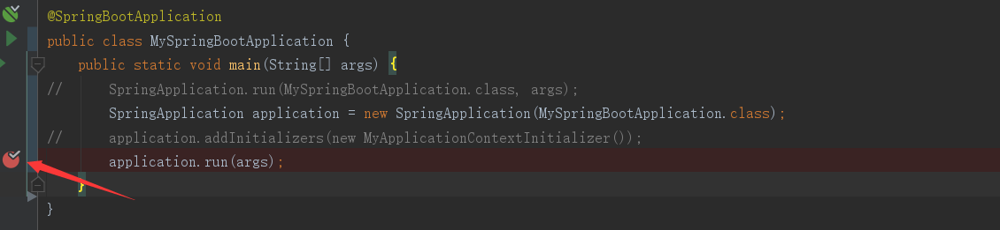

# URL
  - https://www.cnblogs.com/hello-shf/p/10987360.html


# 目录

* 一、 ApplicationContextInitializer 介绍
* 二、三种实现方式
* 三、排序问题


# 一、 ApplicationContextInitializer 介绍
　　首先看spring官网的介绍：

    

 　　翻译一下：

* 用于在spring容器刷新之前初始化Spring ConfigurableApplicationContext的回调接口。（剪短说就是在容器刷新之前调用该类的 initialize 方法。并将 ConfigurableApplicationContext 类的实例传递给该方法）
* 通常用于需要对应用程序上下文进行编程初始化的web应用程序中。例如，根据上下文环境注册属性源或激活配置文件等。
* 可排序的（实现Ordered接口，或者添加@Order注解）
　　看完这段解释，为了讲解方便，我们先看自定义 ApplicationContextInitializer 的三种方式。再通过SpringBoot的源码，分析生效的时间以及实现的功能等。


# 二、三种实现方式
　　首先新建一个类 MyApplicationContextInitializer 并实现 ApplicationContextInitializer 接口。

```
1 public class MyApplicationContextInitializer implements ApplicationContextInitializer {
2     @Override
3     public void initialize(ConfigurableApplicationContext applicationContext) {
4         System.out.println("-----MyApplicationContextInitializer initialize-----");
5     }
6 }
```

##　　2.1、mian函数中添加
　　优雅的写一个SpringBoot的main方法

复制代码

```

1 @SpringBootApplication
2 public class MySpringBootApplication {
3     public static void main(String[] args) {
4         SpringApplication application = new SpringApplication(MySpringBootApplication.class);
5         application.addInitializers(new MyApplicationContextInitializer());
6         application.run(args);
7     }
8 }
```
 

　　运行，查看控制台：生效了

    
　　

##　　2.2、配置文件中配置

```
context.initializer.classes=org.springframework.boot.demo.common.MyApplicationContextInitializer 
```


　　

　　2.3、SpringBoot的SPI扩展---META-INF/spring.factories中配置
org.springframework.context.ApplicationContextInitializer=org.springframework.boot.demo.common.MyApplicationContextInitializer
 

　　

 


# 三、排序问题
　　如图所示改造一下mian方法。打一个断点，debug查看排序情况。
    
　　

　　给 MyApplicationContextInitializer 加上Order注解：我们指定其拥有最高的排序级别。（越高越早执行）

```
1 @Order(Ordered.HIGHEST_PRECEDENCE)
2 public class MyApplicationContextInitializer implements ApplicationContextInitializer{
3     @Override
4     public void initialize(ConfigurableApplicationContext applicationContext) {
5         System.out.println("-----MyApplicationContextInitializer initialize-----");
6     }
7 }
```
 

　　下面我们通过debug分别验证二章节中提到的三种方法排序是否都是可以的。

　　首先验证2.1章节中采用的main函数中添加：debug，断点处查看 application.getInitializers() 这行代码的结果可见，排序生效了。

　　

　　然后再分别验证2.2和2.3章节中的方法。排序都是可以实现的。

　　然而当采用2.3中的SPI扩展的方式，排序指定 @Order(Ordered.LOWEST_PRECEDENCE) 排序并没有生效。当然采用实现Ordered接口的方式，排序验证结果都是一样的。


 # 四、通过源码分析ApplicationContextInitializer何时被调用

　　debug差看上文中自定的 MyApplicationContextInitializer 的调用栈。

　　

　　可见 ApplicationContextInitializer 在容器刷新前的准备阶段被调用。 refreshContext(context); 

　　在SpringBoot的启动函数中， ApplicationContextInitializer 

```
 1     public ConfigurableApplicationContext run(String... args) {
 2         //记录程序运行时间
 3         StopWatch stopWatch = new StopWatch();
 4         stopWatch.start();
 5         // ConfigurableApplicationContext Spring 的上下文
 6         ConfigurableApplicationContext context = null;
 7         Collection<SpringBootExceptionReporter> exceptionReporters = new ArrayList<>();
 8         configureHeadlessProperty();
 9         //从META-INF/spring.factories中获取监听器
10         //1、获取并启动监听器
11         SpringApplicationRunListeners listeners = getRunListeners(args);
12         listeners.starting();
13         try {
14             ApplicationArguments applicationArguments = new DefaultApplicationArguments(
15                     args);
16             //2、构造容器环境
17             ConfigurableEnvironment environment = prepareEnvironment(listeners, applicationArguments);
18             //处理需要忽略的Bean
19             configureIgnoreBeanInfo(environment);
20             //打印banner
21             Banner printedBanner = printBanner(environment);
22             ///3、初始化容器
23             context = createApplicationContext();
24             //实例化SpringBootExceptionReporter.class，用来支持报告关于启动的错误
25             exceptionReporters = getSpringFactoriesInstances(
26                     SpringBootExceptionReporter.class,
27                     new Class[]{ConfigurableApplicationContext.class}, context);
28             //4、刷新容器前的准备阶段
29             prepareContext(context, environment, listeners, applicationArguments, printedBanner);
30             //5、刷新容器
31             refreshContext(context);
32             //刷新容器后的扩展接口
33             afterRefresh(context, applicationArguments);
34             stopWatch.stop();
35             if (this.logStartupInfo) {
36                 new StartupInfoLogger(this.mainApplicationClass)
37                         .logStarted(getApplicationLog(), stopWatch);
38             }
39             listeners.started(context);
40             callRunners(context, applicationArguments);
41         } catch (Throwable ex) {
42             handleRunFailure(context, ex, exceptionReporters, listeners);
43             throw new IllegalStateException(ex);
44         }
45 
46         try {
47             listeners.running(context);
48         } catch (Throwable ex) {
49             handleRunFailure(context, ex, exceptionReporters, null);
50             throw new IllegalStateException(ex);
51         }
52         return context;
53     }
```
 

 　　然后看在 refreshContext(context); 具体是怎么被调用的。

```
1 private void prepareContext(ConfigurableApplicationContext context,
2                             ConfigurableEnvironment environment, SpringApplicationRunListeners listeners,
3                             ApplicationArguments applicationArguments, Banner printedBanner) {
4     context.setEnvironment(environment);
5     postProcessApplicationContext(context);
6     applyInitializers(context);
7     ...
8 }
```
 

 　　然后在 applyInitializers 中遍历调用每一个被加载的 ApplicationContextInitializer 的  initialize(context);  方法，并将 ConfigurableApplicationContext 的实例传递给 initialize 方法。

```
1 protected void applyInitializers(ConfigurableApplicationContext context) {
2     for (ApplicationContextInitializer initializer : getInitializers()) {
3         Class<?> requiredType = GenericTypeResolver.resolveTypeArgument(
4                 initializer.getClass(), ApplicationContextInitializer.class);
5         Assert.isInstanceOf(requiredType, context, "Unable to call initializer.");
6         initializer.initialize(context);
7     }
8 }
```
 

　　OK，到这里通过源码说明了 ApplicationContextInitializer 是何时及如何被调用的。