# URL
  - https://www.solves.com.cn/it/cxkf/yy/JAVA/2019-10-10/5850.html

10分钟搞懂SpringBoot的组件EnvironmentPostProcessor使用和原理

# 前言
关于nacos客户端如何获取到服务端的配置信息的主流程源码分析和客户端拉取服务端变更的主流程源码分析在前两篇文章都分析过了，虽然读的人并不是很多，加起来也没有200个人阅读，也不知道是我写的不好，还是大家对nacos的源码并不感兴趣，不过既然是系列教程，我们还是要坚持把这个小系列教程做完，本小节本来要介绍nacos和spring boot整合的主流程源码分析的，但是思来想去，还是先花几个小节把spring boot的启动流程中涉及到的主要组件一起学习一下，这样可能分析nacos和spring boot整合时候，大家理解的可能会快一点，达到事半功倍的效果

本文为原创文章，主要讲解spring boot一个核心组件EnvironmentPostProcessor，阅读本文大约7分钟，如果觉得本文写的不错，请给一个点赞或者关注一下，您的支持是我写作的最大动力

# EnvironmentPostProcessor功能说明
EnvironmentPostProcessor从名字上看，叫做"环境后置处理器"，它是一个接口，它可以再spring上下文启动的时候，去初始化一些基本配置信息，将某些变量信息，加载到spring容器上下文中，更加通俗的理解就是它可以用来解析加载我们自定义额外properties

举例来说:

1) 我们可以使用EnvironmentPostProcessor来加载json文件中的kv属性，将其解析到全局的环境变量里面，然后使用@Value来获取到信息

2）我们甚至可以使用EnvironmentPostProcessor来加载远程的配置，例如我们可以使用这个组件加载nacos的服务器的配置信息

# EnvironmentPostProcessor 实战——加载本地json数据

step1.编写测试数据

1.1. 首先在spring boot的hello world项目的resource文件夹下新建一个测试的json——custom_properties文件，就写两个简单的kv值

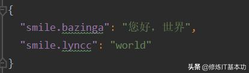
 

1.2. 存在的位置在resources/json/custom_properties.json,格式如下

step2.自定义EnvironmentPostProcessor

2.1. 新建BazingaJsonEnvironmentPostProcessor，这个类主要是读取我们刚才写的cutom_properties.json的文本信息，然后加载到spring的Environment中，BazingaJsonEnvironmentPostProcessor继承我们今天的主角EnvironmentPostProcessor，这是一个接口，我们需要实现postProcessorEnvironment接口

这个接口就是首先读取cutom_properties.json转换成流，然后将流读取成kv值，变成properties，最后写入到ConfigurableEnvironment中去，这样当spring的context开始初始化的时候，就能够在ConfigurableEnvironment中读取到变量，主要实现代码如下

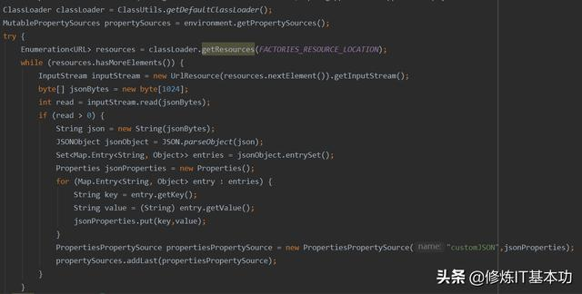

核心实现逻辑

2.2 我们有了自定义的BazingaJsonEnvironmentPostProcessor之后，还是不够的，还缺一个驱动力，springboot启动的时候，不会去主动读取我们自定义的类的，所以我们还需要利用spring boot的SPI机制，来加载我们的环境后置处理器，我们再resources下新建一个文件夹META-INF,然后在META-INF下新建文件spring.factories,整体结构如下图所示

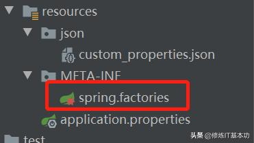

2.3 文件的内容也是有规范的，我们要指定spring的接口具体的实现类是我们自定义的

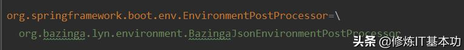
 

到这边为止，我们所有的配置就到此结束了，最后我们写一个简单的测试controller，来测试一下我们自定义的两个KV能否在@Value这种注解中生效

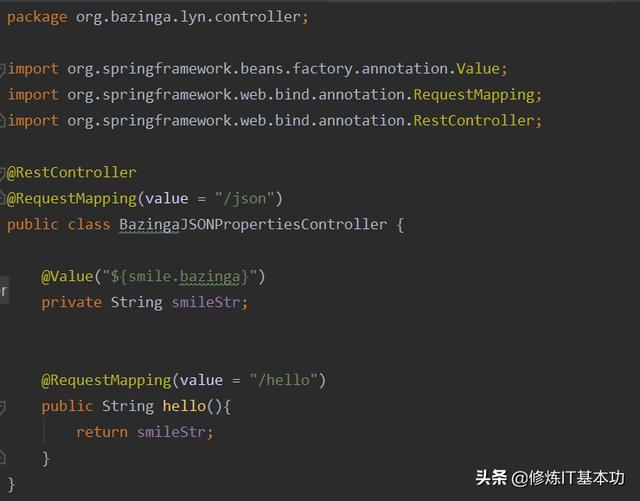
 

我们整体的项目骨架图如下图所示

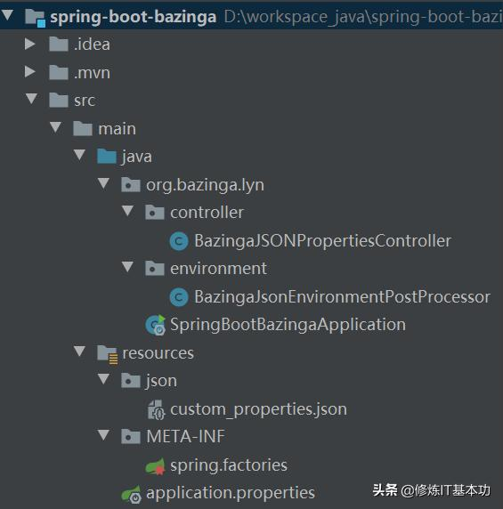
 

我们简单地运行一下localhost:8080/json/hello,可以在浏览器中成功展示我们的"您好，世界"，这样我们就可以成功地将我们自定义的文件中的属性值，让spring boot加载到，并成功运用到我们真实的项目中去了，虽然很简单，但是这个组件EnvironmentPostProcessor的使用套路，大家还是要掌握的，很多优秀的源代码中都运用了这个套路，例如携程的Apollo.

# EnvironmentPostProcessor的原理讲解

我们已经初步懂得了EnvironmentPostProcessor的使用技巧，还有它的作用，在讲解原理之前，我们首先要记得一点，如果你有特殊的配置文件要加载的话，使用EnvironmentPostProcessor是很方便的，因为spring boot加载它的顺序是所有组件中最靠前的，等下我们分析看源码的时候，就能体会到这点了

这个源码分析也很简单，debug走一遍源码5分钟也就到了我们今天说的这个组件了，入口当然是我们的main函数了，我们只要看SpringApplication的源码基本上就了解了

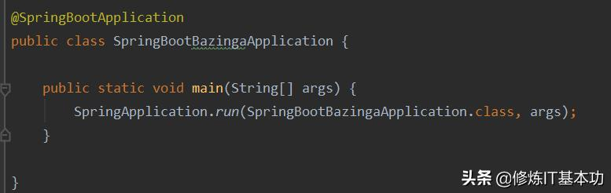
 

我们先打开SpringApplication#run方法

step1：我们第一个要关注的就是spring boot首先初始化了一个全局的事件监听器，这个事件监听器会伴随着springboot的整个生命周期，这个我们以后也会多次接触这个组件

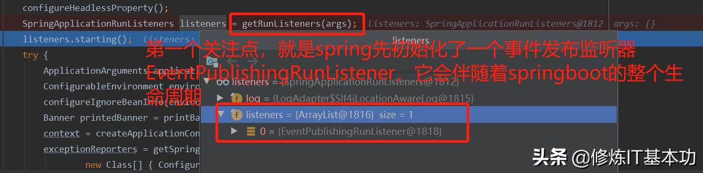

初始化全局的事件监听器EventPublishingRunListener

step2：接下来就是开始准备springboot所有配置文件存储的仓库Environment，这个其实也很好理解，spring是管理bean的，bean里面也有很多属性，所以优先收集整个上下文的配置属性信息，将其放在一个篮子（Environment）里面，然后以后想要什么，就从篮子里面去获取，而不是在想要的时候，在去想办法获取，这样会导致整个springboot的代码变得不是很优雅

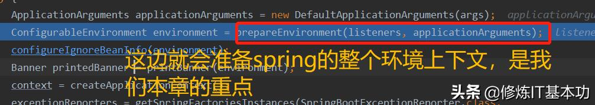
 

step3:我们进入prepareEnvironment方法

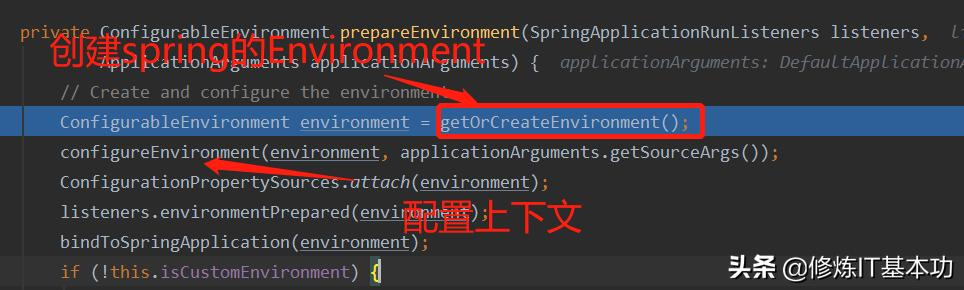
 

我们可以看到首先先调用getOrCreateEnvironment创建好一个"篮子"，有了这个"篮子"我们才可以在这个"篮子"里面放我们想要的东西，所以我们可以接着看下一行的#configureEnvironment方法，例如System.setProperties之类信息会在这边进行加载，放到篮子里面

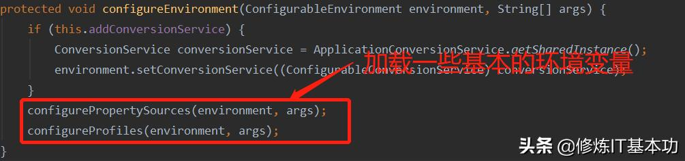
 

主要是加载如下的配置文件，你不要小看这样的配置文件，运维很有用，运维启动启动一般会配置启动参数，其实也就是在这个地方，启动参数被会spring boot解析到作为默认选项，加载到上下文中，作为启动的核心参数启动，但是一般这些参数叫做默认参数，优先级是最低的，如果你在代码有同key值的时候，就会覆盖运维配置的系统级变量值，这点我们平时开发的时候要注意，如下图所示，这点很重要，不过不是我们今天的重点

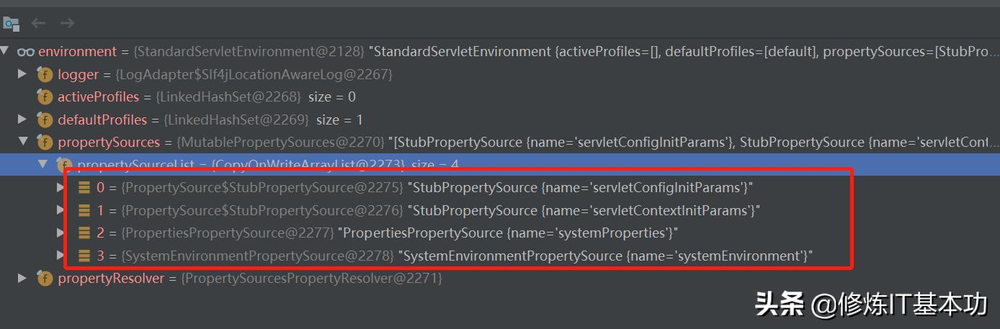
 

其实就算大家不看spring的源码，但是也知道spring有一个很牛的源码原则就是"开闭原则"，"篮子"是spring自己造的，东西也是spring自己放的，不能让我们这些使用者没有一点机会去做点什么，肯定不是springboot的风格，所以spring就开了一个口子，简单地说就是开了一个后门，貌似在说:我东西放完了，你有什么东西要放的啊，口子就在如下的代码中

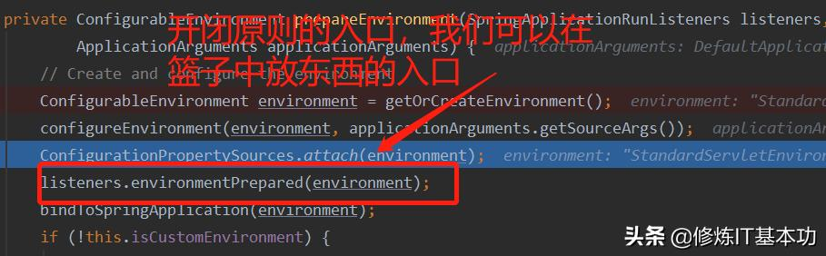
 

我们可以看到方法名叫做environmentPrepared，调用者是listener，是一个监听器，也就是我们上文说的EventPublishingRunListener监听器，就是像是在说："同志们，篮子我已经弄好了，你们有啥东西想放的赶紧放，放完我准备开始用了"

最后我们跟着源码debug，会到了ConfigFileApplicationListener的监听器实例，它监听的是一个ApplicationEnvironmentPreparedEvent，故其名曰"应用环境准备好事件"，虽然有点绕口，也不通顺，但是看到这边我们就动了，springboot是靠一种事件订阅的方式来做解耦合的，源码如下

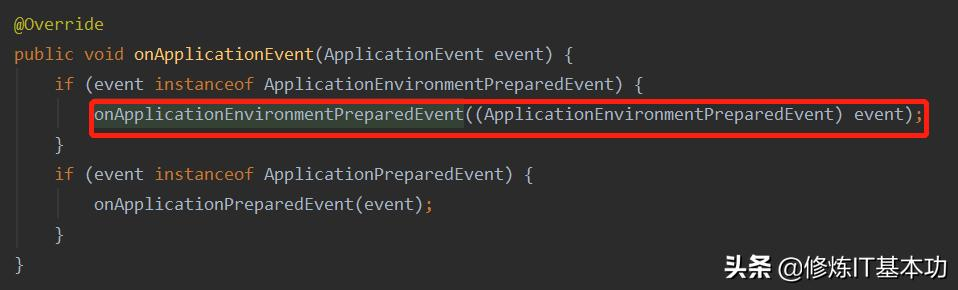

ConfigFileApplicationListener.JAVA

debug到现在，我们进入onApplicationEnvironmentPreparedEvent这个方法，就可以看到我们今天的主角的影子了，有请我们的主角登场

EnvironmentPostProcessor初次出现

我们可以看到当loadPostProcessors执行完之后，看方法名我们也是是加载当前项目中EnvironmentPostProcessor,然后排序，最后调用我们刚刚说的postProcessorEnvironment方法，这个方法的具体实现，也就是我们上文实战小节的那个BazingaJSONEnvironmentPostProcessor的具体实践了，到现在为止，我们已经跟踪源码知道整个加载的主流程了

现在还剩下最后一个问题，为啥我们要写META-INF的spring.factorie配置文件了，答案就是在loadPostProcessors中了，这个方法是一个静态方法，调用SpringFactoriesLoader的loadFactories方法

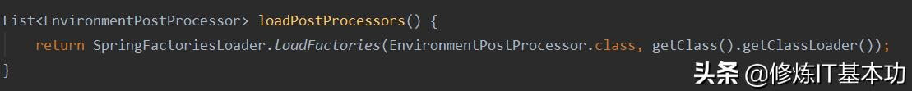
 

这个SpringFactoriesLoader就有一个类似的SPI机制，会去加载META-INF下定义的类，因为这边源码比较长，但是并不是很难理解，我就贴下一个全局的类加载路径，大家基本上看一下也就能懂~

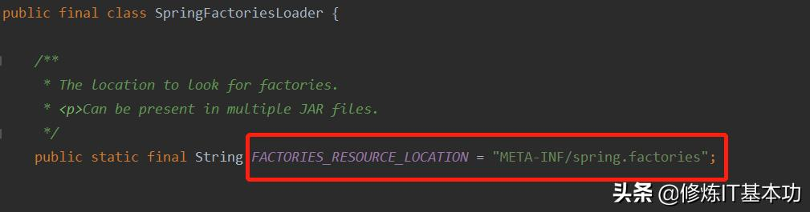

SPI的类加载路径

好了，到此为止，整个分析也就结束了，基本上还是很简单的

# 小结

本小节其实是为了简介nacos整个spring boot源码讲解的一个铺垫，但是单独使用一个小节，也是合理的，EnvironmentPostProcessor组件在整个spring boot的生态中还是比较重要的，如果吧spring boot最后运行成功，比如一个机器人，那么EnvironmentPostProcessor组件就是开始组装这个机器人之前存放零件的仓库，以后缺什么组件都可以在这个容器中寻找~