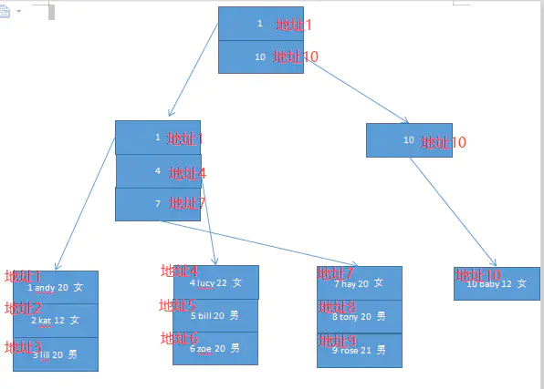

# URL
  - https://www.jianshu.com/p/2530d1185778
<h2>01  开局一张图</h2>

这张图是<code>重点</code>！！！咱要先对MySQL有一个宏观的了解，知道他的执行流程。

一条SQL语句过来的流程是什么样的？那就follow me。哈哈哈哈，皮一下很开心。

<ul>
<li>
1.当客户端连接到MySQL服务器时，服务器对其进行认证。可以通过用户名与密码认证，也可以通过SSL证书进行认证。登录认证后，服务器还会验证客户端是否有执行某个查询的操作权限。
</li>
<li>
2.在正式查询之前，服务器会检查查询缓存，如果能找到对应的查询，则不必进行查询解析，优化，执行等过程，直接返回缓存中的结果集。
</li>
<li>
3.MySQL的解析器会根据查询语句，构造出一个解析树，主要用于根据语法规则来验证语句是否正确，比如SQL的关键字是否正确，关键字的顺序是否正确。
</li>
</ul>

而预处理器主要是进一步校验，比如表名，字段名是否正确等

<ul>
<li>
4.查询优化器将解析树转化为查询计划，一般情况下，一条查询可以有很多种执行方式，最终返回相同的结果，优化器就是根据<code>成本</code>找到这其中最优的执行计划
</li>
<li>
5.执行计划调用查询执行引擎，而查询引擎通过一系列API接口查询到数据
</li>
<li>
6.得到数据之后，在返回给客户端的同时，会将数据存在查询缓存中
</li>
</ul>

<h2>02  查询缓存</h2>

我们先通过<code>show variables like '%query_cache%'</code>来看一下默认的数据库配置，此为本地数据库的配置。

image.png

<h3>2.1  概念</h3>

have_query_cache:当前的MYSQL版本是否支持“查询缓存”功能。

query_cache_limit:MySQL能够缓存的最大查询结果，查询结果大于该值时不会被缓存。默认值是1048576(1MB)

query_cache_min_res_unit:查询缓存分配的最小块（字节）。默认值是4096（4KB）。当查询进行时，MySQL把查询结果保存在query cache，但是如果保存的结果比较大，超过了query_cache_min_res_unit的值，这时候MySQL将一边检索结果，一边进行保存结果。他保存结果也是按默认大小先分配一块空间，如果不够，又要申请新的空间给他。如果查询结果比较小，默认的query_cache_min_res_unit可能造成大量的内存碎片，如果查询结果比较大，默认的query_cache_min_res_unit又不够，导致一直分配块空间，所以可以根据实际需求，调节query_cache_min_res_unit的大小。

<code>注：如果上面说的内容有点弯弯绕，那举个现实生活中的例子，比如咱现在要给运动员送水，默认的是500ml的瓶子，如果过来的是少年运动员，可能500ml太大了，他们喝不完，造成了浪费，那我们就可以选择300ml的瓶子，如果过来的是成年运动员，可能500ml不够，那他们一瓶喝完了，又开一瓶，直接不渴为止。那么那样开瓶子也要时间，我们就可以选择1000ml的瓶子。</code>

query_cache_size:为缓存查询结果分配的总内存。

query_cache_type:默认为on，可以缓存除了以select sql_no_cache开头的所有查询结果。

query_cache_wlock_invalidate:如果该表被锁住，是否返回缓存中的数据，默认是关闭的。

<h3>2.2  原理</h3>

MYSQL的查询缓存实质上是缓存SQL的hash值和该SQL的查询结果，如果运行相同的SQL,服务器直接从缓存中去掉结果，而不再去解析，优化，寻找最低成本的执行计划等一系列操作，大大提升了查询速度。

但是万事有利也有弊。

<ul>
<li>第一个弊端就是如果表的数据有一条发生变化，那么缓存好的结果将全部不再有效。这对于频繁更新的表，查询缓存是不适合的。</li>
</ul>

<code>比如一张表里面只有两个字段，分别是id和name，数据有一条为1，张三。我使用select * from 表名 where name=“张三”来进行查询，MySQL发现查询缓存中没有此数据，会进行一系列的解析，优化等操作进行数据的查询，查询结束之后将该SQL的hash和查询结果缓存起来，并将查询结果返回给客户端。但是这个时候我有新增了一条数据2，张三。如果我还用相同的SQL来执行，他会根据该SQL的hash值去查询缓存中，那么结果就错了。所以MySQL对于数据有变化的表来说，会直接清空关于该表的所有缓存。这样其实是效率是很差的。</code>

<ul>
<li>第二个弊端就是缓存机制是通过对SQL的hash，得出的值为key，查询结果为value来存放的，那么就意味着SQL必须完完全全一模一样，否则就命不中缓存。</li>
</ul>

<code>我们都知道hash值的规则，就算很小的查询，哈希出来的结果差距是很多的，所以select * from 表名 where name=“张三”和SELECT * FROM 表名 WHERE NAME=“张三”和select * from 表名 where name = “张三”，三个SQL哈希出来的值是不一样的，大小写和空格影响了他们，所以并不能命中缓存，但其实他们搜索结果是完全一样的。</code>

<h3>2.3  生产如何设置MySQL Query Cache</h3>

先来看线上参数：

image.png

我们发现将query_cache_type设置为OFF，其实网上资料和各大云厂商提供的云服务器都是将这个功能关闭的，从上面的原理来看，在一般情况下，<code>他的弊端大于优点</code>。

<h2>03  索引</h2>
<h3>3.1  例子</h3>

创建一个名为user的表，其包括id，name，age，sex等字段信息。此外，id为主键聚簇索引，idx_name为非聚簇索引。

<pre><code>CREATE TABLE `user` (
  `id` varchar(10) NOT NULL DEFAULT '',
  `name` varchar(10) DEFAULT NULL,
  `age` int(11) DEFAULT NULL,
  `sex` varchar(10) DEFAULT NULL,
  PRIMARY KEY (`id`),
  KEY `idx_name` (`name`) USING BTREE
) ENGINE=InnoDB DEFAULT CHARSET=utf8;
</code></pre>

我们将其设置10条数据，便于下面的索引的理解。

<pre><code>INSERT INTO `user` VALUES ('1', 'andy', '20', '女');
INSERT INTO `user` VALUES ('10', 'baby', '12', '女');
INSERT INTO `user` VALUES ('2', 'kat', '12', '女');
INSERT INTO `user` VALUES ('3', 'lili', '20', '男');
INSERT INTO `user` VALUES ('4', 'lucy', '22', '女');
INSERT INTO `user` VALUES ('5', 'bill', '20', '男');
INSERT INTO `user` VALUES ('6', 'zoe', '20', '男');
INSERT INTO `user` VALUES ('7', 'hay', '20', '女');
INSERT INTO `user` VALUES ('8', 'tony', '20', '男');
INSERT INTO `user` VALUES ('9', 'rose', '21', '男');
</code></pre>
<h3>3.2  聚簇索引（主键索引）</h3>

先来一张图镇楼，接下来就是看图说话。

image.png

他包含两个特点：

1.使用记录主键值的大小来进行记录和页的排序。

页内的记录是按照主键的大小顺序排成一个单项链表。

各个存放用户记录的页也是根据页中用户记录的主键大小顺序排成一个双向链表。

2.叶子节点存储的是<code>完整的用户记录</code>。

<pre><code>注：聚簇索引不需要我们显示的创建，他是由InnoDB存储引擎自动为我们创建的。如果没有主键，其也会默认创建一个。复制代码
</code></pre>
<h3>3.3  非聚簇索引（二级索引）</h3>

上面的聚簇索引只能在搜索条件是主键时才能发挥作用，因为聚簇索引可以根据主键进行排序的。如果搜索条件是name，在刚才的聚簇索引上，我们可能遍历，挨个找到符合条件的记录，但是，这样真的是太蠢了，MySQL不会这样做的。

如果我们想让搜索条件是name的时候，也能使用索引，那可以多创建一个基于name的二叉树。如下图。

image.png

他与聚簇索引的不同：

1.叶子节点内部使用name字段排序，叶子节点之间也是使用name字段排序。

2.叶子节点不再是完整的数据记录，而是name和主键值。

<code>为什么不再是完整信息？</code>

MySQL只让聚簇索引的叶子节点存放完整的记录信息，因为如果有好几个非聚簇索引，他们的叶子节点也存放完整的记录绩效，那就不浪费空间啦。

<code>如果我搜索条件是基于name，需要查询所有字段的信息，那查询过程是啥？</code>

1.根据查询条件，采用name的非聚簇索引，先定位到该非聚簇索引某些记录行。

2.根据记录行找到相应的id，再根据id到聚簇索引中找到相关记录。这个过程叫做<code>回``表</code>。

<h3>3.4  联合索引</h3>

图就不画了，简单来说，如果name和age组成一个联合索引，那么先按name排序，如果name一样，就按age排序。

<h3>3.5  一些原则</h3>

1.最左前缀原则。一个联合索引（a,b,c）,如果有一个查询条件有a，有b，那么他则走索引，如果有一个查询条件没有a，那么他则不走索引。

2.使用唯一索引。具有多个重复值的列，其索引效果最差。例如，存放姓名的列具有不同值，很容易区分每行。而用来记录性别的列，只含有“男”，“女”，不管搜索哪个值，都会得出大约一半的行，这样的索引对性能的提升不够高。

3.不要过度索引。每个额外的索引都要占用额外的磁盘空间，并降低写操作的性能。在修改表的内容时，索引必须进行更新，有时可能需要重构，因此，索引越多，所花的时间越长。

4、索引列不能参与计算，保持列“干净”，比如from_unixtime(create_time) = ’2014-05-29’就不能使用到索引，原因很简单，b+树中存的都是数据表中的字段值，但进行检索时，需要把所有元素都应用函数才能比较，显然成本太大。所以语句应该写成create_time = unix_timestamp(’2014-05-29’);

5.一定要设置一个主键。前面聚簇索引说到如果不指定主键，InnoDB会自动为其指定主键，这个我们是看不见的。反正都要生成一个主键的，还不如我们设置，以后在某些搜索条件时还能用到主键的聚簇索引。

6.主键推荐用自增id，而不是uuid。上面的聚簇索引说到每页数据都是排序的，并且页之间也是排序的，如果是uuid，那么其肯定是随机的，其可能从中间插入，导致页的分裂，产生很多表碎片。如果是自增的，那么其有从小到大自增的，有顺序，那么在插入的时候就添加到当前索引的后续位置。当一页写满，就会自动开辟一个新的页。

<pre><code>注：如果自增id用完了，那将字段类型改为bigint，就算每秒1万条数据，跑100年，也没达到bigint的最大值。复制代码
</code></pre>
<h3>3.6  万年面试题（为什么索引用B+树）</h3>

1、 B+树的磁盘读写代价更低：B+树的内部节点并没有指向关键字具体信息的指针，因此其内部节点相对B树更小，如果把所有同一内部节点的关键字存放在同一盘块中，那么盘块所能容纳的关键字数量也越多，一次性读入内存的需要查找的关键字也就越多，相对<code>IO读写次数就降低</code>了。

2、由于B+树的数据都存储在叶子结点中，分支结点均为索引，方便扫库，只需要扫一遍叶子结点即可，但是B树因为其分支结点同样存储着数据，我们要找到具体的数据，需要进行一次中序遍历按序来扫，所以B+树更加适合在<code>区间查询</code>的情况，所以通常B+树用于数据库索引。

<h2>04  优化器</h2>

在开篇的图里面，我们知道了SQL语句从客户端经由网络协议到查询缓存，如果没有命中缓存，再经过解析工作，得到准确的SQL，现在就来到了我们这模块说的优化器。

首先，我们知道每一条SQL都有不同的执行方法，要不通过索引，要不通过全表扫描的方式。

那么问题就来了，MySQL是如何选择时间最短，占用内存最小的执行方法呢？

<h3>4.1  什么是成本？</h3>

1.I/O成本。数据存储在硬盘上，我们想要进行某个操作需要将其加载到内存中，这个过程的时间被称为I/O成本。默认是1。

2.CPU成本。在内存对结果集进行排序的时间被称为CPU成本。默认是0.2。

<h3>4.2  单表查询的成本</h3>

先来建一个用户表dev_user，里面包括主键id，用户名username，密码password，外键user_info_id，状态status，外键main_station_id，是否外网访问visit，这七个字段。索引有两个，一个是主键的聚簇索引，另一个是显式添加的以username为字段的唯一索引uname_unique。

image.png

如果搜索条件是select * from dev_user where username='XXX'，那么MySQL是如何选择相关索引呢？

1.使用所有可能用到的索引

我们可以看到搜索条件username，所以可能走uname_unique索引。也可以做聚簇索引，也就是全表扫描。

2.计算全表扫描代价

我们通过<code>show table status like ‘dev_user’</code>命令知道<code>rows</code>和<code>data_length</code>字段，如下图。

image.png

rows：表示表中的记录条数，但是这个数据不准确，是个估计值。

data_length:表示表占用的存储空间字节数。

<code>data_length=聚簇索引的页面数量X每个页面的大小</code>

反推出页面数量=1589248÷16÷1024=97

I/O成本：97X1=97

CPU成本：6141X0.2=1228

总成本：97+1228=1325

3.计算使用不同索引执行查询的代价

因为要查询出满足条件的所有字段信息，所以要考虑回表成本。

I/O成本=1+1X1=2(范围区间的数量+预计二级记录索引条数)

CPU成本=1X0.2+1X0.2=0.4(读取二级索引的成本+回表聚簇索引的成本)

总成本=I/O成本+CPU成本=2.4

4.对比各种执行方案的代价，找出成本最低的那个

上面两个数字一对比，成本是采用uname_unique索引成本最低。

<h3>4.3  多表查询的成本</h3>

对于两表连接查询来说，他的查询成本由下面两个部分构成：

<ul>
<li>单次查询驱动表的成本</li>
<li>多次查询被驱动表的成本（具体查询多次取决于对驱动表查询的结果集有多少个记录）</li>
</ul>
<h3>4.4  index dive</h3>

如果前面的搜索条件不是等值，而是区间，如<code>select * from dev_user where username&gt;'admin' and username&lt;'test'</code>这个时候我们是无法看出需要回表的数量。

步骤1：先根据username&gt;'admin'这个条件找到第一条记录，称为<code>区间最左记录</code>。

步骤2：再根据username&lt;'test'这个条件找到最后一条记录，称为<code>区间最右记录</code>。

步骤3：如果区间最左记录和区间最右记录相差不是很远，可以准确统计出需要回表的数量。如果相差很远，就先计算10页有多少条记录，再乘以页面数量，最终模糊统计出来。

<h2>05  Explain</h2>
<h3>5.1  产品来索命</h3>

产品：为什么这个页面出来这么慢？

开发：因为你查的数据多呗，他就是这么慢

产品：我不管，我要这个页面快点，你这样，客户怎么用啊

开发：。。。。。。。你行你来

image.png

哈哈哈哈，不瞎BB啦，如果有些SQL贼慢，我们需要知道他有没有走索引，走了哪个索引，这个时候我就需要通过explain关键字来深入了解MySQL内部是如何执行的。

image.png

<h3>5.2  id</h3>

一般来说一个select一个唯一id，如果是子查询，就有两个select，id是不一样的，但是凡事有例外，有些子查询的，他们id是一样的。

 

image.png

这是为什么呢？

那是因为MySQL在进行优化的时候已经将子查询改成了连接查询，而连接查询的id是一样的。

<h3>5.3  select_type</h3>
<ul>
<li>simple：不包括union和子查询的查询都算simple类型。</li>
<li>primary：包括union，union all，其中最左边的查询即为primary。</li>
<li>union：包括union，union all，除了最左边的查询，其他的查询类型都为union。</li>
</ul>
<h3>5.4 table</h3>

显示这一行是关于哪张表的。

<h3>5.5 type：访问方法</h3>
<ul>
<li>ref：普通二级索引与常量进行等值匹配</li>
<li>ref_or_null：普通二级索引与常量进行等值匹配，该索引可能是null</li>
<li>const：主键或唯一二级索引列与常量进行等值匹配</li>
<li>range：范围区间的查询</li>
<li>all：全表扫描</li>
</ul>
<h3>5.6 possible_keys</h3>

对某表进行单表查询时可能用到的索引

<h3>5.7 key</h3>

经过查询优化器计算不同索引的成本，最终选择成本最低的索引

<h3>5.8 rows</h3>
<ul>
<li>如果使用全表扫描，那么rows就代表需要扫描的行数</li>
<li>如果使用索引，那么rows就代表预计扫描的行数</li>
</ul>
<h3>5.9 filtered</h3>
<ul>
<li>如果全表扫描，那么filtered就代表满足搜索条件的记录的满分比</li>
<li>如果是索引，那么filtered就代表除去索引对应的搜索，其他搜索条件的百分比</li>
</ul>
<h2>06 redo日志（物理日志）</h2>

InnoDB存储引擎是以页为单位来管理存储空间的，我们进行的增删改查操作都是将页的数据加载到内存中，然后进行操作，再将数据刷回到硬盘上。

那么问题就来了，如果我要给张三转账100块钱，事务已经提交了，这个时候InnoDB把数据加载到内存中，这个时候还没来得及刷入硬盘，突然停电了，数据库崩了。重启之后，发现我的钱没有转成功，这不是尴尬了吗？

解决方法很明显，我们在硬盘加载到内存之后，进行一系列操作，一顿操作猛如虎，还未刷新到硬盘之前，先记录下，在XXX位置我的记录中金额减100，在XXX位置张三的记录中金额加100，然后再进行增删改查操作，最后刷入硬盘。如果未刷入硬盘，在重启之后，先加载之前的记录，那么数据就回来了。

这个记录就叫做重做日志，即redo日志。他的目的是想让已经提交的事务对数据的修改是永久的，就算他重启，数据也能恢复出来。

<h3>6.1  log buffer（日志缓冲区）</h3>

为了解决磁盘速度过慢的问题，redo日志不能直接写入磁盘，咱先整一大片连续的内存空间给他放数据。这一大片内存就叫做日志缓冲区，即log buffer。到了合适的时候，再刷入硬盘。至于什么时候是合适的，这个下一章节说。

我们可以通过<code>show VARIABLES like 'innodb_log_buffer_size'</code>命令来查看当前的日志缓存大小，下图为线上的大小。

image.png

<h3>6.2 redo日志刷盘时机</h3>

由于redo日志一直都是增长的，且内存空间有限，数据也不能一直待在缓存中， 我们需要将其刷新至硬盘上。

那什么时候刷新到硬盘呢？

<ul>
<li>log buffer空间不足。上面有指定缓冲区的内存大小，MySQL认为日志量已经占了 总容量的一半左右，就需要将这些日志刷新到磁盘上。</li>
<li>事务提交时。我们使用redo日志的目的就是将他未刷新到磁盘的记录保存起来，防止 丢失，如果数据提交了，我们是可以不把数据提交到磁盘的，但为了保证持久性，必须 把修改这些页面的redo日志刷新到磁盘。</li>
<li>后台线程不同的刷新 后台有一个线程，大概每秒都会将log buffer里面的redo日志刷新到硬盘上。</li>
<li>checkpoint 下下小节讲</li>
</ul>
<h3>6.3 redo日志文件组</h3>

我们可以通过<code>show variables like 'datadir'</code>命令找到相关目录，底下有两个文件， 分别是ib_logfile0和ib_logfile1,如下图所示。

image.png

image.png

我们将缓冲区log buffer里面的redo日志刷新到这个两个文件里面，他们写入的方式 是循环写入的，先写ib_logfile0,再写ib_logfile1,等ib_logfile1写满了，再写ib_logfile0。 那这样就会存在一个问题，如果ib_logfile1写满了，再写ib_logfile0，之前ib_logfile0的内容 不就被覆盖而丢失了吗？ 这就是checkpoint的工作啦。

<h3>6.4  checkpoint</h3>

redo日志是为了系统崩溃后恢复脏页用的，如果这个脏页可以被刷新到磁盘上，那么 他就可以功成身退，被覆盖也就没事啦。

冲突补习

从系统运行开始，就不断的修改页面，会不断的生成redo日志。redo日志是不断 递增的，MySQL为其取了一个名字日志序列号Log Sequence Number，简称lsn。 他的初始化的值为8704，用来记录当前一共生成了多少redo日志。

redo日志是先写入log buffer，之后才会被刷新到磁盘的redo日志文件。MySQL为其 取了一个名字flush_to_disk_lsn。用来说明缓存区中有多少的脏页数据被刷新到磁盘上啦。 他的初始值和lsn一样，后面的差距就有了。

做一次checkpoint分为两步

<ul>
<li>计算当前系统可以被覆盖的redo日志对应的lsn最大值是多少。redo日志可以被覆盖， 意味着他对应的脏页被刷新到磁盘上，只要我们计算出当前系统中最早被修改的oldest_modification, 只要系统中lsn小于该节点的oldest_modification值磁盘的redo日志都是可以被覆盖的。</li>
<li>将lsn过程中的一些数据统计。</li>
</ul>
<h2>07 undo日志（这部分不是很明白，所以大概说了）</h2>
<h3>7.1 基本概念</h3>

undo log有两个作用：提供回滚和多个行版本控制(<code>MVCC</code>)。

undo log和redo log记录物理日志不一样，它是逻辑日志。可以认为当delete一条记录时，undo log中会记录一条对应的insert记录，反之亦然，当update一条记录时，它记录一条对应相反的update记录。

举个例子:

insert into a(id) values(1);(redo) 
这条记录是需要回滚的。 
回滚的语句是delete from a where id = 1;(undo)

试想想看。如果没有做insert into a(id) values(1);(redo) 
那么delete from a where id = 1;(undo)这句话就没有意义了。

现在看下正确的恢复: 
先insert into a(id) values(1);(redo) 
然后delete from a where id = 1;(undo) 
系统就回到了原先的状态，没有这条记录了

<h3>7.2  存储方式</h3>

是存在段之中。

<h2>08  事务</h2>
<h3>8.1  引言</h3>

事务中有一个隔离性特征，理论上在某个事务对某个数据进行访问时，其他事务应该排序，当该事务提交之后，其他事务才能继续访问这个数据。

但是这样子对性能影响太大，我们既想保持事务的隔离性，又想让服务器在出来多个事务时性能尽量高些，所以只能舍弃一部分隔离性而去性能。

<h3>8.2  事务并发执行的问题</h3>
<ul>
<li>脏写（这个太严重了，任何隔离级别都不允许发生）</li>
</ul>

sessionA：修改了一条数据，回滚掉

sessionB：修改了同一条数据，提交掉

对于sessionB来说，明明数据更新了也提交了事务，不能说自己啥都没干

<ul>
<li>脏读：一个事务读到另一个未提交事务修改的数据</li>
</ul>

session A：查询，得到某条数据

session B：修改某条数据，但是最后回滚掉啦

session A：在sessionB修改某条数据之后，在回滚之前，读取了该条记录

对于session A来说，读到了session回滚之前的脏数据

<ul>
<li>不可重复读：前后多次读取，同一个数据内容不一样</li>
</ul>

session A：查询某条记录 
session B : 修改该条记录，并提交事务 
session A : 再次查询该条记录，发现前后查询不一致

<ul>
<li>幻读：前后多次读取，数据总量不一致</li>
</ul>

session A：查询表内所有记录 
session B : 新增一条记录，并查询表内所有记录 
session A : 再次查询该条记录，发现前后查询不一致

<h3>8.3  四种隔离级别</h3>

数据库都有的四种隔离级别，MySQL事务默认的隔离级别是可重复读，而且MySQL可以解决了幻读的问题。

<ul>
<li>未提交读：脏读，不可重复读，幻读都有可能发生</li>
<li>已提交读：不可重复读，幻读可能发生</li>
<li>可重复读：幻读可能发生</li>
<li>可串行化：都不可能发生</li>
</ul>

但凡事没有百分百，emmmm，其实MySQL并没有百分之百解决幻读的问题。

image

举个例子：

session A：查询某条不存在的记录。

session B：新增该条不存在的记录，并提交事务。

session A：再次查询该条不存在的记录，是查询不出来的，但是如果我尝试修改该条记录，并提交，其实他是可以修改成功的。

<h3>8.4  MVCC</h3>

版本链：对于该记录的每次更新，都会将值放在一条undo日志中，算是该记录的一个旧版本，随着更新次数的增多，所有版本都会被roll_pointer属性连接成一个链表，即为版本链。

readview：

<ul>
<li>未提交读：因为可以读到未提交事务修改的记录，所以可以直接读取记录的最新版本就行</li>
<li>已提交读：每次读取之前都生成一个readview</li>
<li>可重复读：只有在第一次读取的时候才生成readview</li>
<li>可串行化：InnoDB涉及了加锁的方式来访问记录</li>
</ul>
<blockquote>

作者：学习Java的小姐姐 
原文链接：<a href="https://links.jianshu.com/go?to=https%3A%2F%2Fjuejin.im%2Fpost%2F5dfc846051882512327a63b6" target="_blank">https://juejin.im/post/5dfc846051882512327a63b6</a>

</blockquote>
</article>

</section><section class="sFiE8U" aria-label="google-ad"><ins class="adsbygoogle" style="display:inline-block;width:730px;height:114px" data-ad-client="ca-pub-3077285224019295" data-ad-slot="2979144022"></ins></section>

<section class="ouvJEz"></section>
<aside class="_2OwGUo">

<section class="sFiE8U" aria-label="google-ad"><ins class="adsbygoogle" style="display:inline-block;width:260px;height:173px" data-ad-client="ca-pub-3077285224019295" data-ad-slot="1970871612"></ins></section>

</aside>

<footer style="width:100%">

<textarea class="W2TSX_" placeholder="写下你的评论..."></textarea>

<i aria-label="ic-reply" class="anticon"><svg width="1em" height="1em" fill="currentColor" aria-hidden="true" focusable="false" class=""><use xlink:href="#ic-reply"></use></svg></i>评论<!-- -->4

<i aria-label="ic-like" class="anticon"><svg width="1em" height="1em" fill="currentColor" aria-hidden="true" focusable="false" class=""><use xlink:href="#ic-like"></use></svg></i>赞<!-- -->112

<i aria-label="ic-others" class="anticon"><svg width="1em" height="1em" fill="currentColor" aria-hidden="true" focusable="false" class=""><use xlink:href="#ic-others"></use></svg></i>

</footer>

<i aria-label="ic-like" class="anticon"><svg width="1em" height="1em" fill="currentColor" aria-hidden="true" focusable="false" class=""><use xlink:href="#ic-like"></use></svg></i>

112<!-- -->赞113<!-- -->赞

<i aria-label="ic-shang" class="anticon"><svg width="1em" height="1em" fill="currentColor" aria-hidden="true" focusable="false" class=""><use xlink:href="#ic-shang"></use></svg></i>

赞赏

</body></html>